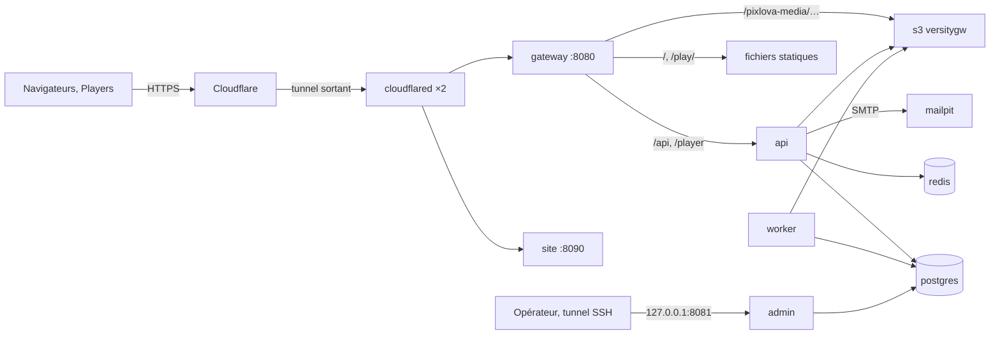

# Déployer la recette sur un serveur Docker avec Cloudflare Tunnel

Procédure pour installer, exploiter et mettre à jour l’instance de **recette** décrite par l’[ADR-015](../architecture/adr/0015-infrastructure-recette.md). Elle ne décrit pas une production : un seul serveur, pas de haute disponibilité, emails capturés et jamais envoyés.

## Ce que vous obtenez



Une seule adresse publique (par exemple `https://recette.example.com`) sert :

- le **dashboard** sur `/` ;
- le **Player Web** sur `/play/` ;
- l’**API** sur `/api/v1`, et l’**API Player** sur `/player/v1` ;
- le **stockage privé** par URLs présignées seulement.

Les emails (vérification de compte, invitations, alertes) arrivent dans **Mailpit**, accessible uniquement depuis le serveur.

## Prérequis

- Serveur Linux x86-64 avec Docker Engine et Docker Compose v2.24 ou plus (`docker compose version`).
  - Proposition **[à valider]** : 2 vCPU, 4 Go de RAM et 40 Go de disque libres pour les médias.
  - La construction des images demande environ 3 Go temporaires.
- Git et, de préférence, Node.js 24 ; sinon, les commandes Node ci-dessous passent par l’image Docker `node`.
- Un domaine géré par Cloudflare et un accès au tableau de bord **Zero Trust**.

## 1. Récupérer le code et générer les secrets

```sh
git clone https://github.com/clempasquiet/pixlovadev.git pixlova && cd pixlova
node infra/recette/scripts/init-recette.mjs --url https://recette.example.com
# Sans Node sur le serveur :
docker run --rm --user "$(id -u):$(id -g)" -v "$PWD:/w" -w /w node:24.21.0-bookworm-slim \
  node infra/recette/scripts/init-recette.mjs --url https://recette.example.com
```

Le script écrit deux choses :

- `infra/recette/.env` (mode 600) : tous les mots de passe et clés. **Sauvegardez ce fichier hors du serveur.** Sans lui, les données chiffrées et les Players appairés sont inutilisables.
- `infra/recette/trust/` : les clés **publiques** des manifests et des commandes, pour les Players.

Les quotas de test (`PIXLOVA_DEV_*`) et les limites d’envoi figurent dans `.env`, modifiables avant le démarrage.

## 2. Créer le tunnel Cloudflare

1. Dans le tableau de bord Cloudflare, ouvrir **Zero Trust → Networks → Tunnels → Create a tunnel**.
2. Choisir le type **Cloudflared** et nommer le tunnel (par exemple `pixlova-recette`).
3. À l’étape d’installation, copier le jeton affiché dans la commande `cloudflared … --token <JETON>`. Ne pas exécuter cette commande : le conteneur s’en charge.
4. Coller le jeton dans `infra/recette/.env` : `CLOUDFLARE_TUNNEL_TOKEN=<JETON>`.
5. Onglet **Public Hostname**, ajouter une route :
   - **Subdomain** `recette`, **Domain** votre domaine ;
   - **Service** : type `HTTP`, URL `gateway:8080`.
6. Ne publier **aucune** autre route vers ce serveur : ni `api:3001`, ni `postgres`, ni `mailpit`.

L’adresse `https://recette.example.com` doit correspondre exactement à `PIXLOVA_PUBLIC_URL`. Sinon, les cookies, les liens des emails et les URLs présignées du stockage sont refusés.

## 3. Démarrer

```sh
docker compose -f infra/recette/compose.yaml up -d --build --wait
docker compose -f infra/recette/compose.yaml ps
```

Au premier démarrage :

- PostgreSQL crée les rôles et la base ;
- le service `migrate` applique les migrations et crée le bucket privé ;
- l’API, le worker, la passerelle et les deux connecteurs démarrent une fois leurs dépendances saines.

La première construction prend plusieurs minutes.

Vérifier ensuite, depuis le serveur :

```sh
node infra/recette/scripts/smoke.mjs      # ou via l’image node comme à l’étape 1, avec --network host
```

Le parcours passe par l’adresse publique, donc par Cloudflare. Il crée un compte `recette-…@example.test`, lit son email dans Mailpit, envoie une image, attend le worker et appaire un Player simulé. Il doit se terminer par « Recette réussie ».

## 4. Utiliser l’application

- **Dashboard** : `https://recette.example.com`, puis « Créer un compte ».
- **Emails** : l’interface Mailpit écoute sur `127.0.0.1:8025` du serveur (identifiants `MAILPIT_UI_USER` / `MAILPIT_UI_PASSWORD` dans `.env`).
  - Depuis votre poste : `ssh -L 8025:127.0.0.1:8025 utilisateur@serveur`, puis `http://localhost:8025`.
  - Sur un réseau local de confiance : `MAILPIT_BIND=0.0.0.0` dans `.env`, puis `up -d`.
- **Player Web** : `https://recette.example.com/play/` dans Chrome ou Edge, puis saisir le code affiché dans **Players → Appairer un Player**.
- **Player natif** : installer le paquet avec `--api-url https://recette.example.com`. Le paquet doit contenir `infra/recette/trust/manifest-keys.json`, `command-keys.json` et votre `release-keys.json` (voir [native/README.md](../../native/README.md#paquets-et-mises-à-jour)).
  - Pour une recette seulement, une paire de clés de release peut être générée sur votre poste :

    ```sh
    node -e "const c=require('crypto');const s=c.randomBytes(32);const k=c.createPrivateKey({key:Buffer.concat([Buffer.from('302e020100300506032b657004220420','hex'),s]),format:'der',type:'pkcs8'});console.log('PIXLOVA_RELEASE_SIGNING_KEY='+s.toString('base64url'));console.log(JSON.stringify({keys:[{kid:'release-recette',public_key:c.createPublicKey(k).export({format:'jwk'}).x}]}))"
    ```

  - La graine reste sur votre poste de release, jamais sur le serveur ni dans le dépôt.
- **Limites d’envoi** : 95 Mo par vidéo et 50 Mo par image, car le plan gratuit Cloudflare refuse les requêtes de plus de 100 Mo. Un fichier plus gros est refusé avant l’envoi, avec « Fichier trop volumineux ».
- **MFA des administrateurs** : elle reste exigée pour les actions sensibles, comme en production. Activez-la dans votre profil avant de gérer les membres.

## 5. Administration plateforme (privée)

La console d’administration ([ADR-016](../architecture/adr/0016-administration-plateforme.md)) tourne dans le conteneur `admin`. Elle écoute sur `127.0.0.1:8081` du serveur et **aucune route publique ni route du tunnel n’y mène**. Ne créez jamais de hostname public vers `admin:8081`.

1. **Créer le premier SuperAdmin**, depuis le serveur :

   ```sh
   docker compose -f infra/recette/compose.yaml exec admin \
     node apps/api/dist/admin-cli.js create-operator --email vous@exemple.fr --name "Votre nom" --role super_admin
   ```

   La commande affiche un **code d’activation**, une seule fois, valable 24 h.
2. **Ouvrir la console depuis votre poste**, par un tunnel SSH : `ssh -L 8081:127.0.0.1:8081 utilisateur@serveur`, puis `http://localhost:8081/activate`.
3. **Activer le compte.** Saisissez votre adresse, le code et un mot de passe d’au moins 12 caractères, puis scannez le QR code avec une application TOTP (Aegis, Google Authenticator, 1Password…). Le second facteur est obligatoire à chaque connexion.
4. **Ajouter d’autres opérateurs** depuis la console, dans **Équipe** : rôles Support, Operator, BillingAdmin ou ContentAdmin. Le code d’activation affiché se transmet hors bande.

**Ce que la console permet.** Toute consultation d’une organisation ou d’un compte demande un **motif**, journalisé. Les actions sensibles redemandent un code TOTP.
- **Santé** de la plateforme, recherche d’**organisations** (usages, droits appliqués, parc, incidents).
- **Comptes clients** par adresse exacte :
  - révocation des sessions ;
  - réinitialisation du second facteur d’un client qui a perdu son téléphone et ses codes de secours, après vérification de son identité hors de pixlova ;
  - désactivation.
- **Tâches en échec** (relance), **incidents**, **templates**, **journal** de la plateforme.

**Opérateur ayant perdu son TOTP.** Un autre SuperAdmin clique sur « Réinitialiser les facteurs » dans **Équipe**. Sinon, depuis le serveur : `... admin-cli.js reset-operator --email <adresse>`.

**Accès distant sans SSH (cible).** Il passe par une route **privée** Cloudflare (Zero Trust → Networks → Routes) avec le client Cloudflare One sur un poste enrôlé et une politique Access. Il n’est pas configuré par défaut.

**Vérification** (ADM-006) : `node infra/recette/scripts/admin-smoke.mjs`. Le script vérifie :
- l’absence de l’administration côté public et depuis la passerelle ;
- l’activation avec TOTP, les droits bornés et la révocation.

Il crée puis révoque un opérateur jetable `recette-admin-…@pixlova.invalid`.

## 6. Site public

Le site public ([ADR-017](../architecture/adr/0017-site-public-domaines.md)) tourne dans son propre conteneur `site`, sans accès à l’API ni à la base. Ses pages sont générées à la construction de l’image :

- leurs boutons « Connexion » et « Créer un compte » mènent au dashboard de `PIXLOVA_PUBLIC_URL` ;
- elles ne sont **jamais indexables** en recette (`noindex`, `robots.txt` fermé).

Pour le publier :

1. Choisir une seconde adresse, par exemple `https://www-recette.example.com`, et l’ajouter à `infra/recette/.env` :

   ```sh
   PIXLOVA_SITE_URL=https://www-recette.example.com
   ```

2. Dans le tunnel Cloudflare, onglet **Public Hostname**, ajouter une route : **Subdomain** `www-recette`, **Service** `HTTP` → `site:8090`.
3. Reconstruire le site : `docker compose -f infra/recette/compose.yaml up -d --build --wait site`.

Sans tunnel, le site reste consultable depuis le serveur sur `127.0.0.1:8090` (`ssh -L 8090:127.0.0.1:8090 utilisateur@serveur`, puis `http://localhost:8090`).

**Vérification** : `node infra/recette/scripts/site-smoke.mjs`. Le script contrôle les pages, les liens vers le dashboard, la CSP, la page 404, le refus d’indexation, et l’isolement du conteneur (API et base injoignables).

## Exploitation courante

```sh
C="docker compose -f infra/recette/compose.yaml"
$C logs -f api worker                  # journaux JSON (rotation 5 × 10 Mo par service)
$C stop                                # arrêt propre : l’API ferme ses connexions, le worker interrompt sa tâche, qui retourne à la file
$C up -d --wait                        # redémarrage ; les tâches interrompues sont reprises
$C restart worker                      # relance d’un service
```

- Le listener interne (santé, métriques) n’est joignable que dans le conteneur de l’API : `$C exec api node -e "fetch('http://127.0.0.1:3001/internal/v1/metrics').then(r=>r.text()).then(console.log)"`.
- Les procédures liées aux alertes et aux Players sont dans les [runbooks](RUNBOOKS.md).

## Sauvegarder et restaurer

```sh
infra/recette/scripts/backup.sh                                   # → infra/recette/backups/<horodatage>/
infra/recette/scripts/restore.sh infra/recette/backups/<horodatage>
```

**Contenu d’une sauvegarde.** Chaque sauvegarde contient :

- la base (`pg_dump`) ;
- les objets du bucket, avec leurs métadonnées ;
- une copie de `.env` ;
- les sommes SHA-256.

Elle peut contenir des données personnelles de test : copiez-la hors du serveur, dans un emplacement chiffré. Exemple de planification quotidienne (crontab de l’utilisateur Docker) :

```cron
17 3 * * * cd /chemin/pixlova && infra/recette/scripts/backup.sh >> /var/log/pixlova-backup.log 2>&1
```

La rétention n’est pas automatique : supprimez vous-même les anciennes sauvegardes **[à valider]**.

**Restauration.** `restore.sh` vérifie les sommes et refuse un `.env` différent de celui de la sauvegarde. Si besoin, restaurez d’abord `env.backup` en `.env`. Le script arrête ensuite l’application, remplace la base et les objets, puis redémarre.

La restauration a été exercée après destruction complète des volumes (`ci-recette.sh`).

## Mettre à jour et revenir en arrière

```sh
infra/recette/scripts/backup.sh                     # 1. sauvegarde AVANT la mise à jour
git fetch && git checkout <nouvelle-version>        # 2. code
node infra/recette/scripts/init-recette.mjs --upgrade   # 3. variables apparues depuis (ex. rôle d’administration)
docker compose -f infra/recette/compose.yaml up -d --build --wait   # 4. rôles, migrations puis nouveaux services
node infra/recette/scripts/smoke.mjs                # 5. vérification
```

Les migrations sont appliquées par `migrate` avant l’API et le worker. Elles sont rétrocompatibles : l’ancienne version peut en principe tourner sur le schéma migré (PRA-033). Le retour arrière :

1. `git checkout <version-précédente>`, puis `up -d --build --wait`.
2. Si l’ancienne version refuse le schéma, ou si les données sont altérées : `restore.sh` avec la sauvegarde de l’étape 1. Les données créées depuis la mise à jour sont alors perdues.

## Arrêter ou supprimer l’instance

```sh
docker compose -f infra/recette/compose.yaml down        # arrêt, données conservées
docker compose -f infra/recette/compose.yaml down -v     # SUPPRIME base, médias et emails
```

Supprimez aussi le tunnel dans Zero Trust si l’instance ne revient pas.

## Essai local sans Cloudflare

Sur un poste de développement, sans tunnel ni HTTPS :

```sh
node infra/recette/scripts/init-recette.mjs --url http://localhost:8080 --no-tunnel
docker compose -f infra/recette/compose.yaml up -d --build --wait
node infra/recette/scripts/smoke.mjs
```

`infra/recette/scripts/ci-recette.sh` rejoue la recette complète, puis **détruit** l’instance :

- parcours ;
- reprise du worker ;
- arrêt propre ;
- sauvegarde, perte des volumes et restauration.

Il refuse de s’exécuter si `infra/recette/.env` existe.

## Limites connues

- **Pas de haute disponibilité.** La panne du serveur, de son disque ou de Docker interrompt le dashboard et les API. Les Players natifs continuent de diffuser leur dernier état valide ; les Players Web continuent sur leur cache, dans les limites de l’ADR-013. Les deux connecteurs `cloudflared` couvrent une coupure de connexion, pas la perte de l’hôte (PRA-032).
- **Emails.** Aucun email ne quitte le serveur. Pour de vraies adresses, remplacer `PIXLOVA_SMTP_URL` par un relais SMTP authentifié (décision de production).
- **Rotation des secrets.** Elle n’est pas outillée. Changer un mot de passe de base impose un `ALTER ROLE` manuel ; changer une clé de signature impose de mettre à jour les clés de confiance de tous les Players.
- **Texte du dashboard.** La bibliothèque affiche encore les limites du contrat (2 Go par vidéo) ; l’API applique celles de la recette.
- **Non exercés sur Cloudflare réel pendant le lot.** Le tunnel, la limite de 100 Mo du plan et la perte d’un connecteur sont à vérifier sur votre serveur.

## Cible haute disponibilité

Cible (PRA-031), non implémentée ; aucune disponibilité n’est promise pour la recette.

| Composant | Recette actuelle | Cible HA |
|---|---|---|
| Hôtes | 1 serveur | Plusieurs domaines de panne |
| API | 1 instance | ≥ 2 instances sans état, derrière la passerelle |
| Worker | 1 instance | ≥ 2, remplaçables (la file PostgreSQL à bail le permet déjà) |
| PostgreSQL | 1 instance, sauvegarde logique | Primaire + réplique, bascule contrôlée, PITR |
| Redis | 1 instance sans persistance | Selon la disponibilité requise (limitation de débit) |
| Stockage | versitygw sur disque local | S3 managé ou stockage distribué, réplication |
| Tunnel | 2 connecteurs sur le même hôte | Connecteurs sur plusieurs hôtes |
| Emails | Mailpit (capture) | Relais SMTP transactionnel |
