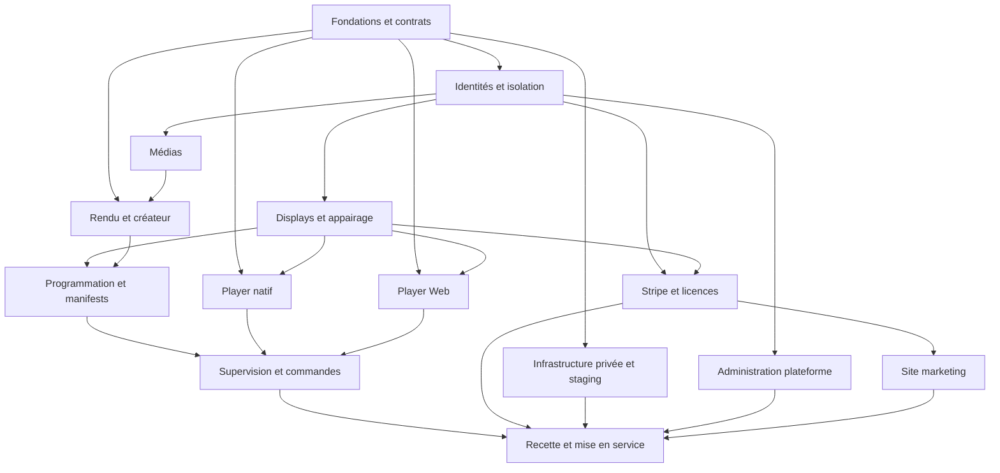

# Roadmap et dépendances

La [roadmap produit](../spec/chapters/18.md) fixe les versions. Le [backlog GitHub](BACKLOG.md) contient les tickets exécutables.

## Ordre de réalisation

Les prototypes peuvent avancer contre les fixtures stabilisées de L00. Une livraison intégrée exige les dépendances API réelles. Les tickets précisent les dépendances de fin de lot ; les travaux sur contrats communs doivent être coordonnés.

## V1

L00 à L09-R livrent ensemble le parcours complet : compte, appairage, Display, média, programmation, manifest, lecture native/Web, supervision et paiement. L09-R ferme uniquement lorsque toutes les preuves de lancement sont présentes.

## V1.5

API publique, webhooks, proof of play, diagnostics enrichis, captures automatiques, rôles personnalisés, templates d’organisation, déploiement progressif, multi-output renforcé et premiers outils intégrateur.

## V2

Canvas distribué, mapping LED, synchronisation qualifiée NTP/PTP, widgets/datasources, HTML isolé, marque blanche, templates intégrateur, SSO/SCIM et SLA avancés.

Les epics V1.5/V2 sont des réserves de périmètre. Ils ne sont pas nécessaires pour finir une tranche V1 et ne doivent pas être commencés par défaut.
