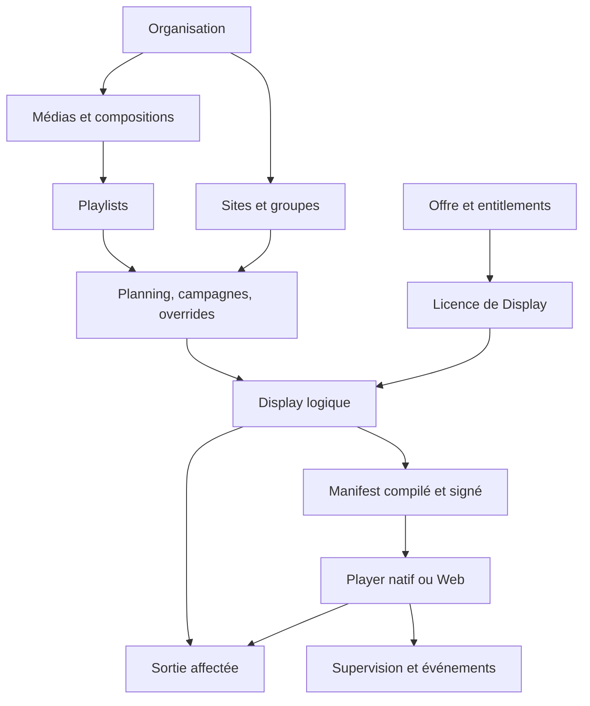
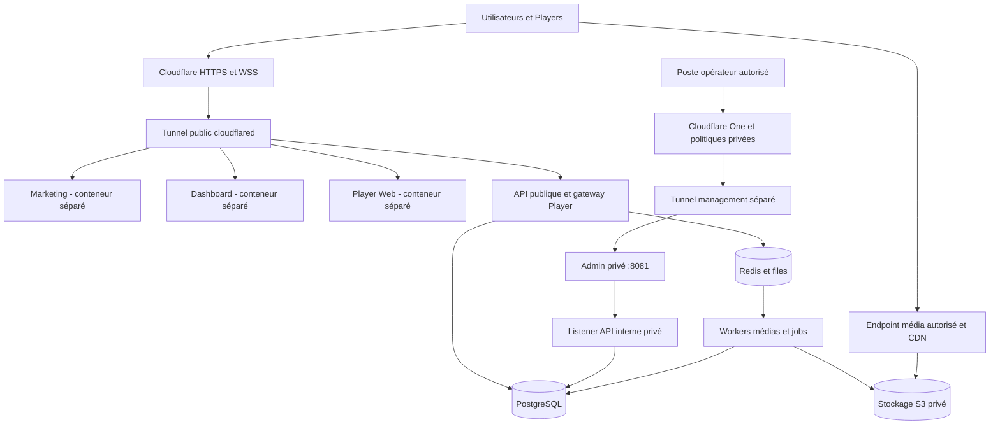

# pixlova — Cahier des charges maître du SaaS d’affichage dynamique

**Version documentaire :** 1.1 — 29 septembre 2026  
**Nom du projet :** pixlova  
**Domaines du projet :** pixlova.com et pixlova.fr  
**Langue :** français  
**Destination :** développement produit, développeurs, Codex, intégrateurs et exploitation  
**Statut :** consolidation des décisions produit et base technique proposée ; paramètres ouverts recensés en section 24.  
**Source produit :** conversation [Développer le cahier des charges](https://chatgpt.com/c/6abbe39d-c3b8-83eb-8cc4-09071c69616f), relue à travers l’accès conversation et son interface web.

Ce document rassemble le produit, ses règles métier, son architecture, ses contrats et sa recette. Il remplace les formulations dispersées de la conversation pour préparer les lots de développement. Il ne constate pas une implémentation existante ni la réussite de tests.

## Sommaire

- [1. Statut des exigences et décisions de référence](#section-1)
- [2. Vision produit et périmètre](#section-2)
- [3. Glossaire et architecture fonctionnelle](#section-3)
- [4. Parcours utilisateur](#section-4)
- [5. Players et Displays](#section-5)
- [6. Médias](#section-6)
- [7. Compositions et templates](#section-7)
- [8. Playlists, planning, campagnes et overrides](#section-8)
- [9. Supervision](#section-9)
- [10. Utilisateurs et RBAC](#section-10)
- [11. Abonnements, Stripe et codes promotionnels](#section-11)
- [12. Sécurité](#section-12)
- [13. Site marketing et administration plateforme](#section-13)
- [14. Architecture technique et déploiement](#section-14)
- [15. Implémentation des Players et moteur de rendu](#section-15)
- [16. Modèle de données de référence](#section-16)
- [17. API et protocole Player–Cloud](#section-17)
- [18. Roadmap et lots de réalisation](#section-18)
- [19. Tests et critères d’acceptation](#section-19)
- [20. PRA, sauvegardes et haute disponibilité](#section-20)
- [21. RGPD et rétention](#section-21)
- [22. Observabilité et exploitation](#section-22)
- [23. Documentation et définition de terminé](#section-23)
- [24. Paramètres, décisions ouvertes et traçabilité](#section-24)

<a id="section-1"></a>

## 1. Statut des exigences et décisions de référence

### 1.1 Convention de lecture

- **Décision de référence :** principe retenu dans les échanges, consolidé selon les arbitrages les plus récents et la roadmap finale.
- **[PROPOSITION] :** précision ajoutée pour rendre le développement déterministe, valeur indicative de la conversation, ou choix technique restant à ratifier. Les sections 15 à 17 sont des contrats détaillés proposés à partir des principes validés ; elles constituent une base cohérente pour les spécifications exécutables.
- **À décider :** choix commercial, juridique, matériel ou technique qui ne peut pas être présenté comme acté. Le registre de la section 24 indique le moment où le fixer.
- **DOIT / NE DOIT PAS :** exigence du périmètre considéré. Une exigence dans une section explicitement proposée reste une proposition, même formulée impérativement.
- **V1 / V1.5 / V2 :** versions fonctionnelles, indépendantes des versions d’API et des numéros de publication du Player.

Les identifiants d’exigence servent aux tickets et aux tests. Un ticket cite les exigences applicables, son périmètre de version et sa recette. Le nom pixlova et les domaines pixlova.com et pixlova.fr sont confirmés. Les sous-domaines et URL techniques proposés, UUID, dates et montants illustratifs ne sont pas des configurations de production.

### 1.2 Arbitrages à conserver

| Sujet | Décision de référence | Conséquence |
|---|---|---|
| Facturation | Organisation + offre + entitlements + licences de Display | L’idée initiale d’un abonnement individuel par Player est abandonnée. |
| Gratuit | Un Display actif, un utilisateur, Player natif ou Web | Le gratuit conserve une vraie capacité de diffusion ; templates du catalogue réservés au payant. |
| Unité d’affichage | Display logique séparé de la machine | Contenus et planning survivent au remplacement du Player. |
| Player natif | Agent Rust, renderer distinct, IPC, SQLite, cache, watchdog | Un crash du rendu ne doit pas tuer l’agent de gestion. |
| Rendu | Moteur partagé entre prévisualisation, Web et renderer natif | Le même document de composition produit un rendu cohérent sur les plateformes qualifiées. |
| Diffusion | Manifest immuable, versionné et signé ; assets vérifiés | Préparation complète avant activation atomique ; dernier état valide conservé. |
| Infrastructure | Services Docker séparés, backend modulaire, PostgreSQL, Redis, stockage S3, workers | Déploiement initial simple, évolution vers plusieurs instances sans refonte métier. |
| Exposition | Services publics via Cloudflare Tunnel ; origine sans port public entrant | Authentification applicative maintenue derrière le tunnel. |
| Administration | Interface privée sur port interne distinct, exemple 8081 | Accès management privé ; aucune route admin sur l’API publique. |
| Continuité | La panne cloud ne doit pas interrompre les contenus locaux valides | Disponibilité SaaS et continuité Player mesurées séparément. |
| Downgrade | Conservation des données, choix des Displays conservés | Suspension fonctionnelle explicite ; aucune suppression arbitraire. |

### 1.3 Harmonisation des propositions successives

1. Le mot « écran » désigne souvent un Display dans l’interface ; le modèle technique distingue toujours Display, sortie et Player.
2. « Layout » devient une composition comportant des zones ; aucune nouvelle entité métier Layout n’est nécessaire en V1.
3. « Diffuser maintenant » utilise une entité Override distincte des campagnes. Les exemples initiaux parlant de campagne temporaire sont remplacés par cette décision.
4. La roadmap finale prime sur les idées antérieures : page Web embarquée, HTML personnalisé, widgets de données et synchronisation avancée passent en V2 ; API publique, proof of play et rôles personnalisés en V1.5.
5. La mention initiale « admin local uniquement » est conservée sous forme d’accès réseau privé, éventuellement distant via Cloudflare One, sans publication Internet. Un simple changement de port ne constitue pas la protection.
6. Les prix, quotas, promotions d’acquisition, essai de 14 jours et remise annuelle discutés sont indicatifs. Ils ne constituent pas une grille commerciale approuvée.
7. Les exemples d’empreinte machine par SHA-256 expriment une empreinte pseudonymisée. Un digest SHA-256 complet n’est pas un UUID : l’implémentation doit distinguer le format UUID et l’empreinte, sans prétendre disposer d’une identité matérielle universelle infalsifiable.
8. Les exemples d’états Player mélangent cycle de vie, présence, santé et maintenance. Le modèle de la section 16 les sépare pour éviter qu’un Player en maintenance apparaisse artificiellement disponible.

### 1.4 Identité du projet et domaines

Le projet s’appelle **pixlova**. Ses domaines de référence sont **pixlova.com** et **pixlova.fr**. Ce nom doit être repris dans le site de présentation, les interfaces, la documentation et les communications du produit.

Le choix du domaine principal, le rôle de chaque domaine (site principal, version localisée ou redirection) et les sous-domaines applicatifs restent à définir. Leur mention dans ce document ne constate ni enregistrement, ni configuration DNS, ni déploiement effectif.

<a id="section-2"></a>

## 2. Vision produit et périmètre

### 2.1 Finalité

Fournir une plateforme SaaS multi-tenant pour créer, organiser, programmer et superviser la diffusion de contenus sur moniteurs de présentation, écrans professionnels et installations LED, y compris de résolution atypique. La chaîne principale est : **SaaS → Player local → sortie vidéo → Display logique**.

Le produit doit servir aussi bien un site équipé d’un écran qu’une organisation exploitant un parc multi-site. Son évolution vise les intégrateurs audiovisuels, les surfaces LED et l’exploitation professionnelle.

### 2.2 Publics et tâches

| Public | Tâches prioritaires |
|---|---|
| Petite entreprise / commerce | Connecter un écran, importer un média, planifier et vérifier la diffusion. |
| Communication / marketing | Composer des contenus, réutiliser des templates, programmer des campagnes ciblées. |
| Exploitant | Identifier rapidement les incidents, comprendre ce qui est diffusé et intervenir à distance. |
| Technicien / intégrateur | Installer, remplacer et maintenir les Players ; diagnostiquer sorties, cache et versions. |
| Responsable d’organisation | Gérer utilisateurs, sites, licences et facturation. |
| Opérateur de la plateforme | Administrer le SaaS, les offres, les releases et les incidents depuis une interface privée. |

### 2.3 Principes produit

**PROD-001 — Autonomie locale.** Un Player natif déjà synchronisé lit ses contenus sans requête cloud nécessaire à chaque lecture. Aucun appel Stripe, aucune URL expirée de téléchargement et aucune perte WebSocket ne doivent invalider des assets locaux vérifiés.

**PROD-002 — Résolutions libres.** Aucune hypothèse 16:9 dans les compositions, Displays et contrats. Exemples de recette : 1920×1080, 1080×1920, 2688×672, 3840×480 et 768×2304. La liberté du canvas ne garantit pas que tout matériel décode toute résolution.

**PROD-003 — Explication de la diffusion.** L’utilisateur peut connaître la source sélectionnée, sa priorité, sa période, les règles remplacées et le dernier état réellement appliqué par le Player.

**PROD-004 — Séparation des responsabilités.** Les droits commerciaux concernent l’organisation et les Displays ; l’identité Player concerne une installation technique ; la programmation concerne le Display.

**PROD-005 — Contrôle effectif au serveur.** L’API vérifie tenant, permission, scope et entitlement pour chaque opération ; l’interface reflète ces contrôles.

**PROD-006 — Fiabilité observable.** Être connecté, rendre une image et détecter une sortie physique sont des signaux distincts. Une capture du renderer ou un connecteur HDMI présent ne prouve pas que la dalle est réellement visible ou allumée.

### 2.4 Périmètre V1 et limites

La V1 couvre le parcours complet : compte → organisation Free → appairage → Display → média/composition → playlist/planning/campagne/override → manifest → diffusion → supervision → abonnement payant.

La V1 comprend le Player natif et le Player Web, l’éditeur de compositions, les templates plateforme payants, Stripe, le site marketing et l’administration privée. L’ensemble détaillé figure en section 18.

Sont différés : synchronisation précise entre machines, canvas réparti et crops automatiques, mapping complexe de murs LED, widgets externes, API publique commerciale, portail intégrateur complet, marque blanche, SSO/SCIM et SLA contractuels avancés, selon les versions précisées dans la roadmap.

Le produit pilote une sortie vidéo ; il ne constitue pas en V1 un outil de configuration des processeurs LED, des receiving cards ou du réseau électrique des écrans. Un message urgent est une diffusion prioritaire soumise à la connectivité et à la préparation des médias ; aucune certification de système d’évacuation n’est définie.

Le déploiement de la plateforme sur l’infrastructure de l’éditeur est prévu. Une distribution on-premise chez les clients et les licences associées restent hors du périmètre commercial validé.

<a id="section-3"></a>

## 3. Glossaire et architecture fonctionnelle

| Terme | Définition |
|---|---|
| Organisation / tenant | Périmètre d’isolation des données, utilisateurs, ressources et abonnement. |
| Site | Regroupement géographique ou opérationnel, avec fuseau horaire. |
| Player | Agent natif ou application Web appairée à une organisation. |
| Installation | Instance locale du logiciel ou profil navigateur ; possède sa propre identité. |
| Output / sortie | Connecteur physique du natif ou surface de rendu virtuelle du Web. |
| Display | Surface logique avec résolution, orientation, programmation, supervision et affectation à une sortie. |
| Display Slot / licence | Droit commercial assignable à un Display actif ; sa libération ne supprime pas le Display. |
| Display Group | Groupe de ciblage ; un Display peut appartenir à plusieurs groupes. |
| Média | Ressource logique du client, associée à un ou plusieurs fichiers ou variantes. |
| Asset | Blob immuable identifié par taille et checksum ; original, miniature ou rendu compatible. |
| Composition | Document graphique versionné : canvas, éléments, zones et paramètres. |
| Template | Modèle réutilisable ; son utilisation crée une composition indépendante. |
| Playlist | Séquence ordonnée de médias ou de compositions avec durées et validités. |
| Schedule / planning | Règles temporelles récurrentes ou datées affectées à des cibles. |
| Campaign / campagne | Contenu + ensemble de cibles + période + priorité. |
| Override | Diffusion immédiate temporaire, annulable, prioritaire sur les règles ordinaires. |
| Manifest | Résultat de compilation immuable et signé, propre à un Display et une version. |
| Entitlement | Droit ou quota effectif, indépendant du nom commercial de l’offre. |
| Proof of play | Journal de lectures déclarées par le Player ; ne prouve pas l’attention d’une audience. |
| RPO / RTO | Perte maximale de données visée / délai de reprise visé après incident. |



**FON-001 — Navigation.** Les cinq entrées produit principales sont Bibliothèque, Créateur, Playlists, Programmation et Écrans. Un tableau de bord d’exploitation résume le parc. Utilisateurs, facturation, paramètres et fonctions avancées sont accessibles selon les droits ; les réglages ne doivent pas masquer les alertes critiques du parc.

**FON-002 — Flux de publication.** Une modification sauvegardée n’est pas assimilée à une diffusion réussie. L’interface distingue brouillon, version publiée, compilation, téléchargement/préparation et version appliquée. Un acquittement Player est nécessaire pour afficher « appliqué ».

**FON-003 — Granularité V1.** L’activation est atomique par Display. Un ciblage de plusieurs Displays n’implique pas une bascule simultanée de toutes les machines ; le suivi expose le résultat de chaque cible. La synchronisation de groupe relève de la V2.

<a id="section-4"></a>

## 4. Parcours utilisateur

### 4.1 Inscription et première diffusion

**PAR-001 — Création du compte et de l’organisation — V1.** Le parcours comprend l’inscription, la vérification de l’adresse email, la création de l’organisation, son pays et son fuseau horaire. Le créateur devient `Owner`. L’organisation commence avec l’offre Free et un Display Slot. Une personne peut ensuite appartenir à plusieurs organisations ; l’organisation active doit rester visible dans la navigation et dans les dialogues d’action sensibles. Une invitation rejoint une organisation existante et ne doit pas créer implicitement une seconde organisation.

**PAR-002 — Installation et appairage — V1.** Le tableau de bord propose les instructions d’installation du Player natif Linux/Windows et l’ouverture du Player Web. Le Player non appairé affiche un code à saisir dans le SaaS. Le compte connecté confirme l’organisation et le site de destination. Après appairage, le SaaS présente les outputs détectés et propose de créer un Display associé lorsque le quota le permet. Le message « connecté, aucun contenu programmé » doit distinguer une installation réussie d’un échec de diffusion. L’absence de slot ne doit pas provoquer une création facturable implicite.

**PAR-003 — Premier contenu — V1.** L’utilisateur importe une image ou une vidéo, suit sa préparation, crée une playlist simple et l’affecte au Display. La publication affiche séparément les états de préparation cloud, synchronisation Player et application effective. Le téléchargement, la vérification du checksum et l’activation atomique précèdent la lecture. La présence réseau seule ne vaut pas confirmation de diffusion. Le parcours doit permettre une première diffusion en moins de dix minutes sur un environnement de recette documenté, avec compte accessible, matériel compatible, réseau disponible et fichier de taille maîtrisée.

### 4.2 Exploitation quotidienne

**PAR-004 — Préparer, prévisualiser, publier — V1.** Toute édition d’une composition, d’une playlist ou d’une programmation doit rendre explicite son effet sur la diffusion. La prévisualisation précède la publication ; la publication indique les Displays ciblés, les éventuels conflits et les incompatibilités. Le contenu en cours de diffusion reste utilisable pendant la préparation de la nouvelle version. Le panneau de suivi permet de savoir quels Displays appliquent la version attendue et lesquels attendent encore des ressources.

**PAR-005 — Diffuser immédiatement — V1.** Depuis un média, une composition ou une playlist compatible, l’action « Diffuser maintenant » demande les cibles, une durée ou une heure de fin et affiche le contenu qui sera interrompu. L’utilisateur voit l’heure de retour à la programmation. Une commande acceptée par le cloud et un override appliqué sur le Player sont deux états distincts. Un Player hors ligne conserve sa diffusion locale ; l’interface ne promet pas une prise en compte immédiate.

**PAR-006 — Parcours d’incident — V1.** À partir d’un Display en alerte, l’opérateur accède à la dernière présence, au contenu courant connu, au manifest attendu/appliqué, aux médias manquants, à l’état de l’output et à la timeline. Les actions autorisées sont proposées avec leur portée et leur résultat. Le remplacement d’un Player réutilise le Display existant et conserve ses playlists, plannings, campagnes, groupes et historique logique.

**PAR-007 — États vides, erreurs et droits — V1.** Les pages distinguent les états vide, chargement, erreur, accès interdit, quota atteint et synchronisation en cours. Une action indisponible explique le droit, la fonctionnalité ou la capacité nécessaire. Les refus de l’API doivent rester compréhensibles même si l’action avait été affichée avant un changement de droits. Les destructions et actions sur plusieurs écrans présentent les ressources affectées avant confirmation.

<a id="section-5"></a>

## 5. Players et Displays

### 5.1 Objets et responsabilités

**PLY-001 / DSP-001 — Séparation du matériel et de l’écran logique — V1.** Un `Player` est une installation exécutant le logiciel de diffusion. Un `PlayerOutput` représente une sortie de rendu disponible. Un `Display` est l’écran logique auquel sont attachées la configuration éditoriale, la programmation, les campagnes et la licence commerciale. Le Player porte la santé de la machine et du logiciel ; le Display porte la destination de diffusion. Ni un remplacement matériel, ni une réinstallation ne doivent obliger à recréer la programmation.

| Objet | Identité et portée | Conséquence fonctionnelle |
|---|---|---|
| Player | `player_id`, UUID cloud permanent, jamais réutilisé | Référent de l’installation enregistrée, des commandes et de la télémétrie |
| Machine native | `machine_uuid`, empreinte technique sans numéro de série brut exposé | Indice de rapprochement lors d’une réinstallation ; ne constitue pas une preuve d’authentification |
| Installation native | `installation_uuid`, créé à l’installation | Change lors d’une réinstallation ; distinct de la machine physique |
| Installation Web | `browser_installation_uuid`, persisté dans IndexedDB | Peut disparaître avec les données du navigateur ; ne prouve pas une identité matérielle |
| PlayerOutput | Identité rattachée au Player et aux informations de sortie disponibles | Point d’affectation d’un Display |
| Display | UUID durable dans l’organisation | Conserve sa fonction et sa programmation quand son Player change |
| Display Slot | Droit de diffusion fourni par l’abonnement | Compté indépendamment du nombre d’installations Player |

**DSP-002 — Affectations — V1.** Une affectation relie un Display à un output du Player de la même organisation. Les conflits d’affectation sont refusés côté serveur. Le modèle supporte plusieurs outputs par Player dès la V1. Cette capacité de modélisation ne vaut pas engagement de synchronisation parfaite entre sorties ou de prise en charge de tout GPU. La gestion multi-output renforcée relève de V1.5 ; les murs, mappings et synchronisations avancées relèvent de V2. **[PROPOSITION]** La V1 applique au maximum une affectation active par Display et par output, afin de rendre le remplacement et la facturation déterministes.

### 5.2 Appairage et cycle de vie

**PLY-002 — Appairage sécurisé — V1.** Le code d’appairage est temporaire, à usage unique et lié à l’installation qui l’a demandé. Il n’est pas un secret permanent. La validation requiert une session utilisateur autorisée dans l’organisation de destination. La consommation du code et l’enregistrement du Player sont atomiques ; deux validations concurrentes ne créent pas deux rattachements. Les essais sont limités, les codes expirés ou réutilisés sont refusés et les opérations sont auditées. La durée exacte et le nombre d’essais restent à paramétrer ; « quelques minutes » est l’intention d’origine.

**PLY-003 — Identifiants et réinstallation — V1.** Après appairage, le Player reçoit ses propres moyens d’authentification, distincts de ceux de l’utilisateur. Une empreinte machine reconnue peut suggérer un rapprochement mais ne doit jamais transférer seule les droits d’un ancien Player. La révocation empêche de nouvelles commandes et synchronisations autorisées. L’interface distingue appairage, révocation, suppression d’une fiche et remplacement d’une installation. Les détails de traitement des caches lors d’une révocation suivent la politique de sécurité et d’effacement du document.

**DSP-003 — Remplacement sans perte — V1.** L’administrateur choisit le Display existant et le nouvel output appairé, consulte l’ancienne affectation, puis confirme le transfert. L’opération conserve le `display_id` et toutes ses références fonctionnelles. L’ancienne affectation est close et historisée ; elle ne doit pas redevenir active à la reconnexion de l’ancien Player. L’interface indique si celui-ci est hors ligne et peut encore lire son dernier cache : une révocation cloud ne peut pas effacer instantanément une machine déconnectée. Le nouveau Player prépare son contenu avant d’être déclaré prêt.

### 5.3 Player natif Rust et Player Web

**PLY-004 — Player natif — V1.** Le Player natif Rust fonctionne sous Linux et Windows sur les matériels qualifiés. Il démarre automatiquement, maintient une base SQLite et un cache média local, gère la reconnexion et sépare la supervision de la machine du rendu. Il doit pouvoir continuer à lire son dernier état valide lors d’une coupure du SaaS, du réseau, du WebSocket, du stockage ou du CDN, dans la limite des ressources déjà disponibles et des contraintes temporelles publiées. Le redémarrage du renderer ne doit pas exiger une intervention humaine ni perdre la configuration locale.

**PLY-005 — Mise à jour native — V1.** Les versions distribuées sont signées et vérifiées avant installation. La mise à jour conserve l’état nécessaire à la reprise et permet le rollback en cas d’échec. La version souhaitée, la version installée et le résultat du déploiement sont visibles. Les canaux bêta et les déploiements progressifs relèvent de V1.5. Les migrations locales ne doivent pas rendre le retour à une version encore supportée impossible sans stratégie explicite.

**PLY-006 — Player Web — V1.** Le Player Web utilise le même modèle de Display, d’appairage, de manifest et de contenu compatible. L’identité de son installation dépend du profil navigateur. La matrice de compatibilité précise les capacités de stockage, codecs, plein écran, démarrage automatique, audio et fonctionnement hors ligne sur chaque navigateur qualifié. L’éviction du cache, la fermeture de l’onglet, la suspension du système ou l’effacement du profil ne doivent pas être présentés comme équivalents à la robustesse d’un service natif. Les capacités disponibles sont remontées ; une opération non supportée est refusée explicitement.

**PLY-007 — Continuité de diffusion — V1.** Un nouveau manifest ne devient actif qu’après validation de son schéma, de ses références et des ressources requises. Les médias corrompus ne sont pas lus. Les ressources du manifest actif restent protégées contre l’éviction jusqu’à l’activation complète de son successeur. En cas de préparation incomplète, le Player garde sa dernière version valide et remonte la cause. La recette comprend une coupure réseau de 24 heures ; une autonomie de plusieurs jours est recherchée lorsque tous les contenus et règles utiles sont synchronisés.

### 5.4 Configuration des Displays

**DSP-004 — Paramètres — V1.** Un Display possède au minimum un nom, un site, une timezone effective, des groupes, une résolution libre en pixels, une orientation et une configuration de diffusion de repli. Les formats standards paysage/portrait et les formats LED atypiques sont acceptés. Les limites de dimensions et de décodage dépendent des capacités déclarées du Player ; elles doivent être contrôlées avant publication et explicites dans la fiche Display.

**DSP-005 — Sortie physique — V1.** Le Player remonte la présence de l’output, sa résolution et les informations techniques fiables disponibles. « Output connecté » ne signifie pas que la dalle est allumée, visible ou sur la bonne entrée. L’interface distingue ces niveaux de connaissance. Le débranchement/rebranchement d’une sortie est historisé et ne doit pas supprimer le Display.

**DSP-006 — Organisation et licences — V1.** Les Displays sont consultables par site et groupe, avec filtres de présence, état de diffusion et occupation des slots. Un Player connecté sans Display n’occupe pas implicitement un slot supplémentaire. L’activation, la désactivation commerciale et la conservation des données suivent les règles de billing ; un downgrade conserve les objets et rend explicite le choix des Displays restant actifs. Aucun changement de quota ne doit supprimer des médias ou une programmation.

<a id="section-6"></a>

## 6. Médias

### 6.1 Bibliothèque et ingestion

**MED-001 — Bibliothèque — V1.** La bibliothèque est propre à chaque organisation. Elle contient images et vidéos, avec dossiers, tags, recherche, filtres, aperçu et sélection multiple. Le glisser-déposer de plusieurs fichiers déclenche des tâches suivies individuellement. Chaque fiche présente nom, type détecté, taille, dimensions, durée si applicable, dates, état de préparation, variantes disponibles et références d’utilisation. Les résultats sont paginés pour ne pas charger toute la bibliothèque.

**MED-002 — Upload direct — V1.** Le client demande une autorisation d’upload limitée à son organisation, sa taille et son type autorisés, puis envoie le fichier directement vers le stockage objet. Le serveur vérifie la réception avant de rendre l’objet exploitable. Le nom ou le type MIME annoncé par le navigateur ne suffit pas à valider le format. Les interruptions, quotas atteints et erreurs de préparation sont visibles ; un upload incomplet ne doit pas apparaître comme média prêt à publier. **[PROPOSITION]** Prévoir la reprise des uploads volumineux par un mécanisme multipart, selon le stockage retenu.

**MED-003 — Pipeline asynchrone — V1.** Après réception : contrôles d’intégrité et de format, extraction de métadonnées, analyse FFprobe pour les vidéos, génération des miniatures, puis transcodage si nécessaire pour les Players ciblés. Le traitement doit se faire en arrière-plan et permettre un nouvel essai contrôlé après échec. L’original est conservé séparément des variantes. Les opérations doivent pouvoir être rejouées sans dupliquer les mêmes variantes ou consommer plusieurs fois les quotas.

**MED-004 — Compatibilité — V1.** Les images et vidéos publiées doivent disposer d’une représentation compatible avec leur cible. H.264/AAC constitue le profil vidéo de référence discuté, à qualifier avec les conteneurs et matériels supportés. Le système évite un transcodage inutile d’un fichier déjà compatible. Les dimensions, la fréquence d’images, le débit, l’audio, la rotation et la durée sont pris en compte. La matrice définit les limites qualifiées ; la simple extension du fichier ne suffit pas à autoriser sa diffusion.

### 6.2 Intégrité, variantes et références

**MED-005 — Checksum — V1.** Chaque original et chaque variante possède un checksum et une taille attendue. Le Player valide chaque fichier avant de le rendre lisible. Une variante est identifiée de manière stable et ne doit pas changer silencieusement sous le même identifiant. Remplacer un média crée une nouvelle version ou un nouvel objet référencé explicitement. Le SaaS indique les playlists, compositions et publications affectées avant propagation.

**MED-006 — Déduplication — V1.** La déduplication éventuelle reste interne au tenant et ne doit pas révéler l’existence des fichiers d’autres organisations. Deux imports identiques peuvent partager un binaire tout en conservant leurs métadonnées et droits logiques distincts. Le calcul des quotas doit être documenté : original, variantes, corbeille et captures n’ont pas nécessairement la même règle. Les références encore utilisées empêchent la suppression physique de leur binaire partagé.

**MED-007 — Préparation de publication — V1.** Une playlist ou composition ne peut publier une dépendance absente, en erreur, supprimée ou non compatible sans résolution explicite. La liste des erreurs indique le média et sa référence. Une publication utilise un ensemble figé de variantes validées ; l’édition de la bibliothèque ne doit pas altérer en place un manifest déjà actif. Les téléchargements peuvent être préparés avant l’heure de début d’une campagne.

### 6.3 Corbeille et suppression

**MED-008 — Suppression logique et restauration — V1.** La suppression place le média dans une corbeille restaurable et présente ses utilisations. La restauration conserve son identité logique lorsqu’elle reste disponible. Les durées de rétention et le comportement après expiration sont configurés par politique ; aucune durée chiffrée n’a été définitivement fixée dans la discussion. La purge définitive doit tenir compte des références actives, des variantes et des obligations de conservation applicables.

**MED-009 — Média encore diffusé — V1.** Une suppression forcée nécessite une permission et une confirmation distinctes. Elle prépare une solution de repli ou une nouvelle publication cohérente pour les références touchées. Le cloud ne doit pas rendre volontairement un manifest courant impossible à satisfaire. La suppression d’un binaire cloud n’efface pas immédiatement son cache sur un Player hors ligne ; l’état d’application de la suppression doit être suivi et ce délai documenté.

**MED-010 — Frontière de périmètre — V1/V2.** La bibliothèque V1 concerne les images et vidéos validées. La page Web distante, le HTML personnalisé et les widgets dynamiques avancés relèvent de V2 selon la roadmap finale. Une proposition antérieure plaçait la page Web en V1 ; cette proposition est écartée au profit du découpage final. Aucun chargement d’URL arbitraire ne doit être introduit indirectement comme un média V1.

<a id="section-7"></a>

## 7. Compositions et templates

### 7.1 Éditeur et modèle de composition

**CMP-001 — Canvas libre — V1.** Une composition définit un canvas de largeur et hauteur libres en pixels, son fond et ses éléments. Les écrans classiques et LED de ratios atypiques utilisent le même modèle. L’éditeur peut proposer des coordonnées en pixels et en pourcentage, avec une règle de conversion documentée et stable. Chaque élément expose `x`, `y`, `width`, `height`, `rotation`, `z_index`, `opacity`, `visible` et `locked`, ainsi que les propriétés propres à son type.

**CMP-002 — Manipulation — V1.** L’éditeur permet sélection, déplacement, redimensionnement, rotation, alignement, duplication, copier/coller, changement de profondeur, verrouillage et annulation/rétablissement. Grille, guides, aimantation et zone de sécurité aident à placer les éléments. L’ordre d’empilement et les éléments masqués restent consultables. Les saisies numériques permettent un placement exact même sur un canvas très large ou très fin.

| Élément V1 | Propriétés fonctionnelles attendues |
|---|---|
| Image | Média/version, `contain`, `cover` ou `stretch`, recadrage, opacité |
| Vidéo | Variante compatible, mode d’ajustement, volume, muet, boucle, points de début/fin compatibles avec la durée |
| Texte | Texte, police, taille, graisse, alignement, interligne, espacement des lettres et couleurs |
| Forme | Type supporté, remplissage, bordure, couleur, dimensions |
| QR Code | Donnée URL, texte, email ou Wi-Fi ; contrôle de validité et preview |
| Horloge | Format, timezone et présentation ; comportement défini hors ligne |
| Zone média | Référence à un média exploitable et règles d’ajustement |
| Zone playlist | Playlist compatible, fenêtre de rendu et règles de progression |

**CMP-003 — Polices et contenu dynamique — V1/V2.** La V1 utilise un ensemble de polices qualifiées et disponibles à la fois en preview et sur les Players. Les polices téléversées constituent une extension future à cadrer, avec droits d’utilisation et packaging. Une horloge locale et un QR Code sont inclus dans le socle V1 ; météo, RSS, API de données, tableaux de bord et HTML personnalisé sécurisé sont prévus en V2.

### 7.2 Durées, dépendances et rendu

**CMP-004 — Durée — V1.** Une composition statique peut emprunter sa durée à l’élément de playlist qui la contient. Une composition temporisée possède une durée fixe explicite. Les règles d’entrée, de boucle et de sortie de ses vidéos ou zones playlists doivent rester déterministes. **[PROPOSITION]** En V1, toutes les zones commencent à l’entrée de la composition et la durée du conteneur gouverne sa sortie ; la présence d’une vidéo ne prolonge pas implicitement la diffusion. Ce contrat doit être confirmé dans le schéma avant l’implémentation du moteur.

**CMP-005 — Dépendances et cycles — V1.** Le serveur analyse l’ensemble des médias, playlists et compositions référencés avant publication. Les cycles directs et indirects sont refusés, notamment composition → zone playlist → composition d’origine. Les limites de profondeur, de nombre d’éléments et de vidéos simultanées sont qualifiées par profil Player et affichées dans l’éditeur. Les contraintes de ressources ne doivent pas être découvertes uniquement au moment de la lecture en production.

**CMP-006 — Prévisualisation — V1.** La preview permet une vue desktop, un canvas personnalisé et le profil d’un Display réel. Elle doit présenter les recadrages, polices, résolutions et dépendances utilisées. Les différences de capacités connues du Player ciblé sont signalées. Une preview locale ne vaut pas confirmation du rendu physique. La preview temporaire sur un Display réel reste à cadrer : **[PROPOSITION]** la traiter comme une session à durée limitée, permissionnée et auditable, fondée sur les règles d’override, avec retour automatique.

**CMP-007 — Versions et publication — V1.** Une composition possède un historique de versions. L’édition d’un brouillon ne modifie pas la version déjà publiée. La publication crée une version immuable référençable par le manifest et permet de revenir à une version compatible antérieure. L’utilisateur voit les playlists ou Displays touchés avant remplacement. **[PROPOSITION]** Employer un contrôle de concurrence optimiste : si deux éditeurs modifient la même version, le second enregistrement reçoit un conflit explicite et ne remplace pas silencieusement le premier.

### 7.3 Templates

**TPL-001 — Catalogue plateforme — V1.** Les templates plateforme sont catégorisés, prévisualisables et réservés à l’usage des offres payantes. Un utilisateur Free peut consulter leur preview ; la duplication est conditionnée aux entitlements. Les catégories initiales couvrent notamment restauration, hôtellerie, retail, immobilier et événementiel. Chaque template contient ses dimensions, ses éléments, une preview, sa catégorie, sa version et ses fonctionnalités requises.

**TPL-002 — Duplication indépendante — V1.** Utiliser un template crée une composition propre à l’organisation. Les modifications ultérieures du template source ne changent pas cette composition. Les placeholders identifient les informations à remplacer : logo, nom, couleurs, thème et autres champs réellement requis. La duplication copie ou référence les assets selon une stratégie garantissant leur disponibilité, leurs droits et leur isolation. Une dépendance inaccessible ne doit pas produire une composition partiellement fonctionnelle.

**TPL-003 — Évolution et droits — V1.5/V2.** Les templates privés d’organisation sont prévus en V1.5 ; les templates intégrateur en V2. `required_features` permet de filtrer et contrôler les capacités nécessaires. Un downgrade conserve les compositions existantes et les données ; les restrictions d’édition ou de nouvelle publication suivent la politique d’entitlements explicite. L’administration plateforme peut publier, retirer et versionner les templates sans modifier silencieusement les copies des clients.

<a id="section-8"></a>

## 8. Playlists, planning, campagnes et overrides

### 8.1 Playlists

**PLN-001 — Séquence éditoriale — V1.** Une playlist ordonne des médias et compositions. Chaque élément possède une position, un état actif/inactif, une durée pertinente pour son type et éventuellement une période de validité. Les opérations d’ajout, retrait, duplication et réorganisation sont possibles avant publication. Une vidéo utilise sa durée connue ou une durée de diffusion explicitement définie ; les comportements de coupe et de boucle doivent être prévisualisables. Les durées nulles, négatives ou incohérentes sont refusées.

**PLN-002 — Éléments inéligibles — V1.** Un élément désactivé ou hors période de validité est ignoré selon la règle compilée. Une playlist devenue vide ne laisse pas le moteur sans contenu : il passe au niveau de repli prévu. Le serveur valide les dépendances et les cycles avant publication. La reprise après interruption doit avoir une règle unique. **[PROPOSITION]** La V1 redémarre la playlist sélectionnée à son premier élément éligible lors d’un changement de source ; une reprise à la position précédente pourra être ajoutée ensuite.

### 8.2 Planning et calendrier

**PLN-003 — Règles temporelles — V1.** Le planning combine périodes de dates, jours de semaine, plages horaires et exceptions datées. Il peut cibler un Display ou être appliqué via les cibles autorisées de l’organisation. Les créneaux traversant minuit sont traités explicitement. Une timezone IANA effective du site ou du Display gouverne la programmation ; le fuseau du navigateur de l’éditeur ne change pas les horaires de diffusion. L’interface affiche toujours la timezone utilisée et permet la simulation d’une date future.

**PLN-004 — Changements d’heure — V1.** Le moteur compile les règles locales vers des instants UTC et conserve la timezone source. Les comportements pendant une heure absente ou répétée doivent être fixés avant mise en production. **[PROPOSITION]** Omettre une occurrence dont l’heure locale de début n’existe pas ; lors d’une heure répétée, sélectionner la première occurrence ; ne jamais exécuter deux fois la même occurrence logique. Des tests doivent couvrir les fuseaux et changements d’heure retenus. Les récurrences complexes telles que « premier lundi du mois » sont prévues en V2.

**PLN-005 — Consultation — V1.** Les vues jour, semaine et mois montrent la source programmée, les périodes de validité et les superpositions. Une vue par Display explique « pourquoi ce contenu est sélectionné » : règle source, priorité, cible correspondante, début et fin, ainsi que les règles masquées par une priorité supérieure. Un aperçu du calendrier doit utiliser le même moteur de décision que le manifest.

### 8.3 Campagnes et ciblage

**PLN-006 — Campagne — V1.** Une campagne réunit un contenu ou une playlist, une date de début, une date de fin, une priorité et des cibles. Les cibles comprennent Display, groupe, site et organisation, avec exclusions explicites. Les droits de l’auteur sont vérifiés sur tout le périmètre visé. Une sélection « organisation entière » n’accorde aucun accès supplémentaire à un utilisateur limité à un site. Les campagnes doivent pouvoir être préparées avant activation puis arrêtées de manière traçable.

**PLN-007 — Résolution des cibles — V1.** Les exclusions priment sur les inclusions. Une seule occurrence est appliquée au Display qui appartient à plusieurs groupes ciblés. L’interface indique le nombre et la liste des Displays concernés au moment de la publication. **[PROPOSITION]** Réévaluer les appartenances de groupes lors de chaque compilation ; journaliser l’ensemble résolu dans la version publiée. Un changement de groupe provoque une recompilation afin d’éviter des différences cachées entre la cible affichée et le manifest distribué.

### 8.4 Arbitrage unique des sources

**PLN-008 — Priorités — V1.** Le moteur utilise l’ordre suivant, partagé par le SaaS, la preview et le Player :

| Niveau | Valeur | Usage |
|---|---:|---|
| Planning ordinaire | 0 à 19 | Programmation de fond |
| Campagne | 20 à 79 | Diffusion prioritaire sur une période |
| Override | 80 à 99 | « Diffuser maintenant » ; valeur usuelle 90 |
| Urgence | 100 | Priorité maximale, soumise à une permission explicite |

Parmi les règles actives, éligibles et autorisées sur le Display, la plus haute priorité gagne. À priorité égale, le début le plus récent gagne, puis l’UUID départage de façon stable. **[PROPOSITION]** Retenir l’ordre lexical croissant de l’UUID pour la dernière comparaison ; ce choix technique doit être identique dans toutes les implémentations. Une règle moins prioritaire n’est pas supprimée : elle redevient candidate quand la règle gagnante prend fin. La priorité 100 réserve une catégorie d’urgence ; elle ne constitue pas une certification de système d’alerte de sécurité.

**PLN-009 — Override borné — V1.** Un override possède ses cibles, son auteur, sa source de contenu, son début et sa fin. Il peut être interrompu par un utilisateur autorisé. À l’expiration, le moteur recalcule la source qui doit jouer à l’instant courant ; il ne restaure pas aveuglément un ancien créneau déjà terminé. Le Player applique cette expiration localement, y compris hors ligne. Un override reçu après sa fin ne doit pas être diffusé.

**PLN-010 — Repli — V1.** Chaque Display dispose d’une stratégie de fallback utilisable localement. Elle s’applique si aucun contenu temporellement admissible n’est sélectionnable. L’absence de réseau ne doit pas forcer un écran noir quand un contenu valide est déjà disponible. Les contenus soumis à une fin impérative ne doivent pas être prolongés au seul motif de la continuité. **[PROPOSITION]** Prévoir un fallback local non soumis à l’expiration des campagnes et livré avant toute activation du Display ; en l’absence totale de contenu, utiliser un écran local explicite d’attente.

### 8.5 Compilation et application

**PLN-011 — Fenêtre de préparation — V1.** Le cloud compile les règles et dépendances dans un manifest versionné, suffisamment à l’avance pour télécharger les ressources futures. La discussion évoquait plusieurs fenêtres possibles ; **[PROPOSITION]** retenir sept jours glissants comme valeur initiale, renouvelée avant épuisement de l’horizon. La taille des médias, les capacités du cache et le volume d’occurrences limitent ce calcul. Le système indique l’horizon réellement disponible et signale son épuisement proche.

**PLN-012 — Cohérence et publication — V1.** Une modification éditoriale produit une nouvelle version cohérente du manifest. Le Player prépare, valide puis active l’ensemble atomiquement ; le cloud suit `desired` et `applied`. Une publication partiellement téléchargée n’est jamais déclarée appliquée. La recompilation doit être déclenchée par les changements de contenus publiés, de règles, de timezone, de cibles résolues ou d’affectation pertinents. Les règles complètes du protocole précisent les reprises, confirmations et erreurs.

**PLN-013 — Fin d’horizon hors ligne — V1.** Le Player connaît la limite de sa programmation compilée. Il conserve le dernier état valide, respecte les fins impératives connues, puis utilise le fallback si les règles futures ne sont plus disponibles. La télémétrie indique une programmation expirée dès que la communication reprend. Le fonctionnement autonome ne doit pas inventer une prolongation commerciale de campagne, ni réactiver un override expiré.

<a id="section-9"></a>

## 9. Supervision

### 9.1 Trois niveaux de visibilité

**SUP-001 — Présence, machine, diffusion — V1.** La supervision distingue : la présence vue du serveur, la santé du Player et la qualité de la diffusion. Un Player connecté peut avoir un renderer en erreur ; un Player absent du cloud peut continuer à diffuser son cache. La fiche ne doit pas réduire ces situations à un voyant unique. Chaque mesure présente son horodatage et son caractère actuel ou ancien.

**SUP-002 — Heartbeat — V1.** Le heartbeat nominal est émis toutes les 30 secondes. Une présence est considérée en ligne quand le dernier heartbeat reçu date de moins de 90 secondes. L’heure serveur de réception gouverne la présence ; l’heure du Player est une information complémentaire utile à la dérive d’horloge. Le passage hors ligne n’affirme pas que l’écran physique est éteint. Le retour de connexion actualise l’état et complète les événements locaux disponibles sans dupliquer les alertes.

| Couche | Informations attendues en V1 |
|---|---|
| Présence | Dernier heartbeat, première connexion, reconnexions, perte du canal temps réel |
| Machine | OS, versions, CPU, RAM, espace disque, uptime et informations matérielles disponibles |
| Player | Version installée/souhaitée, état renderer, redémarrages et erreurs |
| Manifest | Version désirée, préparée/appliquée, retard d’application et erreur bloquante |
| Cache | Ressources requises/prêtes, téléchargements en cours/échoués, octets disponibles |
| Output | Sortie connectée, résolution, orientation et changement de configuration |
| Lecture | Contenu courant connu, source de programmation, erreurs, FPS et images perdues si mesurables |

**SUP-003 — Dashboard et fiche détail — V1.** Le dashboard filtre organisation, site, groupe, présence et erreur. Il rend visibles les Displays sans contenu et ceux dont la publication attendue n’est pas appliquée. La fiche détail combine état courant, dernière capture autorisée et timeline d’événements : connexion, changement de manifest, média en erreur, commande, changement d’affectation, mise à jour et rollback. Une valeur non disponible sur Player Web est affichée comme telle.

### 9.2 Captures et commandes

**SUP-004 — Capture à la demande — V1.** La capture requiert une permission dédiée, peut être désactivée au niveau organisation et est limitée aux capacités du Player. L’interface montre sa date réelle et ne présente pas une ancienne capture comme un flux direct. La demande, le résultat et les consultations sont audités. L’image est privée, soumise à une rétention courte et à suppression automatique ; les valeurs exactes suivent la politique de rétention. Les captures automatiques relèvent de V1.5.

**SUP-005 — Commandes distantes — V1.** Seules les commandes prévues par le protocole sont exposées, avec permission, cible, expiration, confirmation d’exécution et résultat. La liste fonctionnelle comprend notamment actualisation de l’état, resynchronisation, demande de capture, redémarrage du renderer et opérations de mise à jour/rollback autorisées. Les actions plus perturbatrices, comme le redémarrage système, doivent être qualifiées par plateforme et protégées. Aucun terminal arbitraire ni commande shell libre n’est inclus. Les outils de diagnostic distant enrichis relèvent de V1.5.

### 9.3 Alertes et maintenance

**SUP-006 — Alertes simples — V1.** Les alertes couvrent au minimum perte de présence, retard d’application du manifest, échec récurrent de téléchargement/lecture et saturation de disque. Les notifications sont disponibles dans le dashboard et par email, selon les préférences et droits du destinataire. Les valeurs suivantes étaient des exemples dans la discussion et restent des **[PROPOSITIONS]** configurables : hors ligne depuis plus de cinq minutes ; manifest non appliqué après dix minutes ; disque utilisé à plus de 90 %.

**SUP-007 — Réduction du bruit — V1.** L’alerte utilise temporisation, déduplication, délai entre notifications et notification de rétablissement. Une erreur persistante ouvre un incident logique au lieu de produire un email à chaque heartbeat. La timeline conserve les transitions. Les paramètres exacts sont à qualifier en recette. Une forte augmentation simultanée des Players hors ligne doit être corrélée à l’état de la plateforme avant d’attribuer systématiquement la panne au client.

**SUP-008 — Maintenance — V1.** Le mode maintenance conserve la collecte et l’historique mais suspend les notifications concernées pendant la fenêtre définie. Il doit préciser sa portée, son auteur et sa fin ; son expiration réactive automatiquement les règles. Il ne transforme pas un Player en ligne fictivement et n’efface pas les incidents.

**SUP-009 — Extensions — V1.5/V2.** V1.5 ajoute alertes avancées, webhooks, diagnostic distant, captures automatiques, historique long, rapports et Proof of Play. Les intégrations Slack/Teams/SMS sont futures et ne constituent pas un engagement V1. Le Proof of Play doit distinguer un événement de lecture produit par le logiciel d’une preuve que la dalle était visible ; ses événements doivent être horodatés, dédupliqués et transmissibles après retour du réseau.

<a id="section-10"></a>

## 10. Utilisateurs et RBAC

### 10.1 Comptes et appartenances

**IAM-001 — Compte global, rôle local — V1.** Un compte utilisateur peut appartenir à plusieurs organisations. Les rôles, scopes et permissions sont portés par l’appartenance à chaque organisation. Le changement d’organisation recalcule les droits ; aucune session ou sélection précédente ne doit réutiliser des ressources d’un autre tenant. Une organisation ne peut pas consulter les autres appartenances d’un utilisateur sans nécessité fonctionnelle explicite.

**IAM-002 — Invitations — V1.** L’invitation désigne une adresse email, une organisation, un rôle et un scope autorisés pour l’émetteur. Elle expire, ne s’utilise qu’une fois et peut être révoquée. L’acceptation vérifie l’identité du compte destinataire et ne doit pas étendre implicitement le rôle. Le renvoi d’une invitation ne crée pas plusieurs appartenances. La durée précise reste à choisir ; **[PROPOSITION]** utiliser sept jours comme valeur initiale configurable.

### 10.2 Rôles standards et permissions

**IAM-003 — Rôles V1.** Les rôles standards sont `Owner`, `Admin`, `ContentManager`, `Operator`, `Technician` et `Viewer`. Les scopes organisation et site sont disponibles en V1. Les scopes par groupe sont futurs ; les rôles personnalisés relèvent de V1.5. Les autorisations sont vérifiées par le serveur sur chaque ressource et action, y compris en tâche asynchrone, export, canal temps réel et téléchargement privé.

La conversation fixe les rôles et la séparation des permissions sensibles ; la matrice précise suivante est une **[PROPOSITION]** de configuration initiale à confirmer avant implémentation :

| Domaine | Owner | Admin | ContentManager | Operator | Technician | Viewer |
|---|---|---|---|---|---|---|
| Lire le périmètre autorisé | Oui | Oui | Oui | Oui | Oui | Oui |
| Gérer médias/compositions/playlists | Oui | Oui | Oui | Non | Non | Non |
| Publier planning et campagnes | Oui | Oui | Oui | Non | Non | Non |
| « Diffuser maintenant » | Oui | Oui | Oui | Oui | Non | Non |
| Appairer et affecter Player/output | Oui | Oui | Non | Non | Oui | Non |
| Gérer configuration technique | Oui | Oui | Non | Non | Oui | Non |
| Exécuter commandes techniques | Oui | Oui | Non | Sous permission | Oui | Non |
| Gérer utilisateurs et scopes | Oui | Oui, sous contraintes | Non | Non | Non | Non |
| Modifier billing | Oui | Avec `billing.manage` | Non | Non | Non | Non |
| Transférer propriété/supprimer organisation | Oui | Non | Non | Non | Non | Non |

**IAM-004 — Permissions distinctes — V1.** La facturation utilise une permission explicite `billing.manage` ; être administrateur technique ne donne pas automatiquement accès à la facturation. Les captures, leur consultation, la lecture des audits, les overrides urgents, les commandes perturbatrices et les suppressions forcées doivent être identifiables séparément. **[PROPOSITION]** Utiliser des permissions nommées comme `content.publish`, `player.command`, `screenshots.request`, `screenshots.read`, `audit.read` et `override.emergency`, afin de préparer les rôles personnalisés sans changer les contrôles métier.

**IAM-005 — Scopes — V1.** Une permission n’est valable que dans son scope. Les listes sont filtrées, mais le serveur revalide également l’accès direct par identifiant. Les groupes, campagnes ou opérations en masse contenant des Displays hors périmètre sont refusés ou présentent un résultat par cible selon un contrat explicite. Le choix ne doit jamais masquer une exécution partiellement autorisée. **[PROPOSITION]** Pour publier une opération atomique, refuser l’ensemble si une cible est hors scope ; pour une action individuelle en lot, retourner un statut détaillé par cible.

### 10.3 Administration et sécurité du compte

**IAM-006 — Propriété — V1.** Une organisation conserve au moins un Owner actif. Il est impossible de supprimer, révoquer ou rétrograder son dernier Owner sans transfert valide. Les changements de propriété et suppressions d’organisation sont audités et protégés par une réauthentification adaptée. Un administrateur ne peut pas s’accorder un rôle ou un scope supérieur à ce qu’il est autorisé à déléguer.

**IAM-007 — Authentification et sessions — V1.** La V1 inclut MFA, avec protection renforcée des Owner/Admin, validation email, récupération sécurisée du compte, expiration et révocation des sessions. La réinitialisation d’un mot de passe, la modification MFA et la récupération ne doivent pas contourner les contrôles de sécurité. **[PROPOSITION]** Rendre la MFA obligatoire pour Owner/Admin et pour les comptes d’administration interne dès la mise en production ; les modalités de récupération doivent être documentées et testées.

**IAM-008 — Audit — V1.** Les actions sensibles enregistrent au minimum organisation, acteur, permission utilisée, ressource, action, date serveur, résultat et identifiant de corrélation. Sont couverts : invitations, rôles/scopes, sessions sensibles, appairage/révocation, remplacement d’un Player, publications, overrides, commandes, captures, suppressions, billing et actions internes. Les secrets, mots de passe et tokens n’apparaissent pas dans l’audit. Les durées de conservation suivent la politique définie dans le chapitre RGPD.

**IAM-009 — Administration interne — V1.** Les opérateurs de la plateforme utilisent un accès privé distinct de l’interface client. Un rôle client ne confère aucun accès à cet espace. Les interventions sur une organisation doivent être limitées, attribuées à un acteur réel et auditables ; les accès de support ne doivent pas être confondus avec les actions du client. SSO/OIDC/SAML et SCIM relèvent de V2.

<a id="section-11"></a>

## 11. Abonnements, Stripe et codes promotionnels

### 11.1. Unité facturée et catalogue

**BILL-001 — Abonnement par organisation.** L'organisation porte l'abonnement, le client Stripe, la période de facturation et les droits effectifs. Un utilisateur appartenant à plusieurs organisations dispose de droits propres à chacune. Les noms commerciaux des offres ne doivent jamais servir de conditions dans le code métier : les autorisations utilisent des capacités et limites explicites, versionnées dans un catalogue.

**BILL-002 — Slots de Displays.** La quantité commercialisée correspond au nombre de sorties logiques activables. Le cas standard est `display_slots_total = display_slots_included + display_slots_extra` ; les attributions partenaires et dérogations valides complètent cette capacité explicitement, sans double comptage. Un Player de remplacement ou de réserve n'ajoute pas de slot tant qu'aucune sortie logique supplémentaire n'est activée. Les dalles physiques constituant un mur LED ne sont pas comptées individuellement. Remplacer un Player ou déplacer la licence d'un Display conserve son identité, ses contenus et son planning sans nouvel achat.

**BILL-003 — Free.** L'offre gratuite autorise une organisation avec un utilisateur et un Display, exécuté au choix par un Player natif ou Web. Ce choix ne crée pas deux licences simultanées. Les contrôles serveur doivent empêcher le dépassement concurrent de capacité tout en autorisant le remplacement du matériel.

La grille suivante reprend les valeurs de travail. **Les montants, quotas commerciaux et règles fiscales restent à valider avant mise en vente.** Les valeurs servent à construire un catalogue configurable et les scénarios de recette.

| Offre indicative | Base mensuelle | Slots inclus | Slot supplémentaire/mois | Stockage | Utilisateurs |
| --- | ---: | ---: | ---: | ---: | ---: |
| Free | 0 € | 1 | Non prévu | 2 Go | 1 |
| Starter | 14,90 € | 3 | 5 € | 20 Go | 3 |
| Pro | 39 € | 10 | 4 € | 100 Go | 10 |
| Business | 99 € | 30 | 3 € | 500 Go | À fixer |

**BILL-004 — Calcul transparent.** Avec ces prix indicatifs, 14 Displays sous Pro représentent `39 + (14 − 10) × 4 = 55 €/mois`, avant application éventuelle des taxes et remises. L'interface montre slots inclus, extras achetés, slots utilisés et disponibles. Elle n'ajoute pas automatiquement des extras payants à la simple création d'un Display : une confirmation du coût est requise.

**BILL-005 — Entitlements.** Le catalogue décrit notamment capacité Displays, utilisateurs, stockage, fonctionnalités autorisées et éventuelles limites d'usage. Les quotas sont vérifiés dans les services métier, indépendamment de leur présentation dans l'interface. Les modifications de catalogue préservent les contrats existants selon leur version ; une mise à jour tarifaire ne change pas silencieusement un abonnement en cours.

### 11.2. Intégration Stripe

**BILL-006 — Objets Stripe.** Le premier passage payant crée ou réutilise un `Customer` attaché à l'organisation. La `Subscription` contient une base d'offre et une quantité d'extras correspondant au catalogue. Les identifiants client, abonnement, prix et lignes d'abonnement sont conservés localement. Les opérations de création utilisent une clé d'idempotence pour éviter les abonnements doublés après reprise réseau. Les modes test et production sont séparés.

**BILL-007 — Checkout et Portal.** Checkout gère la souscription ; les sessions sont créées côté serveur après vérification des permissions et des prix autorisés. Le Billing Portal donne accès aux factures, moyens de paiement, informations de facturation et annulation, selon configuration. Les changements de formule, de périodicité ou de slots nécessitant des règles propres au SaaS sont pilotés par celui-ci. Le Portal comporte des restrictions pour certaines souscriptions multi-produits ou déjà programmées ; sa configuration réelle doit être testée. [Documentation Stripe Customer Portal](https://docs.stripe.com/customer-management)

**BILL-008 — Confirmation financière.** Le retour navigateur de Checkout ne prouve pas un paiement. Le serveur réconcilie l'opération avec Stripe avant d'activer les nouveaux droits. Une opération en attente est affichée comme telle ; elle peut être reprise sans double facturation. Les moyens de paiement asynchrones ou nécessitant une authentification supplémentaire suivent ce même principe.

**BILL-009 — Projection locale des droits.** Stripe reste la référence financière. La base du SaaS conserve l'état vérifié de l'abonnement et calcule les droits consommés par les API, le dashboard et la publication. Aucun appel Stripe ne doit être requis pour chaque action utilisateur. Un état de synchronisation en retard est visible et réparable ; une indisponibilité de Stripe ne provoque pas de retrait arbitraire des droits acquis.

**BILL-010 — Webhooks.** Vérifier la signature sur le corps HTTP brut, enregistrer durablement l'événement puis répondre rapidement. Traiter en tâche asynchrone, dédupliquer par `event_id`, rendre les effets idempotents et réconcilier par abonnement. Accepter les événements reçus en désordre ; `created` seul ne permet pas un ordonnancement fiable. Une tâche périodique recherche les divergences. Figer et tester la version d'API et du SDK. [Webhooks Stripe](https://docs.stripe.com/webhooks)

Les événements prévus comprennent `checkout.session.completed`, `customer.subscription.created`, `customer.subscription.updated`, `customer.subscription.deleted`, `invoice.paid`, `invoice.payment_failed`, `payment_method.attached` et `customer.updated`. Leur traitement doit être documenté, y compris les événements sans effet sur les droits. Ajouter les événements nécessaires aux moyens de paiement effectivement activés.

### 11.3. Changements d'offre et impayés

**BILL-011 — Augmentation.** L'upgrade et l'ajout de slots peuvent prendre effet immédiatement après confirmation financière. Présenter avant validation le nouveau montant, le prorata, la date d'effet et la prochaine échéance. La transaction conserve l'identifiant de la demande et son état, pour distinguer demande acceptée, paiement attendu, appliquée et échouée.

**BILL-012 — Réduction.** La diminution des extras et le downgrade prennent effet à l'échéance. Si la capacité future est inférieure à l'utilisation actuelle, l'utilisateur autorisé sélectionne explicitement les Displays à conserver actifs. L'application vérifie que la sélection est toujours valable lors de l'exécution. Aucun Display n'est choisi au hasard. Le choix et les conséquences sont visibles, modifiables avant échéance et audités.

**BILL-013 — Conservation.** Un changement d'offre ne supprime aucun média, composition, playlist, planning, Display ou historique. Les données dépassant les nouveaux quotas sont conservées ; les opérations qui aggravent le dépassement sont bloquées et expliquées. Les règles précises de maintien en lecture, publication et édition des fonctions devenues indisponibles doivent figurer dans la matrice des entitlements. Une remise à niveau rétablit les usages sans reconstruction.

**BILL-014 — Annulation.** L'annulation arrête le renouvellement et ramène à Free en fin de période. Si plusieurs Displays sont actifs, le parcours demande lequel conserver. La confirmation indique date, Display retenu, limites futures et conservation des données. Le changement d'abonnement n'est pas une demande d'effacement de l'organisation.

**BILL-015 — Impayé.** Afficher l'état, prévenir les personnes habilitées et fournir un accès au moyen de paiement. La durée de grâce reste **à valider**. Un échec ponctuel ne provoque pas d'écran noir brutal et ne détruit pas le cache. La politique applicable en fin de grâce, notamment pour les Players hors ligne, constitue un point ouvert bloquant avant commercialisation. Les états `past_due`, `unpaid`, `canceled`, `incomplete` et `paused` sont traités explicitement ; `active` ne signifie pas nécessairement que toutes les factures historiques sont réglées. [Cycle des abonnements Stripe](https://docs.stripe.com/billing/subscriptions/webhooks)

**BILL-016 — Périodicité et essai.** Mensuel et annuel sont prévus dans le modèle. Un essai de 14 jours et un tarif annuel équivalent à deux mois offerts sont des **[PROPOSITIONS]**, pas des conditions acquises. Définir avant activation éligibilité, carte obligatoire ou non, fin d'essai, prorata, taxes et traitement des extras.

### 11.4. Promotions et suivi

**BILL-017 — Réductions.** Utiliser les coupons et promotion codes Stripe pour les remises en pourcentage ou montant fixe, ponctuelles, limitées ou permanentes. Exposer la saisie via `allow_promotion_codes` lorsque le parcours le permet. Configurer expiration, maximum d'utilisations, client éligible et offres concernées. Le serveur vérifie également les restrictions métier qui ne correspondent pas directement aux paramètres Stripe. [Coupons et promotion codes](https://docs.stripe.com/billing/subscriptions/coupons)

**BILL-018 — Durées et cumul.** Distinguer durée de remise, date limite d'utilisation du code et périodicité de facturation. Tester mensuel et annuel séparément. Afficher la réduction réellement appliquée et son échéance ; ne pas promettre un cumul absent de la configuration. La représentation Stripe des réductions limitées est à vérifier avec la version d'API choisie, les champs `repeating`/`duration_in_months` étant dépréciés dans la référence consultée. [Objet Coupon Stripe](https://docs.stripe.com/api/coupons)

**BILL-019 — Audit et partenaires.** Conserver organisation, code utilisé, identifiants Stripe, date, acteur et résultat. L'administration V1 consulte les utilisations et statistiques ; la création peut rester dans Stripe. Les conditions partenaires utilisent des prix dédiés et une attribution explicite, sans dissimuler une tarification contractuelle derrière un code partagé.

**BILL-020 — Recette.** Couvrir première souscription, double clic, paiement abandonné, SCA, facture à zéro, code expiré/épuisé, facture impayée/régularisée, événement dupliqué/inversé, upgrade avec prorata, diminution à échéance, sélection devenue invalide et dépassement de stockage après downgrade. Vérifier montants facturés, droits locaux, conservation et audit pour chaque scénario.

<a id="section-12"></a>

## 12. Sécurité

### 12.1. Identités et séparation des tenants

**SEC-001 — Comptes humains.** Hacher les mots de passe avec Argon2id et des paramètres versionnés adaptés à l'infrastructure. Prévoir MFA, récupération de compte, sessions révocables et réinitialisation par jeton limité, à usage unique. Ne jamais journaliser mot de passe, code MFA, jeton de réinitialisation ou cookie de session. Les actions sensibles demandent une authentification récente selon leur politique.

**SEC-002 — Sessions.** Appliquer expiration, déconnexion et révocation serveur ; une modification de droits prend effet sur les sessions existantes. Pour les interfaces Web utilisant des cookies, prévoir `Secure`, `HttpOnly`, politique `SameSite` adaptée et protection CSRF. Réduire l'énumération des comptes et limiter les tentatives de connexion, reset, invitation et appairage. Les seuils chiffrés seront fixés par configuration et testés.

**SEC-003 — Isolation systématique.** Toutes les ressources d'organisation sont rattachées au tenant. Le serveur déduit le contexte autorisé de l'identité et de ses appartenances, puis contrôle l'action et la ressource. Appliquer ces contrôles aux lectures, écritures, recherches, exports, tâches, téléchargements, WebSockets et captures. Un identifiant connu, un nom de fichier ou une URL reçue du client ne donne aucun droit d'accès.

**SEC-004 — Défense dans la base.** Les contraintes empêchent les associations entre objets de tenants différents. Les requêtes et jobs exigent un contexte tenant explicite. **[PROPOSITION]** Évaluer PostgreSQL RLS comme défense complémentaire ; son adoption ne remplace pas les contrôles métier. Tester systématiquement un utilisateur, un Player et une tâche essayant de lire ou modifier l'organisation voisine.

### 12.2. Identité des Players

**SEC-005 — Secrets par appareil.** Chaque Player possède ses propres credentials ; le profil natif utilise une identité cryptographique dont la clé privée reste sur l'appareil et n'est jamais téléversée au cloud. Le profil Web et son éventuel refresh credential rotatif sont qualifiés selon PROTO-002. Le `machine_uuid` sert au rapprochement matériel, tandis que `installation_uuid` distingue les installations ; aucun des deux n'est un secret d'authentification. La révocation d'un Player bloque ses nouvelles opérations cloud sans toucher aux autres appareils.

**SEC-006 — Authentification.** **[PROPOSITION]** Employer un challenge signé par la clé du Player pour obtenir un jeton d'accès court, avec 15 minutes comme durée initiale à valider. L'appairage, la rotation, le renouvellement et la récupération doivent être spécifiés et testés. mTLS reste une option ultérieure. Ne pas placer de secret durable dans une URL, un QR public, les paramètres de processus ou les logs.

**SEC-007 — Limitation de portée.** Un jeton Player donne accès uniquement à son identité, ses Displays affectés et leurs ressources. Il ne permet pas d'administrer l'organisation. Une réaffectation ou révocation ferme les sessions réseau concernées et invalide les futures autorisations. L'impossibilité de contacter un Player hors ligne doit être distinguée d'une révocation effectivement reçue.

### 12.3. Contenus, manifestes et commandes

**SEC-008 — Publication intègre.** Les manifestes publiés sont immuables, versionnés et signés. Les médias sont identifiés par checksum et téléchargés dans un espace temporaire avant validation puis activation atomique. Les URL temporaires autorisent le téléchargement ; elles ne remplacent pas la vérification d'intégrité. Le Player conserve durablement la version acceptée la plus haute pour empêcher un rejeu ancien.

**SEC-009 — Retour arrière autorisé.** Le rollback doit être explicite et authentifié. Restaurer un ancien contenu publie une nouvelle décision de déploiement avec séquence croissante ; cela ne désactive pas globalement la protection contre les anciennes commandes. Les règles de compatibilité, de signature et de rotation des clés sont documentées dans le protocole Player–Cloud.

**SEC-010 — Commandes bornées.** Chaque commande possède identifiant, cible, type, paramètres validés, émetteur, création, expiration et état d'exécution. Le Player déduplique les demandes, refuse une commande expirée et rapporte son résultat. Une reconnexion ne doit pas lancer un ancien redémarrage ou réappliquer un override terminé. Les commandes proposées par l'interface dépendent du rôle et des capacités réelles du Player.

**SEC-011 — Mises à jour.** Les binaires et métadonnées de release sont signés. Vérifier architecture, version, empreinte et signature avant installation. Prévoir récupération après interruption, confirmation de bon fonctionnement et rollback. Séparer les clés de signature des secrets applicatifs ; documenter leur conservation, rotation et révocation. Aucun renderer ne décide seul de télécharger et exécuter un binaire arbitraire.

### 12.4. Cloisonnement d'exécution

**SEC-012 — Natif.** L'agent Rust s'exécute avec les droits minimaux. Le renderer n'accède ni aux credentials cloud ni à la clé privée. Son interface locale accepte une liste limitée d'opérations et valide chaque message. Les rares actions privilégiées passent par un helper étroit, sans shell générique. Les chemins locaux sont contrôlés pour éviter traversées de répertoires et lecture de fichiers hors cache.

**SEC-013 — Web.** Définir CSP, CORS et origines autorisées par application. Ne jamais faire confiance à un jeton envoyé par une page intégrée. Les iframes ou contenus HTML externes avancés relèvent de V2 et requièrent une origine isolée, une sandbox et des capacités explicites. Le Player Web doit documenter les limites du stockage navigateur et de l'exécution en arrière-plan. [Service Workers](https://developer.mozilla.org/en-US/docs/Web/API/Service_Worker_API)

**SEC-014 — Ingestion.** Contrôler extension, MIME déclaré et signature réelle du fichier, taille, dimensions, durée et formats autorisés. Rejeter les fichiers incompatibles avec un motif exploitable. Exécuter FFmpeg/FFprobe et les traitements d'image dans des workers isolés, avec budgets mémoire/CPU/temps, répertoires temporaires bornés et accès réseau restreint. La publication attend la réussite des traitements nécessaires ; un fichier utilisateur ne devient jamais un exécutable du serveur.

**SEC-015 — Infrastructure et secrets.** Stocker les secrets hors dépôt et hors images, avec droits minimaux et rotation documentée. Segmenter bases, files, stockage et administration. Chiffrer les flux sensibles et protéger les volumes ou services de stockage selon leur environnement. Maintenir dépendances et images, analyser les vulnérabilités et définir une procédure de correctif, incluant la flotte de Players.

### 12.5. Audit et opérations sensibles

**SEC-016 — Audit.** Les événements sensibles enregistrent acteur, tenant, action, cible, résultat, horodatage, corrélation et différence avant/après pertinente, en masquant les secrets. Inclure appairage, révocation, changement de rôle, publication, override, remplacement Player, billing, promotion, export, restauration et suppression. Le journal est en ajout seul pour les comptes applicatifs ; sa purge suit une politique autorisée et traçable.

**SEC-017 — Suppression d'organisation.** Réserver l'action à l'Owner, avec MFA, confirmation explicite et aperçu des conséquences. **[PROPOSITION]** Prévoir une suppression différée de 30 jours, annulable pendant cette fenêtre. Ce délai doit être aligné avec les obligations RGPD, les exceptions de conservation et la purge des caches/sauvegardes ; il ne remplace pas le traitement des demandes de droits.

**SEC-018 — Preuves de recette.** Fournir des tests d'isolation entre tenants, accès direct à une ressource, promotion de privilèges, jeton révoqué, média falsifié, manifeste rejoué, commande expirée, fichier malveillant simulé et traversée de chemin. Les incidents et violations suivent le dispositif de réponse décrit dans les sections exploitation et RGPD.

<a id="section-13"></a>

## 13. Site marketing et administration plateforme

### 13.1. Site public

**WEB-001 — Application indépendante.** Le site marketing possède son application et son conteneur. Son déploiement ne doit pas nécessiter de redéployer le dashboard ou les Players. Astro et Next.js restent des choix ouverts à consigner avant développement. Les textes tarifaires consomment une publication contrôlée du catalogue pour éviter une divergence avec Checkout.

**WEB-002 — Pages.** Prévoir accueil, fonctionnalités, tarifs, comparaison Player natif/Web, cas d'usage, FAQ, documentation, état du service, mentions légales, CGV, confidentialité et accord de traitement des données. Les liens connexion et inscription conduisent aux parcours applicatifs. Le statut du service doit rester consultable pendant une panne du dashboard ; le moyen d'hébergement indépendant est à choisir.

**WEB-003 — Promesses vérifiables.** Expliquer la licence par Display, le remplacement d'un Player, le fonctionnement hors ligne et les limites du Player Web. Afficher clairement taxes, périodicité, conditions promotionnelles et engagement lorsqu'ils seront validés. Ne pas présenter comme disponibles les fonctions V1.5/V2 ou les hypothèses d'essai et de remise annuelle.

**WEB-004 — Qualité.** Prévoir navigation clavier, libellés accessibles, responsive, métadonnées, sitemap, liens canoniques et pages d'erreur. Le choix d'outils de mesure d'audience et leurs règles de consentement relève de la conception RGPD. La documentation publique ne contient aucun secret, endpoint privé ou détail facilitant l'accès à l'administration.

### 13.2. Accès à l'administration

**ADM-001 — Réseau dédié.** L'administration écoute sur un port local distinct de 80/443 ; la cible prévue est `admin:8081`, dans le réseau de management privé. Aucun hostname public ne doit la publier. L'accès distant passe par une route privée Cloudflare Tunnel et un poste autorisé utilisant Cloudflare One Client, avec politiques Zero Trust/Access appropriées. Le port différent ne constitue pas, à lui seul, un contrôle de sécurité. [Réseaux privés avec cloudflared](https://developers.cloudflare.com/cloudflare-one/networks/connectors/cloudflare-tunnel/private-net/cloudflared/)

**ADM-002 — Identités séparées.** Les opérateurs appartiennent à `platform_users`, distinct des utilisateurs clients et memberships d'organisation. MFA obligatoire, sessions courtes, révocation et journalisation s'appliquent. Une connexion autorisée par Cloudflare n'accorde pas automatiquement tous les droits applicatifs. La durée exacte des sessions et les conditions de réauthentification sont configurables et à valider.

| Rôle plateforme | Périmètre autorisé |
| --- | --- |
| SuperAdmin | Configuration globale et délégation des rôles, opérations exceptionnelles tracées |
| Support | Consultation nécessaire au diagnostic, sans modification implicite |
| BillingAdmin | Consultation et opérations de facturation expressément autorisées |
| Operator | Exploitation, incidents, santé des services et releases selon habilitation |
| ContentAdmin | Catalogue de templates et contenus de référence |

**ADM-003 — Support.** La V1 n'inclut pas d'impersonation de compte client. Les vues de support rendent visible l'organisation consultée et limitent données personnelles et captures au besoin de diagnostic. Toute mutation sensible demande un motif et conserve son état avant/après. Les exports et accès exceptionnels sont également audités.

**ADM-004 — Fonctions.** Prévoir recherche d'organisations, état des abonnements/entitlements, versions du catalogue, usages stockage, Players, releases, templates, incidents et journaux. Les vues promotions sont consultatives en V1 avec statistiques d'usage et identifiants Stripe. Les liens vers Stripe exigent les droits adéquats ; aucune clé secrète n'est exposée à l'interface.

**ADM-005 — Changements globaux.** Une modification de plan, template partagé ou release affiche son périmètre et ses conséquences avant publication. Séparer brouillon et version publiée. Les feature flags, groupes bêta et déploiements progressifs avancés sont prévus en V1.5 ; la V1 conserve au minimum des releases identifiables et une capacité de retour arrière.

**ADM-006 — Recette réseau.** Vérifier l'inaccessibilité de l'admin depuis Internet, depuis un poste non enrôlé et avec un utilisateur sans rôle. Vérifier ensuite l'accès autorisé, le refus après révocation et la présence de l'audit. PostgreSQL, Redis, console MinIO et API Docker ne sont publiés par aucune route publique ou route utilisateur du tunnel.

<a id="section-14"></a>

## 14. Architecture technique et déploiement

### 14.1. Composants et responsabilités

**ARC-001 — Monolithe modulaire.** Le cloud commence par une API TypeScript structurée en modules métier. NestJS et Fastify restent à arbitrer ; les exigences fonctionnelles ne dépendent pas de ce choix. Les frontières couvrent identité, organisations, contenus, diffusion, flotte, billing et exploitation. Les traitements lourds passent dans les workers, sans bloquer les requêtes utilisateur.

**ARC-002 — Interfaces.** Le dashboard et l'administration reposent sur React/TypeScript, avec Next.js à confirmer selon les besoins. Le Player Web partage les contrats et les éléments de rendu compatibles, sans importer les permissions d'administration. Le natif comporte agent Rust et renderer séparé ; SQLite et le cache local restent opérationnels sans cloud.

**ARC-003 — Persistance.** PostgreSQL porte les données transactionnelles. Utiliser JSONB pour les documents variables identifiés, tout en conservant colonnes, clés étrangères et index pour les relations et filtres centraux. Prisma ou Drizzle reste à choisir. Les transactions protègent notamment quotas, affectations de Displays, publication et transitions d'abonnement.

**ARC-004 — Tâches.** Redis et BullMQ assurent les files médias, compilation de manifestes, emails, réconciliation billing, rapports et nettoyage. Les jobs possèdent une clé métier, un contexte tenant, une politique de reprise et un état observable. **[PROPOSITION]** Une outbox transactionnelle PostgreSQL rend récupérable une tâche métier même si Redis disparaît entre la transaction et son envoi. Redis ne doit pas être l'unique détenteur d'une décision financière ou d'une publication.

**ARC-005 — Médias.** Le stockage utilise une abstraction compatible S3 ; S3, R2, MinIO, Ceph et B2 sont des options à évaluer. Le choix reste ouvert. Le navigateur téléverse directement vers le stockage avec autorisation bornée ; l'API valide l'achèvement avant de lancer l'ingestion. Les Players téléchargent par URL signée ou mécanisme équivalent via un endpoint média/CDN, avec support des requêtes partielles nécessaires à la vidéo.

**ARC-006 — Traitements.** FFmpeg et FFprobe assurent analyse et dérivés vidéo ; libvips est une option pour les images. Les versions et profils de conversion sont enregistrés. Les artefacts produits sont immuables et réutilisables ; les échecs sont visibles sans rendre disponibles des médias incomplets. Les espaces temporaires et les tentatives abandonnées sont nettoyés selon une politique bornée.

### 14.2. Monorepo cible

**ARC-007 — Organisation.** L'arborescence suivante guide la séparation des responsabilités, sans imposer un outil de monorepo particulier :

```text
apps/
  marketing/
  dashboard/
  admin/
  player-web/
  api/
  workers/
packages/
  ui/
  auth/
  permissions/
  render-engine/
  contracts/
  config/
native/
  agent/
  renderer/
```

Les contrats partagés portent schémas, types et versions. Les migrations et tests de compatibilité font partie du dépôt. Un package partagé ne doit pas faire entrer un secret serveur dans un bundle navigateur. Les composants graphiques réutilisables restent séparés des règles d'autorisation appliquées côté serveur.

### 14.3. Réseaux et Cloudflare

**ARC-008 — Entrées publiques.** Les rôles `www`, `app`, `api` et `player` utilisent des hostnames publics HTTPS reliés par Cloudflare Tunnel aux services prévus. Les domaines du projet sont `pixlova.com` et `pixlova.fr` ; leur répartition et les sous-domaines applicatifs restent à définir. **[PROPOSITION]** Les exemples techniques utilisent `app.pixlova.com`, `api.pixlova.com` et `player.pixlova.com`, sans fixer le rôle de `pixlova.fr`. Configurer une liste explicite des routes, un refus par défaut et des réseaux Docker séparant exposition, données et management. L'administration suit uniquement le chemin privé défini en ADM-001.

**ARC-009 — Connecteurs.** `cloudflared` établit ses connexions sortantes ; documenter les règles egress, notamment 7844 TCP/UDP selon transport. Protéger et renouveler les tokens. Les connexions redondantes ou plusieurs réplicas de tunnel ne suppriment pas la dépendance à un hôte unique hébergeant API et base. La promesse HA doit correspondre aux domaines de panne réellement indépendants. [Configuration Tunnel](https://developers.cloudflare.com/tunnel/configuration/), [Disponibilité et bascule](https://developers.cloudflare.com/cloudflare-one/networks/connectors/cloudflare-tunnel/configure-tunnels/tunnel-availability/)

**ARC-010 — Connexions longues.** Le Player supporte une interruption de WebSocket, la reconnexion temporisée et la resynchronisation HTTPS. Cloudflare peut fermer des connexions lors de changements réseau ou de déploiements. La notification de changement ne remplace pas le manifeste validé. Le détail des messages, accusés et reprises est défini dans le protocole Player–Cloud. [WebSockets Cloudflare](https://developers.cloudflare.com/network/websockets/)

**ARC-011 — Chemin des gros fichiers.** Un stockage auto-hébergé peut disposer d'un endpoint dédié, séparé de l'API métier. Vérifier avant choix définitif limites de taille et durée des requêtes, multipart, quotas, cache, requêtes Range et conditions du fournisseur. Aucun engagement de transfert illimité via Tunnel n'est supposé. Les limites mesurées doivent être répercutées dans l'upload et la documentation des formats.

### 14.4. Environnements et livraison

**ARC-012 — Isolation.** Développement, staging et production disposent de bases, stockage, clés Stripe, tokens tunnel et secrets distincts. Les données de test sont synthétiques ou anonymisées. Les migrations et traitements planifiés sont exécutés par des comptes dédiés. Les backups et la restauration font l'objet du PRA.

**ARC-013 — Conteneurs.** Construire des images reproductibles, versionnées et exécutées sans root lorsque possible. Définir limites de ressources, healthchecks, arrêt propre et volumes persistants explicites. Les conteneurs métier ne montent pas le socket Docker. Les consoles de base, Redis, MinIO et l'API Docker restent hors exposition publique et hors routage Player/client.

**ARC-014 — Migrations compatibles.** Le déploiement progressif impose une compatibilité entre versions successives de l'API, des workers et du schéma. Employer des migrations d'ajout puis de retrait différé, avec précontrôles et procédure de récupération. Une migration destructive ne doit pas être déclenchée implicitement par le démarrage simultané de plusieurs réplicas.

**ARC-015 — Livraison.** La chaîne de livraison construit, vérifie, signe les releases concernées et publie des artefacts identifiables. Les environnements exposent versions de l'application, contrats et profils médias. Le retour arrière applicatif est testé avec le schéma encore en service ; le rollback Player conserve sa procédure propre et ses protections contre le rejeu.

**ARC-016 — Capacité initiale et HA.** Docker Compose peut servir au développement et au déploiement initial. Une installation sur un seul serveur doit documenter sa reprise après panne ; une disponibilité tolérant la perte d'un hôte exige plusieurs domaines de panne et une stratégie explicite pour PostgreSQL, stockage, workers et connecteurs. Les objectifs chiffrés, coûts et architecture HA retenue relèvent du chapitre PRA/HA et des points à valider.

### 14.5. Topologie de référence



Le flux média est distinct des requêtes métier : un stockage géré peut exposer son propre endpoint signé ; un stockage auto-hébergé passe par une route dédiée conforme à la politique d'exposition Tunnel. Le navigateur ne reçoit aucun accès console ou credential général S3. Un conteneur worker média peut être isolé plus strictement qu'un worker de compilation ; une panne de transcodage ne doit pas empêcher les heartbeats.

**ARC-017 — Réseau requis.** Les Players initient uniquement des connexions sortantes HTTPS/WSS vers API, stockage/CDN et distribution des releases, avec résolution DNS et synchronisation horaire autorisées. Les accès aux OS repositories éventuels sont documentés séparément. Aucun port de contrôle entrant sur les Players n'est requis. L'egress `cloudflared` côté serveur, notamment 7844 TCP/UDP, ne doit pas être confondu avec l'egress HTTPS 443 des Players. Documenter proxies d'entreprise, renouvellement DNS, certificats et reprise après coupure, sans désactiver la validation TLS.

**ARC-018 — Chaîne CI/CD.** À chaque changement : validation des contrats et migrations, lint/typecheck, tests unitaires et d'intégration concernés, scan de dépendances/images/secrets, build reproductible, publication des artefacts et déploiement staging. Avant production : recette des lots, matrice de compatibilité, sauvegarde et procédure de rollback disponibles. Les builds cloud, Web et natifs sont versionnés indépendamment ; la signature native et ses clés restent dans un environnement de release contrôlé. Kubernetes est une évolution possible, sans obligation V1.

**ARC-019 — Stack d'observabilité.** OpenTelemetry, Prometheus, Grafana, Loki et Sentry ont été proposés comme ensemble de référence, ou équivalents assurant les mêmes fonctions. Choisir les composants et leur rétention avant mise en production ; leurs interfaces internes restent sur le réseau de management.

<a id="section-15"></a>

## 15. Implémentation des Players et moteur de rendu

Les principes Rust, processus séparés, SQLite, IPC, moteur visuel partagé, signatures et rollback sont retenus. **[PROPOSITION]** Les détails d’exécution, seuils et formats de cette section constituent leur déclinaison technique de référence à qualifier sur le matériel cible.

### 15.1 Player natif Rust

**NAT-001 — Découpage.** Le programme comporte un agent `signage-agent`, un renderer `signage-renderer`, un cache, un ordonnanceur local, un gestionnaire de mises à jour et une base SQLite. L’agent supervise le renderer et conserve la connexion cloud lorsqu’il le redémarre.

| Composant | Responsabilités | Accès exclus |
|---|---|---|
| Agent Rust | Appairage, identité, tokens, HTTPS/WSS, cache, téléchargement, vérification, scheduler, commandes, métriques, SQLite | Exécution de code provenant d’une composition. |
| Renderer | Mise en page, images/vidéos, horloge, zones, retour d’état, capture | Clés privées, secrets cloud, accès général au système. |
| Helper privilégié éventuel | Liste fermée d’opérations OS, notamment reboot autorisé | Shell générique, exécution d’arguments arbitraires. |
| Updater | Vérifier le paquet, préparer une version, basculer, confirmer sa santé ou revenir en arrière | Installation d’une archive non signée ou hors de la plateforme attendue. |

Les crates évoquées sont des candidates : Tokio, Reqwest, Serde, SQLite via rusqlite ou sqlx, tracing, UUID, SHA-256, Ed25519 et sysinfo. Le choix des versions, licences et bibliothèques de signature est consigné dans une décision d’architecture. Il ne doit pas conduire à implémenter une cryptographie maison.

**NAT-002 — Renderer interchangeable.** Une interface `RendererBackend` isole WebView/Chromium et un éventuel moteur GPU futur. Wry/Tao/Tauri sont des pistes, pas un choix déjà qualifié. Un prototype doit vérifier décodage H.264/AAC, accélération GPU, kiosk, captures, isolation du processus et formats atypiques sur Linux et Windows avant ce choix.

### 15.2 Plateformes, installation et démarrage

| Cible | Engagement de référence | Qualification à réaliser |
|---|---|---|
| Linux x86-64 | Cible native prioritaire, famille Debian/Ubuntu | Distribution/version supportée, serveur graphique Wayland/X11, GPU/pilotes, audio et autostart. |
| Windows x86-64 | Cible native prévue | Version Windows maintenue, installation signée, service agent et session graphique dédiée. |
| Linux ARM64 / Raspberry Pi | Évolution envisagée | Aucun support implicite de tous les modèles ; qualifier OS, mémoire, GPU et codecs avant annonce. |
| Android / autres systèmes | Piste future | Hors engagement V1 sans nouvel arbitrage. |

**NAT-003 — Linux.** Un service système lance l’agent sous utilisateur dédié ; la session kiosk lance le renderer avec ses droits graphiques. Configurer redémarrage automatique, limitation des boucles de crash, journaux bornés et arrêt propre. Tester un démarrage à froid sans Internet ni session utilisateur manuelle.

**NAT-004 — Windows.** Le service de gestion reste distinct du processus lancé dans la session interactive. Le renderer ne doit pas être supposé visible depuis la session isolée d’un service Windows. Documenter le mécanisme d’ouverture de session kiosk retenu, son durcissement, le démarrage après reboot et le traitement d’une session fermée.

**NAT-005 — Packaging.** Chaque installation fournit version, désinstallation, chemins de données/configuration/logs, diagnostic local et procédure d’appairage. Une réinstallation ne récupère pas les droits d’un tenant par la seule empreinte machine. Les secrets ne sont jamais intégrés à une image clonée pour un parc ; le premier démarrage de chaque clone crée une installation et des clés distinctes.

### 15.3 IPC local

**NAT-006 — Canal.** Utiliser Unix socket sur Linux ou Named Pipe sur Windows, limité au compte du Player. Pas de serveur de contrôle ouvert au LAN. Authentifier le pair local par mécanisme OS et restreindre la taille, le schéma et les commandes de chaque message.

Enveloppe proposée : `protocol_version`, `message_id`, `type`, `correlation_id`, `payload`. Commandes : `LOAD_MANIFEST`, `PREPARE`, `ACTIVATE`, `PLAY`, `STOP`, `RELOAD`, `GET_STATUS`, `TAKE_SCREENSHOT`, `SET_VOLUME`. Réponses : `READY`, `STATUS`, `ERROR`, `FRAME_PRESENTED`, `SCREENSHOT_READY`.

Le renderer reçoit des identifiants d’assets et des chemins locaux autorisés ou un protocole local dédié. Le résolveur rejette traversées de chemin, fichiers hors cache et liens symboliques sortant du répertoire autorisé. Aucun token cloud n’est nécessaire au rendu.

### 15.4 SQLite et cycle de synchronisation

**NAT-007 — Persistance.** Conserver au minimum : installation, association locale, manifests current/previous/staging, plus haute version autorisée, index d’assets, téléchargements, affectation des sorties, outbox d’événements, commandes traitées, état d’update et paramètres locaux. Les secrets sont protégés par l’OS ; ils ne sont pas stockés en clair dans les logs ou un document de composition.

**NAT-008 — Activation atomique et récupération.** L’algorithme suivant s’applique séparément à chaque Display :

1. Télécharger le manifest, vérifier signature, schéma, identité, génération d’affectation, version et compatibilité.
2. Enregistrer le candidat comme `staging` sans modifier l’actif.
3. Résoudre toutes ses dépendances : médias, variantes, polices et documents nécessaires à la fenêtre de diffusion.
4. Réserver l’espace nécessaire et télécharger dans des fichiers temporaires ; reprendre les transferts partiels seulement si l’identité du blob reste inchangée.
5. Vérifier taille et SHA-256 sur le fichier complet, puis renommer atomiquement vers le cache adressé par checksum. Un fichier partiel n’est jamais rendu disponible.
6. Demander au renderer la préparation du nouveau contenu. Les erreurs de décodage ou de ressources doivent empêcher la bascule, même si les fichiers existent.
7. Enregistrer transactionnellement l’intention d’activation avec références old/new ; commander la bascule à une frontière de lecture définie. Pour les priorités urgentes, basculer dès préparation terminée.
8. Confirmer une première image et un état de lecture sain, puis finaliser le pointeur current dans SQLite ; conserver previous et ses assets. Le journal d’intention rend le résultat récupérable en cas de coupure entre l’IPC et le commit.
9. N’émettre `MANIFEST_APPLIED` qu’après activation confirmée. Au redémarrage, terminer ou annuler l’intention ; si le nouveau contenu ne passe pas le contrôle de santé, restaurer l’ancien manifest validé.

Une transaction SQLite ne suffit pas à rendre atomiques les effets du renderer et du système de fichiers : cette récupération est obligatoire. L’ancienne diffusion reste active pendant toute la préparation. La recette « pas de coupure visible » concerne une bascule normale sur matériel qualifié ; le crash de processus et la perte d’alimentation ont des délais de récupération mesurés séparément.

### 15.5 Cache et autonomie

**NAT-009 — Protection des assets.** Épingler les dépendances de current, previous, du candidat préparé et du fallback. Le nettoyage supprime uniquement des blobs non épinglés selon budget disque et dernière utilisation. `CLEAR_UNUSED_CACHE` ne signifie jamais « effacer tous les contenus actifs ».

**NAT-010 — Disque insuffisant.** Ne pas supprimer l’actif pour faire de la place au candidat. Abandonner ou différer la nouvelle préparation, signaler `DISK_FULL`, conserver la diffusion valide. Réserver un espace minimal pour SQLite et les événements critiques ; borner les journaux et les files locales.

**NAT-011 — Offline.** La fenêtre précompilée est jouée localement à l’heure prévue. À la fin de cette fenêtre, utiliser le fallback persistant tant que sa politique autorise la lecture. Ne pas prolonger automatiquement une campagne ou un override arrivé à expiration. Un événement non reçu pendant une coupure ne peut pas devenir une nouvelle commande locale.

**NAT-012 — Horloge.** Les décisions calendrier s’appuient sur UTC ; les durées de lecture s’appuient sur une horloge monotone. Conserver l’écart observé avec le serveur et signaler une dérive. Les règles récurrentes sont compilées au cloud avec le fuseau IANA ; le Player reçoit des intervalles UTC. Une horloge manifestement invalide bloque l’exécution des commandes temporelles sensibles ; la diffusion de secours déjà validée reste possible.

### 15.6 Updates et rollback

**NAT-013 — Chaîne de confiance.** Métadonnées signées : release ID, version, OS, architecture, checksum/taille, protocole minimal/maximal, schéma SQLite, build de renderer et identifiant de clé. Télécharger puis vérifier avant toute installation. Les clés de signature de release sont distinctes des clés d’identité des appareils.

**NAT-014 — Bascule A/B proposée.** Préparer l’installation dans un emplacement distinct, conserver la version précédente et un marqueur de santé. Contrôler démarrage de l’agent, ouverture SQLite, lancement du renderer et lecture locale. Un accès cloud réussi ne doit pas être requis pour confirmer la santé locale pendant une panne réseau.

**[PROPOSITION]** Trois échecs de démarrage ou absence de santé locale après deux minutes déclenchent le retour à la version précédente. Ces valeurs doivent être qualifiées. Après rollback, ne pas réinstaller automatiquement la même release défectueuse ; publier l’erreur à la reconnexion.

**NAT-015 — Migrations locales.** Une version ne doit pas rendre la base incompatible avec le rollback prévu. Utiliser des migrations additives compatibles ou un mécanisme de snapshot/restauration contrôlé. Ne jamais restaurer une ancienne base contenant des identités révoquées sans réconciliation.

Les mises à jour manuelles et rollback sont V1. Les canaux beta et déploiements progressifs sont V1.5. Une release bloquée ne peut plus être proposée au parc.

### 15.7 Player Web

**WEBPLY-001 — Identité.** Une installation navigateur crée un UUID conservé dans IndexedDB. Effacer le stockage ou changer de profil crée une nouvelle installation nécessitant appairage. Le navigateur ne dispose pas d’une empreinte matérielle équivalente au natif ; aucun fingerprinting intrusif n’est requis.

**WEBPLY-002 — Stockage et cycle de vie.** Application HTTPS, application shell caché, IndexedDB pour état/manifests/outbox et Cache API ou stockage adapté pour assets. La page active porte la lecture ; le service worker peut être interrompu par le navigateur et ne constitue pas un service système permanent. [Service Worker API](https://developer.mozilla.org/en-US/docs/Web/API/Service_Worker_API)

Demander la persistance du stockage, afficher son résultat et l’espace estimé ; gérer `QuotaExceededError` et disparition de données. La présence du cache doit être revérifiée après chaque démarrage. Un navigateur peut évincer ses données, et l’utilisateur peut les effacer ; ne pas promettre une autonomie universelle sur tous les navigateurs. [Quotas et éviction](https://developer.mozilla.org/en-US/docs/Web/API/Storage_API/Storage_quotas_and_eviction_criteria)

**WEBPLY-003 — Plein écran et audio.** Expliquer l’action utilisateur ou la politique kiosk nécessaire au plein écran et à l’autoplay audio ; signaler un blocage et permettre la reprise. Tester d’abord vidéo muette puis son autorisé. [Autoplay](https://developer.mozilla.org/en-US/docs/Web/Media/Guides/Autoplay)

**WEBPLY-004 — Mise à jour.** Précharger une version complète de l’application et ses contrats. Ne pas activer un service worker qui mélange anciens bundles et nouveau runtime pendant une lecture. Une reload distante reste une action limitée à l’application ; elle ne peut pas redémarrer la machine.

**WEBPLY-005 — Matrice de capacités.** Le serveur accepte une capacité absente ou `unsupported`, sans la transformer en métrique nulle ou en succès.

| Capacité | Natif | Web |
|---|---|---|
| Cache/offline | Persistant, supervisé par l’agent et l’OS | Sous réserve de cache, quota, navigateur et page active. |
| Reboot machine | Si helper installé et permission accordée | Non. |
| Autostart OS / watchdog | Oui sur configuration qualifiée | Dépend du dispositif kiosk externe. |
| CPU, RAM, disque, températures | Selon support OS/matériel | Généralement limité ou indisponible. |
| Sortie physique connectée | Selon API OS | Non fiable ; surface virtuelle seulement. |
| Capture | Renderer, permission et capacité requises | Selon moteur et contraintes de capture ; aucune permission système implicite. |
| Multi-output | Modèle prévu, qualification progressive | Un Display par contexte de lecture V1. |

### 15.8 Moteur commun et qualification visuelle

**REN-001 — Contrat unique.** Le moteur TypeScript consomme un schéma versionné, sans dépendre directement du dashboard. Éditeur et Players partagent calcul de layout, z-order, fit, crop, texte, timers, transitions et zones.

**REN-002 — Déterminisme.** Définir explicitement les arrondis de pixels, l’origine des rotations, la sélection de police et les durées. Les polices garanties doivent être distribuées légalement avec leurs assets ; dépendre uniquement de polices système différentes ne permet pas de promettre un rendu identique.

**REN-003 — Médias et audio.** Qualifier le profil H.264/AAC de base et les variantes autorisées ; détecter l’accélération réelle et les limites concurrentes de décodage. H.265/WebM/4K ne sont pas universellement garantis par une simple extension de fichier. La publication doit refuser ou transcoder une variante incompatible avec la cible.

**[PROPOSITION]** V1 : transition coupe et fondu simple, vidéo muette par défaut, une source audio active par composition, durée obligatoire pour image/composition statique, fin effective explicite pour vidéo découpée. Préchargement de l’item suivant et fallback sur échec de décodage. Ces règles doivent être conservées dans les fixtures de rendu.

**REN-004 — Benchmark préalable.** Mesurer au moins une boucle vidéo, une composition texte/QR/horloge, deux zones média, rotation portrait et format LED large. Publier pour chaque profil matériel : résolution maximale testée, FPS, nombre de vidéos simultanées, RAM, temps de démarrage et limites connues. La V1 ne promet pas une synchronisation frame-accurate entre Players.

<a id="section-16"></a>

## 16. Modèle de données de référence

Le modèle relationnel PostgreSQL et les entités métier ci-dessous proviennent de la conversation. **[PROPOSITION]** Les noms précis, tables auxiliaires, contraintes, index et états normalisés complètent ce modèle pour l’implémentation. Les migrations SQL et schémas exécutables doivent en être dérivés et relus avant développement de chaque lot.

### 16.1 Conventions et intégrité

**DATA-001 — Conventions.** Identifiants UUID, temps serveur en `timestamptz` UTC, durées en millisecondes entières, tailles en octets entiers, montants en unités monétaires mineures et devise explicite. Les versions monotones sont des `bigint` en base, sérialisées en chaînes décimales dans JSON pour éviter une perte de précision JavaScript. Les heures et dates locales des règles restent distinctes des instants compilés.

`created_at`, `updated_at` et `created_by` sont ajoutés aux objets éditables lorsque pertinents. `deleted_at` est utilisé sur les objets restaurables. Les données sont privées par défaut. Les champs JSONB ont un schéma versionné, une limite de taille et une validation à l’entrée ; ils ne remplacent pas les relations nécessaires au contrôle de tenant.

**DATA-002 — Isolation structurelle.** Toute table possédée par un client porte `organization_id`, y compris les tables de jointure sensibles. Une clé étrangère doit vérifier à la fois l’identifiant et le tenant, via clé unique `(organization_id, id)` du parent. Un UUID valide d’un autre tenant reste interdit. Des policies PostgreSQL RLS peuvent compléter ces contraintes et les contrôles API ; elles doivent être testées avec le pool de connexions et les jobs.

**DATA-003 — Références typées.** Les références `content_type/content_id` et `target_type/target_id` des exemples conceptuels ne doivent pas devenir des relations sans intégrité. Implémenter des colonnes FK exclusives avec contrainte « exactement une cible », ou des tables spécialisées. Les objets plateforme partagés, notamment templates, ont un accès explicitement contrôlé et ne contournent pas l’isolation des médias clients.

### 16.2 Comptes, organisations et droits

| Table | Champs métier principaux | Contraintes et cycle de vie |
|---|---|---|
| `organizations` | id, name, slug, country, timezone, status, deletion_requested_at, purge_after, deleted_at | Slug unique ; état active/suspended/deletion_pending/deleted. Billing, suppression et suspension sécurité ont des motifs distincts. |
| `users` | id, email_normalized, password_hash, email_verified_at, status, mfa_enabled | Email normalisé unique ; compte global, aucune propriété implicite des ressources de toutes ses organisations. |
| `user_sessions` | id, user_id, token_hash, expires_at, last_seen_at, ip, user_agent, revoked_at | Secrets de session non stockés en clair ; index utilisateur et expiration. |
| `auth_tokens` | id, user_id, purpose, token_hash, expires_at, used_at | Validation email / reset ; consommation unique atomique. |
| `mfa_credentials` | id, user_id, type, encrypted_secret, created_at, revoked_at | Secret TOTP chiffré ; codes de secours hachés séparément et consommables une fois. |
| `memberships` | id, organization_id, user_id, status | Une appartenance active par couple organisation/utilisateur. |
| `membership_grants` | id, membership_id, organization_id, role_id, scope_type | Grants organisation ou sites, plusieurs possibles pour des rôles différents selon site. |
| `membership_grant_sites` | grant_id, organization_id, site_id | Scope réellement normalisé, sans liste JSON impossible à contraindre. |
| `roles` | id, organization_id nullable, key, name, is_system | Rôles standards système ; rôles propres au tenant en V1.5. |
| `permissions` / `role_permissions` | permission_key ; role_id, permission_key | Clés stables, unicité du couple ; validation de l’origine du rôle. |
| `invitations` | id, organization_id, email, role_id, scope, token_hash, expires_at, accepted_at, revoked_at, invited_by | Acceptation liée au compte email vérifié ; quota utilisateurs et portée recontrôlés à l’acceptation. |
| `sites` | id, organization_id, name, timezone nullable, address nullable, metadata | Timezone héritée de l’organisation si absente ; changement → recompilation des cibles concernées. |

Le modèle `memberships + membership_grants` affine le modèle initial `membership.role_id/scope_data` pour autoriser les cas discutés de rôles par site. **DATA-004 :** conserver au moins un Owner actif sous verrou transactionnel de l’organisation ; deux rétrogradations concurrentes ne doivent pas supprimer tous les Owners.

Pour les contenus, **[PROPOSITION]** ajouter `visibility_scope = organization | sites`, `owner_site_id` éventuel et des jointures d’accès. Un responsable de site peut lire les ressources explicitement partagées avec lui et modifier celles relevant de ses grants. La diffusion d’un asset vers un Display n’accorde aucun droit de modification de la bibliothèque aux autres sites. Toute publication recalcule les droits sur la totalité des dépendances, pas seulement sur la playlist racine.

### 16.3 Players, sorties, Displays et affectations

| Table | Champs métier principaux | Contraintes |
|---|---|---|
| `players` | id, organization_id, site_id nullable, name, type native/web, lifecycle_status, machine_uuid nullable, machine_fingerprint_hash nullable, installation_uuid, app_version, os, architecture, capabilities JSONB, last_seen_at, deleted_at | `player_id` permanent ; lifecycle paired/disabled/revoked/deleted. Empreinte non unique globalement : clonage ou matériel imparfait possible. |
| `player_credentials` | id, organization_id, player_id, public_key ou credential_hash, credential_type, generation, created_at, expires_at, revoked_at | Jamais de clé privée Player cloud ; rotation et révocation par génération. |
| `pairing_sessions` | id, installation_uuid, public_key, code_hash, registration_secret_hash, expires_at, claimed_by, organization_id nullable, consumed_at | Avant appairage, pas de tenant attribué par le Player ; usage unique sous transaction. |
| `player_outputs` | id, organization_id, player_id, output_key, connector_type, width, height, refresh_rate, connected, capabilities, last_seen_at | Unique `(player_id, output_key)` ; le changement d’EDID ne doit pas créer silencieusement un nouveau Display. |
| `displays` | id, organization_id, site_id, name, width, height, orientation, timezone nullable, lifecycle_status, fallback_content_ref, desired_manifest_id, assignment_generation | Dimensions positives, orientation autorisée ; un Display peut être non affecté. |
| `display_assignments` | id, organization_id, display_id, player_output_id, generation, started_at, ended_at, assigned_by | Une affectation active par Display et par output ; même tenant ; historique conservé. |
| `display_groups` | id, organization_id, name, description | Groupe V1 de ciblage, sans garantie de synchronisation. |
| `display_group_members` | organization_id, group_id, display_id | Unicité du couple ; FK tenant des deux côtés. |
| `player_status` | player_id, organization_id, received_at, presence, health, renderer_status, metrics_summary | Projection reconstruisible ; absence de mesure = unknown, pas zéro. |
| `display_status` | display_id, organization_id, player_id, assignment_generation, manifest_applied_id, current_content_ref, output_connected, playback_state, observed_at, received_at | Accepter seulement les remontées correspondant à l’affectation courante ; conserver les anciennes comme événements historiques. |
| `maintenance_windows` | id, organization_id, target_ref, starts_at, ends_at, reason, created_by | Fenêtre explicite et bornée ; n’altère pas la présence observée. |

**DATA-005 — Présence distincte.** `presence = online/offline/unknown`, `health = healthy/degraded/error/unknown`, `lifecycle_status` et fenêtre de maintenance sont des dimensions séparées. Redis fournit une projection TTL, PostgreSQL conserve les états nécessaires à la reprise ; une panne Redis ne transforme pas artificiellement tout le parc en incident client confirmé.

**DATA-006 — Remplacement transactionnel.** Verrouiller Display et outputs concernés, clore l’ancienne affectation, incrémenter `assignment_generation`, ouvrir la nouvelle et publier un événement outbox. Révoquer l’accès de l’ancienne affectation aux nouveaux manifests/assets. Le transfert garde la licence du Display ; il ne crée pas une vente supplémentaire. La réception d’un ancien heartbeat ne restaure jamais une affectation fermée.

### 16.4 Facturation et droits commerciaux

| Table | Champs métier principaux | Contraintes |
|---|---|---|
| `plans` | id, key, name, active, version, included_displays, included_storage_bytes | Offre versionnée ; un tarif archivé reste interprétable pour les clients legacy. |
| `plan_prices` | id, plan_id, interval, currency, base_stripe_price_id, additional_display_stripe_price_id, active | Prix de base et prix unitaire distincts ; aucun montant pris depuis le navigateur. |
| `plan_entitlements` | plan_id, entitlement_key, value JSONB | Types définis : booléen, entier, liste ; validation de schéma. |
| `billing_customers` | organization_id, stripe_customer_id | Un customer canonique par organisation/environnement. |
| `subscriptions` | id, organization_id, plan_id, stripe_subscription_id nullable, stripe_status, effective_status, period_start, period_end, cancel_at_period_end, grace_until, last_reconciled_at | Une souscription commerciale effective à la fois ; historique des précédentes. Free peut exister sans objet Stripe. |
| `subscription_items` | id, subscription_id, kind base/extra/addon, stripe_item_id, price_id, quantity | Quantity positive ou nulle ; aucune quantité extra négative. |
| `billing_changes` | id, organization_id, requested_by, kind, status, effective_at, target_plan_id, desired_extra_quantity, idempotency_key, financial_result | États requested/pending_payment/scheduled/applied/failed/cancelled ; aucun droit payant accordé sur simple retour navigateur. |
| `billing_change_displays` | change_id, organization_id, display_id, keep_active | Sélection des Displays conservés lors d’une baisse de capacité. |
| `display_licenses` | id, organization_id, source free/included/additional/partner/custom, status, assigned_display_id nullable, valid_from, valid_until, source_subscription_item_id nullable | Un Display n’a qu’une licence assignée active ; une licence ne sert qu’un Display. |
| `entitlement_overrides` | id, organization_id, key, value, starts_at, ends_at, reason, platform_actor_id | Dérogations limitées dans le temps, auditées ; ne simulent pas un paiement Stripe. |
| `stripe_webhook_events` | stripe_event_id, environment, type, object_id, received_at, processing_status, attempts, error, processed_at | ID unique par environnement, payload protégé avec rétention ; dédup durable. |
| `promotion_redemptions` | id, organization_id, stripe_coupon_id, stripe_promotion_code_id, stripe_discount_id, code_snapshot, applied_at, applied_by nullable, billing_change_id | Historique du discount effectivement appliqué ; origine système si acteur inconnu, jamais inventé. |
| `usage_counters` | organization_id, category, observed_value, reserved_value, measured_at | Projection réconciliable ; réservations pour uploads/activations concurrentes. |

**DATA-007 — Slots.** La capacité effective vaut slots inclus + slots supplémentaires confirmés + dérogations valides. Les slots libres achetés et les slots assignés sont visibles. Une désaffectation matérielle ne supprime ni le Display ni automatiquement un achat ; la suppression/libération commerciale suit les règles à échéance prévues en section 11. La sauvegarde d’une intention d’achat précède l’appel Stripe, effectué hors verrou DB long ; l’application après webhook/réconciliation est atomique et idempotente.

**DATA-008 — Quotas.** Réserver sous transaction puis finaliser ou libérer. Ne pas calculer un quota avec deux opérations séparées « lire compteur / créer » sujettes aux courses. Une réconciliation compare régulièrement compteurs, objets et abonnements. Les données hors quota restent conservées après downgrade ; les droits de nouvelle création/publication sont calculés séparément.

### 16.5 Médias, compositions et templates

| Table | Champs métier principaux | Contraintes |
|---|---|---|
| `media_folders` | id, organization_id, parent_id nullable, name | Interdire cycles et parent d’un autre tenant. |
| `media` | id, organization_id, folder_id, name, type, status, mime_type, original_filename, size_bytes, checksum_sha256, width, height, duration_ms, metadata, created_by, deleted_at | États uploading/processing/ready/error/deleted ; champs calculés par traitement fiable. |
| `upload_sessions` | id, organization_id, media_id, object_key, declared_size, reserved_bytes, state, expires_at, multipart_id nullable | Objet de quarantaine ; finalisation unique après vérification. |
| `media_assets` | id, organization_id, media_id, variant, storage_key, mime_type, size_bytes, checksum_sha256, codec_metadata, status | Un blob publié est immuable ; contraintes de variante/version ; clé opaque sans chemin fourni par client. |
| `tags` / `media_tags` | id, organization_id, name ; media_id, tag_id | FK de tenant ; pas de jointure inter-organisation. |
| `compositions` | id, organization_id, name, width, height, draft_revision, published_version_id, created_by, deleted_at | Concurrence optimiste du brouillon ; pointeur version publiée distinct. |
| `composition_versions` | id, organization_id, composition_id, version, schema_version, document JSONB, created_by, created_at | Unique composition/version ; document immuable après publication. |
| `templates` | id, owner_type platform/organization/integrator, organization_id nullable, name, category, premium, active, preview_asset_id, current_version_id | Organization/integrator selon roadmap ; lecture catalogue distincte du droit d’utilisation. |
| `template_versions` | id, template_id, version, source_document, placeholders, theme, required_features, asset_manifest, created_at | Document et assets de modèle versionnés ; aucune FK vers un asset client non autorisé. |
| `content_dependencies` | organization_id, owner_version_type, owner_version_id, dependency_type, dependency_id | Graphe matérialisé validé, utilisé pour publication, utilisation et purge ; contrôle de cycles. |

**DATA-009 — Copie de template.** L’utilisation produit une composition indépendante, une trace du template/version source et des références de médias autorisées. Les assets plateforme nécessaires deviennent disponibles via copie contrôlée ou référence partagée explicitement autorisée. Le retrait d’un template du catalogue ne casse pas les copies déjà publiées. Les dépendances requises restent épinglées tant qu’un manifest utilisable les référence.

### 16.6 Programmation et manifests

| Table | Champs métier principaux | Contraintes |
|---|---|---|
| `playlists` | id, organization_id, name, draft_revision, published_version_id, deleted_at | Objet logique éditable, publications immuables. |
| `playlist_items` | id, organization_id, playlist_id, position, item_type, media_id nullable, composition_id nullable, duration_ms, valid_from, valid_until, enabled, settings | Brouillon ; une seule source par item ; position stable et durée selon type. |
| `playlist_versions` | id, organization_id, playlist_id, version, document, created_at | Snapshot avec références de versions et variantes précises. |
| `schedules` | id, organization_id, name, timezone, priority, active, published_revision | Règles validées avant activation ; priorité dans bande autorisée. |
| `schedule_rules` | id, organization_id, schedule_id, typed_target_ref, typed_content_ref, start_date, end_date, start_time, end_time, weekdays, priority, settings | Dates et heures locales ; fenêtre de validité cohérente ; pas de JSON de règle arbitraire exécutable. |
| `schedule_exceptions` | id, organization_id, schedule_id/rule_id, local_date, action skip/replace, replacement_content_ref nullable | Dérogation datée explicite, precedence documentée. |
| `campaigns` | id, organization_id, name, content_ref, starts_at, ends_at, priority, status, published_revision, created_by | draft/scheduled/active/ended/cancelled/archived ; état temporel calculé, pas dépendant uniquement d’un cron. |
| `campaign_targets` | organization_id, campaign_id, typed_target_ref, excluded | Même tenant ; exclusions prioritaires ; pas de double ciblage effectif. |
| `overrides` / `override_targets` | id, organization_id, content_ref, starts_at, ends_at, priority, created_by, cancelled_at ; cibles typées | Durée bornée V1 proposée ; priorité spéciale ; annulation recompilée et diffusée. |
| `display_config_revisions` | id, organization_id, display_id, revision, input_snapshot_hash, created_at | Révision désirée ; compile une photographie cohérente des données publiées. |
| `manifests` | id, organization_id, display_id, version, assignment_generation, config_revision_id, schema_version, payload JSONB, payload_hash, key_id, signature, generated_at, valid_from, schedule_until | Unique Display/version ; immuable ; aucune URL de média permanente requise. |
| `manifest_assets` | organization_id, manifest_id, asset_id, required | Épinglage/purge et contrôle de préparation. |
| `manifest_deliveries` | organization_id, manifest_id, player_id, assignment_generation, state, received_at, applied_at, error | desired/notified/received/downloading/ready/applied/failed/superseded ; statut appliqué issu du Player. |

**DATA-010 — Compilation concurrente.** Le compilateur prend un snapshot de révision, produit le manifest signé puis vérifie que sa révision est encore désirée. Un job ancien ne doit pas écraser une version plus récente. Allouer les numéros de manifest sous verrou/séquence par Display ; utiliser des événements outbox pour notifier après commit. Un remplacement de Player provoque une nouvelle génération et un nouveau manifest.

### 16.7 Exploitation, événements et administration

| Table | Champs métier principaux | Contraintes |
|---|---|---|
| `player_events` | event_id, organization_id, player_id, display_id nullable, assignment_generation, type, severity, observed_at, received_at, payload | Dédup `(player_id,event_id)` ; index par tenant/temps ; horloge Player non fiable pour l’ordre serveur. |
| `player_commands` | id, organization_id, player_id, display_id nullable, assignment_generation nullable, type, payload, status, requested_by, issued_at, expires_at, completed_at, result | pending/sent/acknowledged/running/success/failed/expired/cancelled/unknown ; résultat borné. |
| `screenshots` | id, organization_id, player_id, display_id, command_id, asset_key, captured_at, received_at, expires_at | Contrôle de consultation et purge programmée ; aucun bucket public. |
| `diagnostic_reports` | id, organization_id, player_id, command_id, object_key, status, expires_at | Diagnostic distant enrichi V1.5 ; bundle expurgé des secrets. |
| `alert_rules` / `alerts` | id, organization_id, type, config, enabled ; rule_id, target, status, severity, opened_at, resolved_at, dedup_key | Un incident actif par règle/cible/clé ; transitions et reprise notifiées une fois. |
| `notification_deliveries` | id, organization_id, alert_id, recipient_ref, channel, status, attempts, next_attempt_at | Préférences vérifiées au départ ; idempotence et rétention. |
| `proof_of_play` | event_id, organization_id, player_id, display_id, content_version_ref, started_at, ended_at, duration_ms, result | Modèle anticipé V1 ; produit V1.5 ; dédup, partitionnement temps, export asynchrone. |
| `audit_logs` | id, organization_id nullable, actor_type, actor_id, action, target_type, target_id, ip, request_id, result, reason, metadata, created_at | Append-only applicatif ; rétention contrôlée distincte de l’absence de modification par un client. |
| `platform_users` / rôles plateforme | id, email, password_hash, mfa_enabled, status ; relations rôles/permissions | Identités et sessions séparées des utilisateurs tenants ; MFA obligatoire. |
| `player_releases` | id, version, channel, platform, architecture, artifact_key, sha256, signature, key_id, compatibility, status | Release immuable ; état draft/published/blocked/retired ; artefact et métadonnées signés. |
| `player_update_jobs` | id, organization_id, player_id, release_id, status, started_at, completed_at, previous_version, result | Suivi V1 ; campagne progressive V1.5. |
| `outbox_events` | id, organization_id nullable, aggregate_type/id, event_type, payload, created_at, dispatched_at, attempts | Écrit dans la transaction métier ; livraison au moins une fois, consommateur idempotent. |
| `deletion_jobs` | id, organization_id, scope, requested_by, scheduled_at, state, resource_manifest, pending_player_acks | Suppression suivie cloud/cache/sauvegardes ; aucune fausse confirmation d’effacement complet. |

V1.5 ajoute `api_credentials`, `webhook_endpoints`, `webhook_deliveries`, `feature_flags`, `rollout_groups`, `partner_organization_links` selon les lots. V2 ajoute notamment datasources, mapping de canvas, synchronisation de groupes, connexions SSO et provisioning SCIM. Préparer les points d’extension n’oblige pas à livrer ces fonctions en V1.

### 16.8 Contraintes et index prioritaires

**DATA-011 — Index.** Indexer chaque chemin de liste sur `(organization_id, created_at, id)` ou les champs de filtrage réellement utilisés ; FK référencées ; médias `(organization_id,status,deleted_at)` ; Players `(organization_id,last_seen_at)` ; événements `(organization_id,display_id,received_at)` ; commandes `(player_id,status,expires_at)` ; webhooks non traités ; outbox non distribuée ; règles temporelles et cibles ; manifests `(display_id,version DESC)`.

Exemples SQL de contraintes sur le schéma proposé :

```sql
CREATE UNIQUE INDEX display_one_active_assignment
    ON display_assignments (display_id) WHERE ended_at IS NULL;

CREATE UNIQUE INDEX output_one_active_assignment
    ON display_assignments (player_output_id) WHERE ended_at IS NULL;

CREATE UNIQUE INDEX display_one_assigned_license
    ON display_licenses (assigned_display_id)
    WHERE assigned_display_id IS NOT NULL AND status = 'assigned';

CREATE UNIQUE INDEX manifest_version_unique
    ON manifests (display_id, version);

CREATE UNIQUE INDEX stripe_event_unique
    ON stripe_webhook_events (environment, stripe_event_id);
```

L’expiration d’une licence nécessite une transition de statut gérée par le service métier ; une contrainte basée sur `now()` dans un index partiel n’est pas le mécanisme retenu. Les contraintes inter-tables complexes sont assurées par transaction, FK composite et, si nécessaire, trigger documenté. Toute purge respecte les dépendances des versions conservées et la politique d’effacement.

### 16.9 Transactions à tester explicitement

1. Appairage concurrent du même code : une seule organisation obtient l’installation.
2. Affectation concurrente au dernier slot ou au même output : une seule opération réussit.
3. Transfert de Display : aucune période avec deux affectations actives en base.
4. Rétrogradation simultanée des deux derniers Owners : au moins un reste actif.
5. Publication pendant transcodage ou suppression : aucun manifest ne référence un asset non prêt/non autorisé.
6. Webhook Stripe répété pendant une panne du worker : un seul effet commercial.
7. Recompilation retardée après nouvelle édition : la plus récente révision désirée reste prioritaire.
8. Restauration/purge d’un média dédupliqué : aucune référence vivante perd son blob.

<a id="section-17"></a>

## 17. API et protocole Player–Cloud

Les familles d’API, WebSocket versionné, manifests immuables, signatures, commandes idempotentes et files offline ont été retenus dans la conversation. **[PROPOSITION]** Cette section précise les contrats pour une implémentation cohérente. Les routes complémentaires et schémas devront être publiés en OpenAPI/JSON Schema, dans `packages/contracts`, avec fixtures communes TypeScript/Rust.

### 17.1 Conventions HTTP communes

**API-001 — Séparation des surfaces.**

| Préfixe | Utilisateurs | Exposition |
|---|---|---|
| `/api/v1` | Dashboard et utilisateurs authentifiés | HTTPS public via tunnel, session utilisateur, RBAC et tenant. |
| `/player/v1` | Players natifs/Web | HTTPS/WSS public, identité Player et portée limitée aux affectations. |
| `/internal/v1` | Workers et services autorisés | Réseau privé et identité de service ; jamais routé par le tunnel public. |
| `/internal/v1/admin` | Back-office plateforme | Listener privé accessible au back-office, session plateforme et permissions dédiées. |
| `/api/public/v1` | Intégrations clientes | V1.5, clés/scopes/quota ; aucune promesse d’API publique commerciale en V1. |

Le backend peut partager ses modules métier entre listeners, mais les routes internes ne doivent pas être enregistrées sur le listener public. Filtrer uniquement les liens de l’interface admin ne suffit pas.

**API-002 — Tenant et droits.** Une requête utilisateur désigne l’organisation active par un contexte explicite, proposé ici `X-Organization-Id`. Le serveur le confronte aux memberships, puis vérifie permission, scope de ressource, dépendances et entitlement. Un Player n’envoie pas un tenant faisant autorité : celui-ci provient de son identité authentifiée. Une lecture hors scope ne divulgue pas l’existence de la ressource.

**API-003 — Sérialisation.** JSON UTF-8 ; UUID en chaînes ; dates RFC 3339 UTC pour instants, timezone IANA pour règles locales ; versions `bigint` en chaînes décimales. Valider longueur, enum, bornes numériques, cardinalité des listes et taille totale. Rejeter propriétés inconnues des commandes et écritures sensibles ; préserver une stratégie d’évolution explicite pour les réponses.

**API-004 — Pagination et concurrence.** Listes à curseur stable fondé sur tri + ID, avec `items`, `next_cursor`, `has_more`. **[PROPOSITION]** Taille par défaut 50, maximum 200. Les écritures de brouillons utilisent `ETag`/`If-Match` ou `revision` attendue ; un conflit retourne `409`/`412` sans écraser la modification concurrente. Une publication identifie exactement la révision à publier.

**API-005 — Idempotence.** `Idempotency-Key` obligatoire pour appairage confirmé, création de Checkout, changement d’abonnement, affectation/transfert, publication et commande. La clé est scindée par acteur/tenant/opération. Même clé + même requête renvoie le résultat connu ; même clé + corps différent renvoie `409 IDEMPOTENCY_CONFLICT`. La durée de conservation doit dépasser les reprises autorisées ; le billing conserve en plus un identifiant métier durable.

**API-006 — Réponses.** `201` objet créé ; `202` tâche/commande acceptée avec ID et URL de suivi ; `204` action terminée sans corps ; `400` syntaxe ; `401` authentification ; `403` permission ; `404` ressource absente ou non divulguable ; `409` conflit/quota métier ; `413` trop volumineux ; `415` format ; `422` validation métier ; `429` limite avec `Retry-After` ; `503` indisponibilité temporaire. Chaque réponse porte un `request_id` corrélé aux logs.

```json
{
  "error": {
    "code": "DISPLAY_LIMIT_REACHED",
    "message": "Aucune licence de Display disponible.",
    "request_id": "11111111-1111-4111-8111-111111111111",
    "retryable": false,
    "details": { "allowed": 1, "assigned": 1 }
  }
}
```

Codes métier minimum : `UNAUTHORIZED`, `FORBIDDEN`, `RESOURCE_NOT_FOUND`, `VALIDATION_ERROR`, `RATE_LIMITED`, `DISPLAY_LIMIT_REACHED`, `PLAYER_NOT_PAIRED`, `PLAYER_REVOKED`, `PAIRING_EXPIRED`, `PAIRING_ALREADY_USED`, `ASSIGNMENT_CONFLICT`, `STALE_ASSIGNMENT`, `ASSET_NOT_READY`, `STORAGE_QUOTA_EXCEEDED`, `MANIFEST_NOT_FOUND`, `MANIFEST_INVALID`, `UNSUPPORTED_SCHEMA`, `CAPABILITY_UNSUPPORTED`, `COMMAND_EXPIRED`, `BILLING_PENDING`, `REVISION_CONFLICT`.

### 17.2 API dashboard : inventaire minimal

Dans le tableau, « CRUD » signifie lister/lire/créer/modifier/supprimer selon les droits et les règles de suppression du domaine ; il ne dispense pas de documenter chaque opération dans OpenAPI. Les suppressions fonctionnelles restent logiques lorsqu’une restauration est prévue.

| Domaine et routes proposées sous `/api/v1` | Contrat principal |
|---|---|
| `POST /auth/register`, `/auth/verify-email`, `/auth/login`, `/auth/logout`, `/auth/refresh` | Validation email, authentification et session révocable ; réponses anti-énumération. |
| `POST /auth/password-reset/request`, `/auth/password-reset/confirm` | Jeton court, unique ; révocation des sessions selon politique. |
| `GET /auth/sessions`, `DELETE /auth/sessions/:id`, `POST /auth/sessions/revoke-all` | Sessions du compte uniquement ; réauthentification pour actions sensibles. |
| `POST /auth/mfa/enroll`, `/auth/mfa/verify`, `/auth/mfa/disable`, `/auth/mfa/recovery` | Activation vérifiée, récupération encadrée, audit sans secret. |
| `GET/POST /organizations`, `GET/PATCH /organizations/:id` | Création Free/Owner atomique ; paramètres tenant autorisés. |
| `POST /organizations/:id/deletion`, `/organizations/:id/deletion/cancel`, `/organizations/:id/export` | Owner, MFA récente et tâche suivie pour purge/export. |
| `/sites`, `/display-groups` et `/display-groups/:id/members` | CRUD avec contrôle des sites et membres ; recompilation des cibles affectées. |
| `/users`, `/memberships/:id`, `/invitations` | Gestion des membres, rôle/scope, invitation/retrait/révocation ; quota et dernier Owner. |
| `GET /permissions`, `/roles` | Catalogue des droits effectifs ; édition rôles personnalisés V1.5. |
| `POST /players/pair`, `GET /players`, `GET/PATCH/DELETE /players/:id` | Claim par code ; état, métadonnées et suppression contrôlée. |
| `POST /players/:id/revoke`, `GET /players/:id/outputs` | Révocation ciblée et découverte des outputs. |
| `POST /players/:id/commands`, `GET /commands/:id` | Permission par commande, expiration, résultat asynchrone. |
| `/displays`, `POST /displays/:id/assignment`, `DELETE /displays/:id/assignment` | CRUD Display et transfert transactionnel ; licence indépendante de la machine. |
| `GET /displays/:id/status`, `/timeline`, `/effective-program`, `/manifests` | État daté, raison de diffusion, desired/applied et historique autorisé. |
| `POST /media/upload-session`, `/media/upload-session/:id/complete`, `/media/upload-session/:id/abort` | Réservation quota, upload direct privé, finalisation contrôlée et nettoyage. |
| `/media`, `/media/:id`, `/media-folders`, `/tags` | Bibliothèque et métadonnées ; pas d’édition directe du checksum calculé. |
| `GET /media/:id/usages`, `POST /media/:id/restore`, `DELETE /media/:id` | Références, corbeille, restauration ; suppression forcée explicitement signalée. |
| `/compositions`, `GET /compositions/:id/versions`, `POST /compositions/:id/publish`, `/restore-version` | Brouillon concurrent, version immuable ; restauration crée une nouvelle version. |
| `GET /templates`, `GET /templates/:id`, `POST /templates/:id/instantiate` | Catalogue/preview selon visibilité ; création réservée au droit payant effectif. |
| `/playlists`, `POST /playlists/:id/publish`, `GET /playlists/:id/versions` | Édition ordonnée, durées et dépendances, snapshot publié. |
| `/schedules`, `/schedules/:id/rules`, `/schedules/:id/exceptions`, `POST /schedules/:id/publish` | Règles validées, période/timezone/priorité, simulation cohérente. |
| `/campaigns`, `POST /campaigns/:id/publish`, `/campaigns/:id/cancel` | Cibles résolues et contrôlées, période bornée, suivi par Display. |
| `POST /overrides`, `GET /overrides`, `POST /overrides/:id/cancel` | Source publiée, cibles, début/fin, priorité ; ne simule pas un instantané cloud déjà appliqué. |
| `GET /monitoring/summary`, `/alerts`, `/events` ; `/alert-rules`, `/maintenance-windows` | Périmètre filtré, alertes et maintenance ; historique horodaté. |
| `POST /displays/:id/screenshots`, `GET /screenshots/:id` | Permission de demande/lecture, capacité, upload privé, rétention et audit. |
| `GET /billing/catalog`, `/billing/subscription`, `/billing/usage`, `/billing/invoices` | Catalogue publié, droits effectifs, slots et factures autorisées. |
| `POST /billing/checkout-session`, `/billing/portal-session`, `/billing/change-preview`, `/billing/changes` | Prix serveur, simulation coût, consentement, suivi financier et sélection conservée. |
| `GET /billing/changes/:id`, `POST /billing/changes/:id/cancel` | Suivi ou annulation si encore autorisée avant date d’effet. |
| `GET /audit`, `GET/PATCH /settings`, `/notification-preferences` | Lecture audit permissionnée ; secrets exclus ; préférences par utilisateur/organisation. |

`POST /webhooks/stripe` est un endpoint technique public distinct, sans session utilisateur, authentifié par la signature Stripe. Il ne doit jamais être traité comme une route utilisateur anonyme ordinaire.

**API-007 — Upload.** `upload-session` reçoit nom, MIME déclaré, taille et checksum client facultatif. Il renvoie `upload_id`, champs/URLs temporaires, expiration et contraintes. La finalisation vérifie l’objet, son propriétaire, sa taille et son intégrité calculée ; un ETag multipart n’est pas considéré comme SHA-256. Une tâche ne peut passer le média à READY qu’après analyse fiable et variantes requises.

### 17.3 Provisioning et authentification Player

**PROTO-001 — Première association.**

1. Le Player génère son `installation_uuid` et sa paire de clés ; le natif conserve la clé privée dans le mécanisme OS protégé.
2. `POST /player/v1/register` transmet type, installation, clé publique, versions et capabilities. Le serveur répond par `registration_id`, code lisible, expiration et secret de suivi aléatoire. Le code public n’autorise pas le téléchargement des credentials.
3. L’utilisateur authentifié appelle `POST /api/v1/players/pair` avec code, organisation/site et options d’onboarding. Le serveur vérifie les droits et consomme le code sous transaction. Un Display ne s’active que si un slot est disponible ou acquis explicitement.
4. Le Player appelle `POST /player/v1/pair` avec sa preuve de possession de l’enregistrement ; ce endpoint lui restitue l’association validée et le mécanisme d’obtention de token. Il ne peut pas choisir lui-même une organisation arbitraire.
5. Le serveur journalise la génération de credentials ; toutes les reprises sont idempotentes. Le code expire et n’est plus accepté après association.

**[PROPOSITION]** Code lisible sans caractères ambigus, expiration de cinq minutes, secret de suivi de 256 bits ; polling borné avec `Retry-After`. Le budget de tentatives combine IP, installation et compte, sans rendre possible le blocage global d’un tenant par un attaquant.

**PROTO-002 — Tokens.** Le natif reçoit un challenge à usage unique comprenant audience, nonce, installation et expiration ; il le signe, puis obtient un access token court. Le serveur vérifie la clé enregistrée, la révocation et l’unicité du challenge avant émission. `POST /player/v1/token/refresh` désigne le renouvellement authentifié, pas l’échange illimité d’un secret global. **[PROPOSITION]** Access token 15 minutes, challenge 60 secondes.

Pour le Web, qualifier WebCrypto et stockage d’une clé non exportable sur les navigateurs cibles. Si le profil retenu utilise un refresh credential rotatif à la place, le documenter dans les capacités de sécurité, stocker seulement son hash côté serveur et détecter sa réutilisation. Une clé non exportable n’empêche pas un script compromis dans la même origine de l’utiliser : CSP et séparation des origines restent nécessaires.

**PROTO-003 — Révocation.** Le contrôle d’autorisation serveur vérifie aussi l’état Player et la génération de credential ; la seule validité cryptographique d’un access token ancien ne doit pas prolonger un accès révoqué. Fermer les sockets concernées. La diffusion déjà locale d’un appareil hors ligne suit les règles de sécurité/rétention documentées ; le cloud ne prétend pas l’avoir effacée.

### 17.4 API Player et reprise HTTPS

| Route sous `/player/v1` | Fonction |
|---|---|
| `POST /register`, `/pair`, `/token/challenge`, `/token/refresh` | Provisioning et authentification décrits ci-dessus. |
| `GET /config` | Affectations autorisées, générations, paramètres et versions compatibles. |
| `GET /manifest?display_id=…` | Dernier manifest désiré pour une affectation ; ETag/304 possible. |
| `GET /manifests/:id` | Version précise autorisée, immuable ; aucune traversée de tenant. |
| `GET /assets/:id/url?manifest_id=…` | URL temporaire liée à une dépendance autorisée ; réponse avec expiration, taille, hash, possibilité Range. |
| `POST /events`, `/metrics` | Lots bornés et dédupliqués, horodatages observed/received distincts. |
| `POST /heartbeat` | Repli de présence lorsque WSS est indisponible ; même logique serveur. |
| `GET /commands?cursor=…`, `POST /commands/:id/ack`, `/commands/:id/result` | Récupération des commandes encore valides et résultats ; mêmes IDs que WSS. |
| `POST /screenshots/upload-session`, `/screenshots/:id/complete` | Upload privé autorisé uniquement pour une capture demandée et non expirée. |
| `GET /releases/desired`, `POST /updates/:id/status` | Métadonnées signées et statut d’update/rollback. |
| `POST /proof-of-play`, `/diagnostics` | V1.5 ; schémas anticipés, activation contrôlée par entitlement/capacité. |

**PROTO-004 — Autorisation des assets.** Vérifier que l’asset appartient à un manifest autorisé pour ce Player, son Display et sa génération d’affectation. Une URL temporaire expire indépendamment de la validité des octets déjà mis en cache. En cas d’expiration pendant un transfert, demander une nouvelle URL et reprendre de manière sûre. Une fuite d’URL reste utilisable jusqu’à sa fin de validité : garder une durée courte, ne pas la journaliser et documenter cette limite de révocation.

### 17.5 WebSocket versionné

**PROTO-005 — Canal.** URL proposée : `wss://api.pixlova.com/player/v1/ws`, sous réserve de validation du sous-domaine API. Authentifier avant d’accepter les messages métier. Pour le Web, employer un ticket WSS à usage unique obtenu par HTTPS ou une séquence d’authentification strictement bornée ; aucun token durable en query string. Le serveur lie la connexion à `player_id`, `organization_id`, `session_id` et aux capabilities.

L’enveloppe commune est `type`, `version`, `id`, `timestamp`, `payload` ; `correlation_id` est ajouté pour les réponses. Les types sont normalisés en MAJUSCULES dans le contrat V1.

```json
{
  "type": "HEARTBEAT",
  "version": 1,
  "id": "22222222-2222-4222-8222-222222222222",
  "timestamp": "2026-09-29T18:00:00Z",
  "payload": {
    "uptime_seconds": 123456,
    "renderer": "ok",
    "displays": [
      {
        "display_id": "33333333-3333-4333-8333-333333333333",
        "assignment_generation": "2",
        "manifest_applied_version": "182"
      }
    ]
  }
}
```

| Direction | Messages V1 |
|---|---|
| Player → Cloud | `HELLO`, `HEARTBEAT`, `STATUS`, `MANIFEST_RECEIVED`, `MANIFEST_READY`, `MANIFEST_APPLIED`, `MANIFEST_FAILED`, `ASSET_DOWNLOAD_STARTED`, `ASSET_DOWNLOAD_COMPLETED`, `ASSET_DOWNLOAD_FAILED`, `PLAYBACK_STARTED`, `PLAYBACK_ERROR`, `DISPLAY_CONNECTED`, `DISPLAY_DISCONNECTED`, `COMMAND_ACK`, `COMMAND_RESULT`, `PONG` |
| Cloud → Player | `WELCOME`, `CONFIG_CHANGED`, `MANIFEST_AVAILABLE`, `COMMAND`, `UPDATE_AVAILABLE`, `UPDATE_REQUIRED`, `PING`, `ERROR` |

Le `HELLO` contient versions protocole/logiciel, installation, boot ID, capabilities, générations d’affectation, versions appliquées, compte d’événements en attente et heure locale. `WELCOME` indique heure serveur, politique de heartbeat, versions supportées et état de configuration. Une notification de manifest porte ID/version/hash ; le document complet se télécharge en HTTPS.

**PROTO-006 — Connexion résiliente.** Heartbeat nominal 30 s, présence serveur 90 s ; métriques lourdes séparées. **[PROPOSITION]** Reconnexion exponentielle de 1 à 60 s avec aléa, remise à zéro après connexion stable ; contrôle HTTPS de config toutes les 5 minutes si le canal temps réel est perdu. Les délais précis sont configurables. Les WebSockets peuvent être interrompus au niveau du réseau Cloudflare ; cela impose reprise et resynchronisation. [WebSockets Cloudflare](https://developers.cloudflare.com/network/websockets/)

La présence indique le dernier contact authentifié ; une connexion WSS ouverte mais sans heartbeat n’est pas suffisante. Les messages anciens d’une socket remplacée ne doivent pas écraser l’état d’une session plus récente. Le canal temps réel du dashboard utilisateur est distinct et filtre les événements par scope ; il ne reçoit aucun secret Player.

### 17.6 Commandes : réception et résultat

**PROTO-007 — Contrat.** Une commande contient `command_id`, `player_id`, `display_id` et `assignment_generation` si nécessaire, `type`, `issued_at`, `expires_at`, `payload` validé et identité de l’émetteur conservée côté serveur. Les commandes sensibles sont signées par le cloud selon une enveloppe dédiée ; le transport TLS seul ne remplace pas expiration et déduplication.

V1 : `FORCE_SYNC`, `RELOAD_CONTENT`, `GET_STATUS`, `TAKE_SCREENSHOT`, `RESTART_RENDERER`, `CLEAR_UNUSED_CACHE`, `UPDATE_PLAYER`, `ROLLBACK_PLAYER`, et `REBOOT_HOST` seulement sur plateforme/capacité qualifiée. `RUN_DIAGNOSTICS` enrichi et collecte de bundles distants relèvent de V1.5 ; le diagnostic local natif reste disponible en V1.

**PROTO-008 — Exécution.**

1. Vérifier identité, signature, type/capacité, paramètres, expiration et génération d’affectation.
2. Inscrire durablement l’ID avant d’acquitter `COMMAND_ACK`. Un ACK indique réception, jamais réussite.
3. Exécuter l’effet autorisé, enregistrer puis transmettre `COMMAND_RESULT`.
4. Un doublon renvoie l’état/résultat connu, sans exécuter à nouveau. Un même ID avec contenu différent est rejeté.
5. Après crash entre début et fin, vérifier l’effet observé avant reprise. Un reboot marqué comme lancé n’est pas rejoué automatiquement ; le boot ID permet de confirmer un redémarrage, sinon résultat `unknown` à traiter.

Le protocole garantit déduplication et reprises contrôlées, pas un « exactly once » universel pour un effet externe OS. Une commande reçue après expiration est refusée. Une commande déjà en exécution peut finir après expiration ; ce cas est distingué d’une commande jamais lancée.

### 17.7 Manifest et signature

**PROTO-009 — Champs requis.**

| Champ du payload | Règle |
|---|---|
| `schema_version` | Version de schéma supportée avant toute lecture. |
| `manifest_id`, `organization_id`, `display_id`, `player_id` | Identités vérifiées contre l’association locale. |
| `version`, `assignment_generation`, `config_revision` | Chaînes d’entiers monotones ; comparaison numérique. |
| `generated_at`, `valid_from`, `activate_before` | Création, premier instant autorisé et dernière date de première activation. |
| `schedule_until` | Fin de la fenêtre compilée ; ne désigne pas l’expiration de l’URL média. |
| `display` | Dimensions, orientation, mode d’ajustement et timezone informative. |
| `required_capabilities` | Profil de contenu, codecs et version renderer nécessaires. |
| `assets` | ID, variante, MIME, taille, SHA-256 ; aucune URL éternelle. |
| `contents` | Documents/versions figés de médias, compositions et playlists résolues, avec dépendances complètes. |
| `timeline` | Intervalles UTC non chevauchants `[starts_at, ends_at)`, référence de contenu et origine de la décision. |
| `fallback` | Contenu local valide et politique après fin d’horizon. |

**PROTO-010 — Exemple de forme.** Exemple JSON illustratif : identifiants, checksum et signature ne sont pas ceux d’un artefact réel ; les fixtures exécutables devront être générées et signées par les tests.

```json
{
  "protected": {
    "type": "SIGNAGE_MANIFEST_V1",
    "alg": "Ed25519",
    "kid": "manifest-key-2026-01"
  },
  "payload": {
    "schema_version": 1,
    "manifest_id": "44444444-4444-4444-8444-444444444444",
    "organization_id": "55555555-5555-4555-8555-555555555555",
    "display_id": "33333333-3333-4333-8333-333333333333",
    "player_id": "66666666-6666-4666-8666-666666666666",
    "version": "182",
    "assignment_generation": "2",
    "config_revision": "57",
    "generated_at": "2026-09-29T18:00:00Z",
    "valid_from": "2026-09-29T18:00:00Z",
    "activate_before": "2026-10-06T18:00:00Z",
    "schedule_until": "2026-10-06T18:00:00Z",
    "display": {
      "width": 2688,
      "height": 672,
      "orientation": 0,
      "fit": "contain",
      "timezone": "Europe/Paris"
    },
    "required_capabilities": { "images": ["image/png"], "render_schema": 1 },
    "assets": [
      {
        "id": "77777777-7777-4777-8777-777777777777",
        "variant": "display-image",
        "mime_type": "image/png",
        "size_bytes": 125000,
        "sha256": "ffffffffffffffffffffffffffffffffffffffffffffffffffffffffffffffff"
      }
    ],
    "contents": [
      {
        "id": "content-accueil-v1",
        "type": "media",
        "asset_id": "77777777-7777-4777-8777-777777777777",
        "duration_ms": 15000,
        "fit": "contain"
      }
    ],
    "timeline": [
      {
        "starts_at": "2026-09-29T18:00:00Z",
        "ends_at": "2026-10-06T18:00:00Z",
        "content_ref": "content-accueil-v1",
        "loop": true,
        "source": { "type": "schedule", "priority": 10, "revision": "57" }
      }
    ],
    "fallback": {
      "content_ref": "content-accueil-v1",
      "after_schedule": "play_fallback"
    }
  },
  "signature": "EXEMPLE_NON_SIGNE"
}
```

**PROTO-011 — Octets signés.** Canonicaliser `{protected, payload}` en JSON JCS UTF-8 ; signer ces octets avec Ed25519 ; encoder la signature en base64url. La signature n’est pas incluse dans les octets signés. Rejeter clés JSON dupliquées, nombres non finis et données hors schéma. Le champ `protected.type` assure la séparation entre manifest et commande ; l’algorithme accepté est fixé dans le protocole, sans négociation libre depuis le message. Employer des bibliothèques éprouvées et des vecteurs de tests communs. [JCS — RFC 8785](https://www.rfc-editor.org/rfc/rfc8785), [EdDSA — RFC 8032](https://www.rfc-editor.org/rfc/rfc8032)

**PROTO-012 — Rotation.** Le Player embarque une racine de confiance permettant de valider un jeu versionné de clés de signature. Une notification réseau ne peut pas ajouter arbitrairement une clé de confiance. Prévoir chevauchement des clés, récupération d’appareils longtemps offline, incident de compromission et mise à jour des trust stores. Un Player hors ligne ne peut pas apprendre immédiatement une révocation de clé cloud : cette limite fait partie du runbook.

**PROTO-013 — Anti-rejeu et rollback.** Conserver la plus haute version acceptée pour le Display/génération. Refuser un candidat inférieur ou une même version avec un hash différent. Une retransmission strictement identique est sans effet. Une restauration éditoriale republie le contenu précédent avec un numéro supérieur ; elle ne réutilise pas arbitrairement un vieux numéro. Le retour local automatique vers `previous`, déjà validé et épinglé, est permis en récupération sans abaisser le compteur de sécurité. Une ancienne affectation ne redevient jamais légitime par rollback.

**PROTO-014 — Expiration et offline.** `activate_before` interdit une première activation tardive, mais ne stoppe pas un manifest déjà actif à elle seule. Le Player respecte les fins de créneaux et d’overrides, puis le fallback après `schedule_until`. Une éventuelle politique d’effacement local ou de contenu à durée légale limitée doit être un champ signé distinct et une décision produit explicite ; elle ne doit pas être dissimulée dans le TTL d’un token.

### 17.8 Schémas composition, playlist et capacités

**PROTO-015 — Composition.** Schéma minimum : `schema_version`, `canvas` (`width`, `height`, `background`), `elements[]`, `settings` (`duration_ms`, `audio_policy`). Chaque élément a ID unique, type enum, coordonnées, dimensions, rotation, profondeur, opacité et visibilité. La représentation de rendu normalise les coordonnées en pixels ; les unités d’édition peuvent être conservées séparément. Propriétés texte, image, vidéo, QR, horloge et zones sont validées par une union discriminée ; aucun script exécutable dans le document.

```json
{
  "schema_version": 1,
  "canvas": { "width": 1920, "height": 1080, "background": "#101820" },
  "elements": [
    {
      "id": "titre",
      "type": "text",
      "x": 100,
      "y": 120,
      "width": 1720,
      "height": 180,
      "rotation": 0,
      "z_index": 1,
      "opacity": 1,
      "visible": true,
      "locked": false,
      "props": {
        "text": "Bienvenue",
        "font_family": "sans-serif",
        "font_size_px": 96,
        "font_weight": 600,
        "color": "#FFFFFF",
        "alignment": "left"
      }
    }
  ],
  "settings": { "duration_ms": 15000, "audio_policy": "muted" }
}
```

Cet exemple utilise une famille générique à titre de forme ; la fidélité de rendu en production exige la politique de polices qualifiées de REN-002. `locked` est un état d’édition et ne modifie pas la lecture. Une restauration de version crée un nouveau brouillon/version et ne modifie pas le passé.

**PROTO-016 — Playlist.** Items : ID, position, source typée, version publiée, durée, transition, enabled, validités. Une composition comportant une zone playlist ne peut pas référencer directement ou indirectement la playlist qui la contient. La compilation détecte les cycles et limite profondeur, nombre de nœuds et coût de rendu. Le compilateur résout les validités des items dans les intervalles UTC ; le Player exécute des séquences déjà éligibles.

**PROTO-017 — Capabilities.** Transmettre type Player, OS/architecture, versions, moteur/profil de rendu, codecs/images supportés, dimensions maximales qualifiées, capacité multi-output, capture, contrôle volume/reboot, stockage persistant et schémas reconnus. Ces capacités servent au choix de variantes et à l’UX ; elles ne sont pas une autorisation de sécurité ni une preuve matérielle indépendante.

### 17.9 Algorithme de compilation et tests de contrat

**PROTO-018 — Compilation.**

1. Prendre un snapshot des versions publiées et de la configuration du Display.
2. Résoudre timezone, cibles, groupes et exclusions dans le scope autorisé.
3. Générer les occurrences et frontières de temps de la fenêtre ; les intervals sont semi-ouverts `[début, fin)`.
4. À chaque intervalle, sélectionner les règles éligibles ; appliquer priorité décroissante, début d’occurrence le plus récent puis UUID lexical croissant.
5. Résoudre playlists, compositions et variantes compatibles ; refuser toute dépendance non prête ou cyclique.
6. Produire des intervalles non chevauchants et le fallback ; fusionner ceux dont le contenu et les conditions sont identiques.
7. Allouer version, signer, enregistrer et notifier via outbox si la révision est encore désirée.

Si tous les items d’une règle sont inéligibles, cette règle ne gagne pas : examiner le niveau inférieur, puis le fallback. Une erreur de décodage imprévisible sur le terrain utilise le fallback prévu et déclenche un événement ; elle ne provoque pas une réinterprétation libre des règles métier par le Player.

**PROTO-019 — Événements offline.** Chaque événement a un UUID, boot ID, séquence locale, `observed_at`, type et payload borné. Le cloud ajoute `received_at`, déduplique et accuse les IDs persistés. Le Player ne retire que les événements acquittés. Une queue bornée agrège ou élimine d’abord les métriques répétitives ; elle conserve en priorité erreurs, résultats de commandes et transitions de manifest. Une perte due au budget local produit un compteur de données perdues. Les audits d’actions utilisateur restent écrits au cloud lors de l’action.

**PROTO-020 — Compatibilité.** Backend, Player, protocole, manifest et composition sont versionnés séparément. Le serveur compile pour les schémas et capacités annoncés. Un changement incompatible crée une nouvelle version majeure ; les schémas inconnus sont refusés sans interrompre la diffusion active. **[PROPOSITION]** Maintenir N et N−1 pour le protocole et une période de dépréciation annoncée avant retrait. La durée et les versions de logiciels couvertes sont publiées dans une matrice réelle, sans promesse illimitée.

**PROTO-021 — Fixtures obligatoires.** Valider entre Rust et TypeScript : signature valide/falsifiée, ordre des clés JSON, Unicode, grand numéro de version, même version/hash différent, rotation de clé, mauvaise affectation, expiration d’override, DST, cycles, téléchargement tronqué, URL expirée, ACK perdu, résultat dupliqué, reboot après ACK et reprise après coupure de courant lors de l’activation.

### 17.10 API publique et webhooks clients — V1.5

Clés d’API affichées une seule fois, hashées, révocables, avec scopes et quotas d’organisation/site. Les scopes réutilisent les permissions canoniques des services métier ; ils n’accordent pas automatiquement tous les droits de l’Owner.

Webhooks minimum : Player online/offline, erreur de lecture, campagne commencée/terminée. Signature HMAC sur corps brut + timestamp, identifiant de livraison stable, fenêtre anti-rejeu, retries avec backoff, journal et possibilité de relivraison. Définir clairement l’événement : « campagne commencée » peut être l’heure métier prévue, tandis qu’une application confirmée par Display est un événement distinct.

Le service de webhooks sortants valide les destinations et empêche l’accès aux adresses privées, metadata services et redirections non autorisées. Les secrets sont renouvelables avec chevauchement limité. Une panne de destination cliente ne bloque ni la diffusion ni les autres tenants.

<a id="section-18"></a>

## 18. Roadmap et lots de réalisation

### 18.1 Règles de livraison

- **ROAD-001 — Versions.** La V1 constitue un produit exploitable en production : administration, facturation, publication et continuité de diffusion doivent fonctionner ensemble. La V1.5 améliore l'exploitation des parcs ; la V2 ouvre les usages avancés, l'intégration et la distribution par partenaires.
- **ROAD-002 — Dépendances.** Construire d'abord les identités, l'isolation entre organisations, le modèle Display/Player et le contrat de manifeste. Les fonctionnalités de diffusion s'appuient sur ces fondations. Le billing gère des droits explicites ; aucune fonctionnalité ne déduit ses permissions du seul nom commercial d'une offre.
- **ROAD-003 — Contrats avant intégration.** Chaque lot définit schémas, états, autorisations, erreurs, migrations, événements et critères d'acceptation avant son intégration. Une fonctionnalité visible mais non raccordée à ses contrôles serveur n'est pas livrée.
- **ROAD-004 — Arbitrages.** Les seuils identifiés `[PROPOSITION]` doivent être validés avant l'engagement correspondant. Une limitation constatée doit être documentée dans la matrice de compatibilité et dans l'interface lorsqu'elle change le résultat attendu.

### 18.2 V1 — Socle commercial et diffusion fiable

| Lot | Contenu obligatoire | Dépendances et preuve de livraison |
|---|---|---|
| L01 — Identités et organisations | Compte email, organisation, invitations, rôles standard, périmètres organisation/site, MFA, audit, administration privée | Tests d'autorisation et d'isolation ; parcours de récupération de compte |
| L02 — Displays et appairage | Display indépendant du matériel, Player natif et Web, code d'appairage, identité et révocation, sites, groupes, formats libres dont LED | Remplacement du Player sans recréer le Display ni son planning |
| L03 — Médiathèque | Upload S3, dossiers, métadonnées, FFprobe, transcodage, variantes, checksum, corbeille et restauration | Fichiers invalides rejetés ; traitement asynchrone et reprise contrôlée |
| L04 — Création de contenus | Compositions canvas, image, vidéo, texte, forme, QR code, horloge, zone média, zone playlist, versions et prévisualisation ; templates plateforme et droits payants | Publication d'une version immuable ; cohérence du rendu sur profil qualifié |
| L05 — Programmation | Playlists, plannings avec fuseau horaire, fallback, campagnes prioritaires, overrides « Diffuser maintenant » avec expiration | Résolution déterministe des conflits ; simulation d'une date et d'un Display |
| L06 — Diffusion | Player Rust, cache local et SQLite, manifeste complet, fonctionnement hors ligne, heartbeat, mise à jour signée et rollback ; Player Web selon compatibilité publiée | Tests terrain de coupure réseau, crash, redémarrage et mise à jour |
| L07 — Supervision | État des Players et sorties, contenu courant, versions, cache, erreurs, capture à la demande, CPU/RAM/disque lorsque disponibles, timeline, commandes distantes, alertes simples | Une commande a un état suivi ; une capture est autorisée et auditée |
| L08 — Commerce | Free limité à un Display, plans et emplacements supplémentaires, mensuel/annuel, Stripe Checkout et Portal, codes promotionnels, grâce et downgrade sans suppression | Scénarios de paiement et de perte de droits testés de bout en bout |
| L09 — Mise en production | Site marketing, configuration Docker et Tunnel, sauvegardes, restauration, métriques, runbooks, documentation utilisateur et développeur | Restauration mesurée ; recette complète et procédure de support |

**ROAD-005 — Qualification V1.** Le modèle de données accepte plusieurs sorties par Player. **[PROPOSITION]** Qualifier initialement un Display actif par Player/profil de matériel ; le multi-output simultané est annoncé seulement pour les profils effectivement testés. Le nombre final de sorties supportées en V1 reste à décider après prototype. Un format LED libre décrit une résolution et un ratio ; il ne constitue pas une promesse de synchronisation de plusieurs machines ni de pilotage électronique de dalle.

### 18.3 V1.5 — Exploitation de parc et intégration

**ROAD-006 — Périmètre V1.5.** Prévoir : alertes avancées ; webhooks ; API publique documentée ; preuves de diffusion et rapports ; historique étendu ; diagnostic distant ; captures automatiques paramétrables ; rôles personnalisés ; templates d'organisation ; feature flags ; déploiement progressif et canal bêta des Players ; stockage configurable ; amélioration multi-output et multisite ; premiers éléments de branding ; portail Integrator initial.

Les preuves de diffusion distinguent « lecture déclarée par le Player », « capture disponible » et « écran physiquement visible ». Un événement logiciel ne prouve pas à lui seul que la dalle était allumée. Les diagnostics distants exposent des actions limitées et tracées. Le déploiement progressif exige un groupe pilote, un arrêt en cas d'échec et un retour à la version précédente.

### 18.4 V2 — Orchestration avancée et distribution

**ROAD-007 — Périmètre V2.** Prévoir : canvas multi-écran, crop et mapping de surfaces non rectangulaires ; orchestration LED ; synchronisation temporelle NTP/PTP selon matériel ; widgets météo, RSS et sources de données ; HTML isolé et contrôlé ; templates intégrateur ; marque blanche ; SSO OIDC/SAML ; SCIM ; engagements SLA ; analytics publicitaires.

La synchronisation doit préciser le résultat attendu : déclenchement approché, alignement temporel ou synchronisation à l'image. NTP/PTP ne suffisent pas à garantir une précision de rendu sans mesurer la chaîne complète. Chaque intégration externe définit cache, quota, mode dégradé, secrets et droits de réutilisation des données.

<a id="section-19"></a>

## 19. Tests et critères d’acceptation

### 19.1 Stratégie de vérification

**TST-001 — Quatre niveaux.** Maintenir des tests unitaires, d'intégration, de bout en bout et Player/terrain. Les tests terrain s'exécutent sur le matériel qualifié, avec les sorties vidéo et le système d'exploitation effectivement distribués. Chaque exigence critique renvoie à un test automatisé ou à un protocole manuel reproductible avec résultat conservé.

| Niveau | Couverture prioritaire |
|---|---|
| Unitaires | Priorités, fuseaux horaires, fenêtres de diffusion, quotas, permissions, transitions d'état, validation des schémas |
| Intégration | PostgreSQL, stockage objet, files de travaux, transcodage, manifeste, signature, webhooks Stripe et isolation multi-tenant |
| Bout en bout | Inscription jusqu'à diffusion, publication, remplacement du Player, promotion, downgrade, supervision et suppression/restauration |
| Player/terrain | Décodage réel, cache, sorties, veille, reboot brutal, renderer, réseau instable, disque plein, mise à jour et rollback |

**TST-002 — Données et environnement.** Utiliser au moins deux organisations aux identifiants volontairement connus des tests. Tester les accès croisés par ID, recherche, export, fichier, URL signée, WebSocket et tâche asynchrone. Les tests de paiement utilisent l'environnement de test Stripe ; les médias de recette sont libres de droits et comprennent portrait, paysage, ratio LED atypique, fichiers volumineux et fichiers corrompus.

### 19.2 Matrice de recette fonctionnelle V1

| ID | Scénario | Résultat observable attendu |
|---|---|---|
| TST-010 | Compte, organisation et premier Display | Un nouvel utilisateur termine le parcours jusqu'à la première diffusion en moins de 10 minutes, avec matériel et média prêts, hors délais externes explicités |
| TST-011 | Appairage natif et Web | Code valide utilisable une seule fois ; code expiré ou déjà consommé refusé ; identité rattachée à la bonne organisation |
| TST-012 | Upload et traitement média | Progression visible ; état prêt uniquement après contrôles ; checksum et variante attendus disponibles ; échec compréhensible |
| TST-013 | Composition et template | Brouillon modifiable ; version publiée stable ; droits d'usage vérifiés ; prévisualisation cohérente avec le profil ciblé |
| TST-014 | Playlist et planning | Ordre et durées respectés ; fuseau Display appliqué ; cas de minuit et changement d'heure couverts |
| TST-015 | Campagne prioritaire | Ciblage et priorité résolus selon les règles du document ; conflit visible ; retour au planning à expiration |
| TST-016 | Override immédiat | Autorisation contrôlée ; durée obligatoire ; application du manifest suivie par Display ; expiration exécutée localement si la connexion disparaît |
| TST-017 | Nouveau manifeste | Téléchargement, validation et préparation complets avant activation ; état actif et état désiré distingués |
| TST-018 | Remplacement du Player | Display, contenus, planning et historique logique conservés ; ancienne affectation invalidée ; nouvel équipement synchronisé ; les autres sorties de l'ancien Player restent autorisées si elles ne sont pas concernées |
| TST-019 | Offre, impayé et downgrade | Grâce et droits conformes à la politique ; données conservées ; Display maintenu explicite ; régularisation rétablit les droits |
| TST-020 | Code promotionnel | Réduction et durée affichées ; restrictions testées ; code expiré, épuisé ou non applicable refusé proprement |
| TST-021 | Rôles et périmètres | Action permise uniquement au rôle et au périmètre autorisés ; contrôle identique via interface et API |
| TST-022 | Corbeille et restauration | Références actives signalées ; restauration cohérente ; purge traite originaux, variantes, miniatures et caches concernés |
| TST-023 | Commandes et captures | Commande expirée non exécutée ; duplication sans double effet dangereux ; capture autorisée, stockée selon rétention et accès tracé |
| TST-024 | Mise à jour et rollback | Paquet non signé refusé ; version précédente restaurée après échec selon le protocole ; version réelle remontée |

### 19.3 Matrice de pannes obligatoire

| ID | Panne provoquée | Attendu et preuve |
|---|---|---|
| TST-030 | Internet coupé pendant 24 h | Player natif déjà préparé poursuit la programmation disponible et le fallback ; aucune dépendance cloud bloquante ; journal local récupéré après reconnexion |
| TST-031 | API indisponible | Diffusion locale maintenue ; tentatives bornées et espacées ; supervision montre l'ancienneté des dernières données |
| TST-032 | Redis indisponible | Travail durable récupérable ; pas de perte silencieuse d'une publication ; reprise sans effets métier dupliqués |
| TST-033 | PostgreSQL redémarré | Reconnexion ; transactions incomplètes annulées ; aucune réponse de succès pour une opération non enregistrée |
| TST-034 | Stockage objet ou CDN inaccessible | Cache actif utilisé ; nouvelle version reste en attente ; téléchargements repris lorsque possible |
| TST-035 | WebSocket coupé | Lecture inchangée ; reconnexion temporisée ; resynchronisation HTTPS récupère la dernière version |
| TST-036 | Manifeste corrompu ou incomplet | Refus avant activation ; dernier manifeste valide conservé ; raison remontée |
| TST-037 | Média corrompu | Checksum invalide détecté ; fichier non rendu ; contenu valide ou fallback maintenu ; resynchronisation tentée |
| TST-038 | Disque Player plein | Nettoyage des éléments évictables ; versions actives protégées ; alerte ; publication bloquée si l'espace reste insuffisant |
| TST-039 | HDMI débranché puis rebranché | Processus stable ; état remonté si détectable ; reprise sur la sortie ; aucun état matériel inventé |
| TST-040 | Renderer arrêté brutalement | Watchdog relance le rendu ; état de lecture et incident tracés ; aucune réinitialisation destructive du cache |
| TST-041 | Machine redémarrée brutalement | Base locale et pointeur de version restent cohérents ; démarrage sur version complète ; service lancé automatiquement |
| TST-042 | Mise à jour interrompue | Pas d'installation partielle utilisée ; redémarrage sûr ou rollback ; incident visible dans la supervision |

**TST-043 — Hors ligne Web.** Répéter la recette sur chaque couple navigateur/OS supporté, après amorçage en ligne et téléchargement complet. Tester quota dépassé, stockage non persistant, effacement du cache, redémarrage et autoplay. Le navigateur peut évincer les données et suspendre son service worker : le résultat dépend des préconditions publiées. Une garantie universelle de 24 heures ne doit pas être attribuée au Player Web. [Stockage navigateur](https://developer.mozilla.org/en-US/docs/Web/API/Storage_API/Storage_quotas_and_eviction_criteria), [Service Worker](https://developer.mozilla.org/en-US/docs/Web/API/Service_Worker_API).

### 19.4 Performance, endurance et invariants

**TST-050 — Performance.** Mesurer le dashboard sur un parc de 1 000 Displays : pagination serveur, recherche, filtres et récupération des détails sans chargement intégral du parc. L'architecture doit permettre une évolution vers 10 000 connexions ; cette cible n'est pas une capacité certifiée avant essai. Publier matériel, volume de données, débit, percentile de latence, taux d'erreur et saturation de chaque mesure.

**TST-051 — Seuils de recette proposés.** `[PROPOSITION]` Sur environnement de référence documenté : liste filtrée de Displays visible en moins de 2 secondes au p95 ; lectures API courantes en moins de 500 ms au p95 hors transferts ; reprise du renderer en moins de 15 secondes ; essai d'endurance natif de 72 heures sans fuite mémoire progressive ni interruption non expliquée. Valider ces seuils avec les profils matériels retenus.

**TST-052 — Invariants bloquants.** La livraison est refusée si un test démontre : fuite entre tenants ; application d'un manifeste incomplet ; rendu d'un média dont l'intégrité est invalide ; perte du planning lors d'un remplacement ; suppression de données causée par downgrade ; action sensible non auditée ; acceptation d'une mise à jour non signée ; impossibilité de revenir à une version fonctionnelle selon le protocole prévu.

**TST-053 — Continuité qualifiée.** Avec cache complet, contenu valide et matériel fonctionnel, une simple perte de connexion cloud ne doit pas provoquer d'écran noir. La continuité native de 24 heures est obligatoire ; plusieurs jours constituent l'objectif d'endurance à qualifier. Les cas de disque défaillant, panne électrique, dalle arrêtée ou cache non préparé font l'objet d'un diagnostic distinct.

<a id="section-20"></a>

## 20. PRA, sauvegardes et haute disponibilité

### 20.1 Objectifs et couverture

**PRA-001 — Objectifs de reprise.** Retenir pour PostgreSQL un objectif RPO inférieur ou égal à 15 minutes et un objectif RTO inférieur ou égal à 1 heure. Le RPO mesure la perte de données maximale constatée ; le RTO mesure le délai de restauration du service défini, depuis le déclenchement documenté de l'incident. Ces objectifs deviennent un engagement seulement après validation par exercice et décision commerciale.

**PRA-002 — Périmètre.** Le PRA couvre base métier, objets médias et dérivés nécessaires, clés de chiffrement, secrets, configuration, DNS/Tunnel, images et paquets précédents, accès administratifs et dépendances de facturation. Une base restaurée dont les objets ou les clés manquent ne constitue pas une reprise complète. La lecture autonome des Players réduit l'impact sur les écrans ; elle ne rétablit pas l'administration cloud.

### 20.2 Politique de sauvegarde

- **PRA-010 — PostgreSQL.** Sauvegardes complètes, archivage WAL et restauration à un instant donné ; contrôle de continuité des archives ; alerte sur retard supérieur au budget RPO ; tests de cohérence après restauration.
- **PRA-011 — Objets.** Versioning, réplication et règles de cycle de vie cohérentes avec la rétention. Une réplication qui propage une suppression ne remplace pas une sauvegarde indépendante. Conserver les liens entre versions de médias, objets et manifestes.
- **PRA-012 — Secrets et versions.** Sauvegarder les configurations nécessaires sous forme chiffrée ; séparer accès aux sauvegardes et clés ; conserver les versions applicatives et Player permettant un retour arrière compatible avec les données.
- **PRA-013 — Isolation.** Chiffrement en transit et au repos, accès limités, copie géographiquement distincte et copie isolée hors ligne. Tester la restauration des clés sans dépendre exclusivement du compte ou du serveur sinistré. [Recommandations CNIL sur les sauvegardes](https://www.cnil.fr/fr/securite-sauvegarder).
- **PRA-014 — Calendrier.** `[PROPOSITION]` Sauvegarde complète quotidienne, WAL archivés en continu, restauration technique mensuelle et exercice complet trimestriel. Durées de conservation et volume d'archives à dimensionner avec les contraintes de données personnelles ; éviter une conservation illimitée par défaut.

### 20.3 Procédure de reprise

**PRA-020 — Runbook obligatoire.** Le responsable d'incident qualifie la panne, suspend les écritures conflictuelles et choisit le point de restauration. L'équipe recrée l'environnement, restaure clés, base et objets, vérifie l'isolation entre organisations, réapplique les suppressions requises, réconcilie les travaux et paiements, puis effectue une recette sur un tenant de contrôle et un Player. La réouverture suit la validation explicite de la cohérence.

Mesurer les horaires de chaque étape, pertes réelles et écarts aux objectifs. Après rétablissement, contrôler publications en attente, transactions Stripe, commandes expirées, files de transcodage et Players demeurés absents. Un incident se clôt avec chronologie, cause, conséquences, corrections et propriétaire des actions.

### 20.4 Déploiement initial et cible HA

**PRA-030 — Déploiement initial.** Un serveur Docker/Compose avec sauvegardes et reprise documentée peut convenir à la V1 selon les engagements retenus. La panne de cet hôte interrompt le cloud : ce déploiement n'est pas présenté comme hautement disponible.

**PRA-031 — Cible HA.** Prévoir plusieurs domaines de panne, au moins deux instances API, deux instances WebSocket, workers remplaçables, PostgreSQL avec bascule contrôlée, Redis adapté à la disponibilité requise, stockage distribué et plusieurs connecteurs `cloudflared`. Les files et verrous doivent conserver leurs garanties lors d'une bascule ; aucune tâche métier ne repose uniquement sur la mémoire d'un processus.

**PRA-032 — Tunnel.** Plusieurs connecteurs apportent une redondance de connexion ; ils ne rendent pas une origine unique tolérante à la panne et ne remplacent pas une stratégie de santé applicative. Tester la perte d'un connecteur, d'un hôte et de la base primaire. [Disponibilité Cloudflare Tunnel](https://developers.cloudflare.com/cloudflare-one/networks/connectors/cloudflare-tunnel/configure-tunnels/tunnel-availability/).

**PRA-033 — Déploiements.** Migrations rétrocompatibles, versions épinglées, vérification de santé avant réception du trafic, arrêt propre des workers, drainage des connexions et rollback documenté. Si une migration empêche le retour au binaire précédent, fournir une procédure de récupération des données et la qualifier avant livraison.

<a id="section-21"></a>

## 21. RGPD et rétention

### 21.1 Responsabilités et conception

**GDPR-001 — Registre.** Identifier les traitements pour lesquels le SaaS est responsable et ceux réalisés pour les clients en qualité de sous-traitant. Pour chaque catégorie : finalité, personnes concernées, données, base légale, destinataires, localisation, durée active, archivage éventuel et mécanisme de purge. Documenter les sous-traitants, accès distants et transferts ; le contrat de sous-traitance et les garanties de transfert hors UE doivent être examinés séparément. [Clauses de sous-traitance CNIL](https://www.cnil.fr/fr/clauses-contractuelles-types-entre-responsable-de-traitement-et-sous-traitant).

**GDPR-002 — Minimisation.** Limiter les données de compte au nécessaire : nom, email, données organisationnelles, éléments de facturation et journaux utiles. Encadrer la collecte d'IP et identifiants techniques. Ne pas placer de secrets, données de carte bancaire ni contenu intégral des médias dans les logs. Fournir politique de confidentialité, accord de traitement et gestion des consentements lorsqu'ils sont applicables.

### 21.2 Tableau de conservation à valider

Les durées suivantes sont des paramètres produit `[PROPOSITION]`, à valider selon finalité, contrat et obligations applicables. Elles ne sont pas des durées universelles imposées par le RGPD. [Durées de conservation CNIL](https://www.cnil.fr/fr/passer-laction/les-durees-de-conservation-des-donnees).

| Catégorie | Durée active proposée | Règle de sortie |
|---|---|---|
| Compte et membres | Durée de relation utile | Suppression ou anonymisation ; conservation séparée des éléments légalement nécessaires |
| Audit des actions sensibles | 90 jours par défaut ; 365 jours si offre et finalité le justifient | Purge automatique ; accès limité et journalisé |
| Logs techniques | 7, 30 ou 90 jours selon catégorie et besoin | Configuration explicite ; pas d'allongement tacite lors d'un incident |
| Captures d'écran | Désactivées par défaut au niveau organisation ; 24 heures si activées, jusqu'à 7 jours sur paramétrage justifié | Suppression automatique des objets et références ; accès auditables |
| Médiathèque et corbeille | Durée d'usage, puis délai de corbeille à arbitrer | Purge des variantes, miniatures et copies concernées |
| Organisation dont la suppression a été demandée | Délai de suppression différée à arbitrer | Export possible, puis purge planifiée et suivie ; une résiliation d'abonnement suivie du retour Free ne déclenche pas cette purge |
| Données de facturation | Selon obligations applicables à l'entité et aux documents | Archive distincte, accès restreint, durée juridiquement validée |
| Proof of Play (V1.5) | Durée selon offre et finalité à fixer | Purge des événements détaillés et agrégats selon la politique approuvée |
| Sauvegardes | Cycle borné documenté | Expiration contrôlée et réapplication des suppressions avant remise en service |

### 21.3 Droits, effacement et incidents

**GDPR-010 — Demandes.** Fournir un parcours d'accès, rectification, effacement, limitation et portabilité lorsqu'elle s'applique. Enregistrer réception, vérification proportionnée de l'identité, décision, exécution et réponse. Prévoir le délai de principe d'un mois ; une prolongation justifiée de deux mois impose d'informer la personne pendant le premier mois. [Réponse aux demandes d'accès](https://www.cnil.fr/fr/respecter-les-droits-des-personnes/professionnels-comment-repondre-une-demande-de-droit-dacces).

**GDPR-011 — Export.** Exporter dans un format structuré les données accessibles et pertinentes pour la demande, après contrôle des droits. L'export ne doit pas inclure les secrets ni les données d'autres organisations. Les liens de téléchargement ont une durée limitée et leurs accès sont tracés.

**GDPR-012 — Effacement distribué.** La suppression suit un identifiant d'opération et couvre production, objets, miniatures, CDN, captures et caches Player. Un Player hors ligne ne peut confirmer immédiatement la purge : afficher les appareils en attente, reprendre la commande à reconnexion et définir une expiration locale lorsque la finalité l'impose. Distinguer « suppression demandée », « cloud purgé » et « équipements confirmés ».

**GDPR-013 — Sauvegardes.** Prévoir un registre minimal des suppressions à réappliquer avant remise en service d'une sauvegarde. Restreindre l'accès aux archives et borner leur durée. Faire valider ce mécanisme ; l'expiration d'une sauvegarde ne suffit pas à elle seule à démontrer la conformité de chaque demande. [Mesures d'effacement CNIL](https://www.cnil.fr/sites/cnil/files/atoms/files/cnil-pia-3-fr-basesdeconnaissances.pdf).

**GDPR-014 — Violations.** Tenir un registre des violations et un circuit de qualification du risque. En qualité de sous-traitant, alerter rapidement le client responsable. Pour les traitements dont le SaaS est responsable, préparer la notification requise à l'autorité dans les meilleurs délais et, si possible, sous 72 heures ; documenter les motifs d'un retard et les mesures prises. [Règles CNIL sur les violations](https://www.cnil.fr/fr/violations-de-donnees-personnelles-les-regles-suivre).

<a id="section-22"></a>

## 22. Observabilité et exploitation

### 22.1 Mesures et corrélation

**OBS-001 — Trois sources.** Collecter logs structurés, métriques et traces des opérations critiques. Propager un identifiant de corrélation depuis la publication jusqu'au manifeste, au téléchargement et à l'accusé du Player. Les horodatages distinguent moment de l'événement et réception cloud afin de conserver la chronologie après une période hors ligne.

**OBS-002 — Mesures cloud.** Suivre disponibilité et latence API, erreurs par route, connexions WebSocket, reconnexions, retard des files, durée/échecs des transcodages, publications en attente, taux d'échec des téléchargements, capacité PostgreSQL/Redis, saturation de stockage, retard WAL et âge de la dernière restauration vérifiée. Éviter les labels métriques à cardinalité incontrôlée ; conserver les détails par Player dans les journaux et vues adaptées.

**OBS-003 — Mesures Player.** Suivre dernière présence, version installée, manifeste désiré/préparé/actif, état par sortie, contenu courant, espace disque, cache prêt, erreurs de lecture, redémarrages renderer et disponibilité CPU/RAM/température selon plateforme. Une mesure indisponible s'affiche comme telle. L'absence de heartbeat indique une perte de contact, sans conclure que la diffusion s'est arrêtée.

### 22.2 Alertes et commandes

**OBS-010 — Alertes V1.** Couvrir Player sans contact, erreur de rendu répétée, publication bloquée, espace faible, mise à jour échouée, retard de sauvegarde, erreur durable de traitement Stripe et dégradation cloud. Chaque alerte possède sévérité, condition d'ouverture, condition de résolution, déduplication, destinataires autorisés et lien vers le diagnostic.

**OBS-011 — Bruit et seuils.** La présence passe offline après 90 secondes sans contact authentifié selon SUP-002. La notification d'incident utilise une temporisation distincte, proposée à cinq minutes, et une période stable avant résolution. Grouper les incidents d'un même site et prévoir les maintenances pour éviter une notification par écran lors d'une panne commune. Ces règles n'altèrent pas les horodatages bruts de présence.

**OBS-012 — Commandes.** Présenter les états en attente, reçue, exécutée, échouée, expirée ou annulée ; distinguer transport et résultat. Appliquer autorisation, durée de validité et déduplication. Une commande de capture ne contourne pas les réglages de confidentialité de l'organisation. Les téléchargements de diagnostic et les actions de support sont audités.

### 22.3 Exploitation quotidienne

**OBS-020 — Tableaux de bord.** Fournir une vue plateforme, une vue organisation et une vue Player/Display. La timeline rapproche publication, changement de planning, override, activation du manifeste, perte de contact, erreur et reprise. Les captures montrent leur date réelle et ne sont jamais présentées comme un flux direct.

**OBS-021 — Runbooks.** Maintenir des procédures pour panne cloud, Player absent, écran noir signalé, disque plein, média illisible, publication bloquée, paiement non réconcilié, rollback, fuite suspectée et restauration. Chaque procédure indique diagnostic initial, mesures conservatoires, étapes de reprise, vérifications et escalade.

**OBS-022 — Service.** Définir responsables de support, horaires, niveaux de gravité et communication d'incident avant commercialisation. Les SLO internes distinguent administration cloud, propagation d'une publication et lecture locale ; aucun SLA contractuel ne découle automatiquement des objectifs techniques. Les engagements renforcés appartiennent au périmètre V2.

<a id="section-23"></a>

## 23. Documentation et définition de terminé

### 23.1 Documentation livrée avec le produit

| ID | Livrable | Contenu minimal |
|---|---|---|
| DOC-001 | Guide utilisateur | Inscription, appairage, Display, médias, composition, playlist, planning, campagne, override, supervision et billing |
| DOC-002 | Guide installateur | Matériel et OS supportés, réseau, format vidéo, alimentation, kiosque, sorties, amorçage, remplacement et dépannage |
| DOC-003 | Référence développeur | Architecture, schéma de données, migrations, permissions, variables, environnements, commandes de développement et conventions |
| DOC-004 | Contrats API et Player | OpenAPI, schémas JSON, authentification, erreurs, pagination, idempotence, événements, compatibilité et exemples exécutables |
| DOC-005 | Exploitation | Déploiement Docker/Tunnel, secrets, sauvegarde, restauration, supervision, alertes, incident, mise à jour et rollback |
| DOC-006 | Produit et conformité | Offres et limites, compatibilité, règles de rétention, confidentialité, sous-traitants, consentements applicables et procédure de droits |
| DOC-007 | Registre de décisions | Choix actés, propositions restantes, motifs, alternatives utiles, conséquences et date de validation |

**DOC-010 — Documentation versionnée.** Stocker la documentation technique avec le code, relier chaque version cloud/Player à ses contrats et notes de livraison, fournir des exemples sans secrets. Le guide utilisateur est accessible depuis l'application. Les différences entre Player natif, Player Web et plateformes sont visibles avant installation.

### 23.2 Exécution par développeurs ou Codex

**DOC-020 — Fiche de lot.** Chaque tâche issue de ce cahier des charges mentionne IDs d'exigences, objectif observable, dépendances, schémas ou endpoints modifiés, critères de recette, migration éventuelle et procédure de retour arrière. Les ambiguïtés sont enregistrées ; une proposition non validée ne devient pas une décision commerciale ou un engagement juridique implicite.

**DOC-021 — Définition de terminé.** Un lot est terminé lorsque :

1. Le comportement attendu fonctionne avec autorisations serveur et isolation tenant.
2. Les états normaux, erreurs, reprise et cas de concurrence pertinents sont couverts.
3. Les tests appropriés passent et les preuves terrain requises sont conservées.
4. Les migrations, configuration et dépendances sont reproductibles.
5. Les métriques, logs et audits nécessaires permettent le diagnostic.
6. Les documents, contrats et notes de livraison reflètent le comportement livré.
7. Le rollback ou la récupération sont documentés et testés selon le risque.
8. Aucune anomalie bloquante connue ne contredit les invariants de recette.

**DOC-022 — Autorisation de mise en service.** Le dossier de livraison rassemble résultats des tests, compatibilité qualifiée, exercice PRA, risques résiduels, limites connues et décisions encore ouvertes. Les fonctionnalités non livrées sont explicitement désactivées. La validation de production porte sur cette version et cet environnement ; elle n'étend pas implicitement la certification à d'autres matériels ou capacités.

<a id="section-24"></a>

## 24. Paramètres, décisions ouvertes et traçabilité

### 24.1 Registre des décisions à fermer

Ce registre distingue les éléments déjà retenus des paramètres manquants. Il permet de commencer les fondations sans transformer une hypothèse commerciale ou une limite matérielle en engagement implicite.

| ID | Sujet à décider | Base proposée ou options déjà évoquées | Moment de décision |
|---|---|---|---|
| DEC-01 | Identité confirmée ; répartition des domaines à préciser | Nom : **pixlova**. Domaines : **pixlova.com** et **pixlova.fr**. Domaine principal, redirections et sous-domaines encore à définir. | Nom et domaines actés ; routage à fixer avant certificats et configuration de production. |
| DEC-02 | Grille commerciale et marge | Free 1 Display ; Starter/Pro/Business avec inclus + extras ; prix et quotas indicatifs section 11 | Avant création du catalogue Stripe de production. |
| DEC-03 | Entitlements précis par offre | Templates payants confirmé ; utilisateurs, stockage, multi-zone, historique, captures et fonctions avancées à préciser | Avant branchement des contrôles commerciaux et tests de downgrade. |
| DEC-04 | Grâce, fin d’impayé et retour Free sans choix valide | Continuité du cache et absence de suppression confirmées ; durée et restrictions exactes ouvertes | Avant commercialisation ; obligatoire pour recette billing. |
| DEC-05 | Trial et annuel | Essai 14 jours et deux mois offerts proposés ; carte, éligibilité et conditions non fixées | Avant activation de ces parcours. |
| DEC-06 | Plateformes matérielles | Linux Debian/Ubuntu et Windows ; ARM/Raspberry Pi envisagé ; versions OS, GPU et codecs à qualifier | Avant packaging et promesse de compatibilité. |
| DEC-07 | Backend, ORM et renderer | NestJS/Fastify ; Prisma/Drizzle ; WebView/Wry/Tauri/Chromium à comparer par prototype | Avant fondations concernées ; conserver une décision d’architecture. |
| DEC-08 | Stockage, CDN et hébergement | S3 compatible ; R2/S3/MinIO/Ceph/B2 possibles ; mono-hôte initial ou cible HA | Avant test d’upload maximal, dimensionnement et PRA. |
| DEC-09 | Limites techniques | Taille fichier, durée vidéo, résolution, vidéos concurrentes, profondeur de composition, taille manifest, budget cache/outbox | Avant exposition publique des uploads et qualification des Players. |
| DEC-10 | Temps et reprises | Fenêtre 7 jours, alertes, retry, DST et tolérance d’horloge proposés | Avant tests de contrats et publication temporelle. |
| DEC-11 | Politique de rétention et suppression | Audit 90/365 jours, logs 7/30/90 jours, captures 24 h/7 jours ; paramètres non juridiques | Avant production, avec finalités, DPA, sous-traitants et traitement offline. |
| DEC-12 | Sécurité des identités et clés | Challenge signé natif, profil Web qualifié, renouvellement, racines de signature, gestion des clés compromises | Avant appairage public et première release distribuée. |
| DEC-13 | Disponibilité et capacité | Objectifs PostgreSQL RPO ≤15 min/RTO ≤1 h ; architecture vers 10 000 connexions | Avant engagement commercial ; mesurer réellement sur l’infrastructure choisie. |
| DEC-14 | Support, responsabilités et coût d’exploitation | Horaires, niveaux d’incident, maintenance programmée, notifications, coûts de stockage/transfert/transcodage | Avant première vente. |
| DEC-15 | Extensions évoquées sans lot arrêté | PDF, audio autonome, import URL, YouTube/flux vidéo, polices importées, mappings constructeurs, Android, offre on-premise | Hors V1 ; décision de lot avant toute promesse ou développement. |
| DEC-16 | Preview sur écran et override non borné | Preview temporaire via override proposée ; « jusqu’à nouvelle programmation » évoqué avant le découpage final | V1 par défaut avec fin obligatoire ; mode non borné à spécifier séparément. |

### 24.2 Paramètres initiaux de développement proposés

Les valeurs ci-dessous servent de paramètres de recette ; elles ne remplacent pas le registre précédent.

| Paramètre | Valeur de travail | Statut |
|---|---|---|
| Heartbeat / présence offline | 30 s / 90 s depuis dernier contact reçu | Valeurs de référence de la conversation, configurables. |
| Alerte offline | Après 5 min d’absence | Exemple source, proposé pour V1. |
| Alerte manifest non appliqué | Après 10 min | Exemple source, proposé pour V1. |
| Alerte disque | Occupation >90 % | Exemple source ; réserve minimale de fonctionnement à qualifier. |
| Code d’appairage | 5 min | Complément proposé ; source : quelques minutes. |
| Access token Player / challenge | 15 min / 60 s | Complément proposé ; durée token évoquée à titre d’exemple. |
| Invitation utilisateur | 7 jours | Complément proposé. |
| Fenêtre compilée | 7 jours glissants, renouvellement avant épuisement | Valeur proposée à partir des exemples 7/30 jours. |
| Reconnexion | Backoff 1–60 s avec aléa | Complément proposé. |
| Polling de secours config | 5 min si WSS indisponible | Complément proposé ; ne promet pas une urgence reçue en temps réel. |
| Pagination | 50 objets, maximum 200 | Complément proposé. |
| Rollback Player | 3 échecs ou absence de santé locale après 2 min | Complément proposé à mesurer sur matériel. |
| Suppression d’organisation demandée | Délai annulable de 30 jours | Exemple proposé, distinct de résiliation et des demandes légales d’effacement. |

**DEC-17 — Sémantique temporelle proposée.** Les intervalles compilés sont `[début, fin)`. Pour un créneau traversant minuit, la fin porte sur le jour local suivant. Si l’heure locale de début n’existe pas au changement d’heure, omettre cette occurrence ; si la fin n’existe pas, la placer au premier instant local existant suivant. Pour une heure répétée, sélectionner sa première occurrence ; rejeter une occurrence dont la fin calculée ne suit pas le début. Conserver la version de la base de fuseaux utilisée par le compilateur et tester explicitement le passage à l’heure d’été et d’hiver.

**DEC-18 — Publication et versions proposées.** Un brouillon de média, composition, playlist ou règle n’altère jamais un manifest actif. Publier une nouvelle version affiche l’impact et demande la propagation aux dépendants concernés ; les manifests conservent les références figées. La restauration d’une version utilise le même mécanisme de publication. Le compilateur, la vue « Pourquoi ce contenu ? » et le simulateur calendrier partagent une suite de tests de décision.

### 24.3 Matrice d’entitlements à implémenter

Le catalogue doit distinguer **version du produit disponible**, **fonction incluse dans l’offre** et **permission utilisateur**. La présence d’une fonction dans V1 ne signifie pas qu’elle est offerte à tous les plans.

| Clé indicative | Type | Free / payant | Disponibilité produit |
|---|---|---|---|
| `display_slots_included` | entier | Free = 1 ; autres à fixer | V1 |
| `display_slots_extra` | entier | Free sans achat additionnel ; payant selon confirmation | V1 |
| `max_users` | entier | Free = 1 ; autres selon catalogue | V1 |
| `storage_quota_bytes` | entier | 2/20/100/500 Go évoqués, indicatifs | V1 |
| `templates` | booléen | Free = false ; payant = true | V1 |
| `composition_limits` | objet borné | Composition simple Free ; limites de zones/éléments à fixer | V1 |
| `advanced_schedule` | booléen | Niveau Free/payants à définir précisément | V1 |
| `remote_screenshot` | booléen | Free limité ou désactivé, décision ouverte ; payant proposé | V1 |
| `monitoring_level` | enum | Basique Free ; avancé selon offre | V1 puis V1.5 |
| `audit_retention_days` / `technical_log_retention_days` | entier | Politique justifiée et catalogue ; pas de rétention infinie implicite | V1 |
| `api_access`, `webhooks`, `proof_of_play`, `custom_roles` | booléens | Plans payants à déterminer | V1.5 |
| `organization_templates`, `progressive_rollout` | booléens | Selon catalogue | V1.5 |
| `sso`, `scim`, `white_label`, `multi_player_sync` | booléens | Offres avancées à déterminer | V2 |

**DEC-19 — Effets d’une réduction de droits.** Toujours conserver les objets. Pour chaque entitlement retiré, décider explicitement : lecture de l’existant, édition, duplication, nouvelle publication et export. **[PROPOSITION]** Autoriser consultation et export ; maintenir la dernière diffusion valide pendant la transition ; empêcher toute nouvelle opération nécessitant le droit retiré ; rétablir ces opérations au retour à une offre compatible. La continuité du cache hors ligne n’équivaut pas à une licence de publication illimitée.

**DEC-20 — Annulation reçue hors du parcours SaaS.** Stripe peut notifier une annulation sans sélection valide des Displays à garder. **[PROPOSITION]** Faire choisir et conserver un `preferred_free_display_id` lors du passage payant, revalidé lors de toute suppression de ce Display. À l’échéance, appliquer cette préférence si elle est valide ; sinon demander une sélection et suspendre les nouvelles publications tant qu’elle manque, sans supprimer ni effacer les caches. Cette règle doit être ratifiée avec DEC-04 et ajoutée au modèle commercial avant lancement.

**DEC-21 — Décompte stockage.** **[PROPOSITION]** Compter dans le quota médias les originaux et variantes utiles, y compris corbeille durant sa période de conservation ; facturer seulement l’espace physique dédupliqué à l’intérieur du tenant si la déduplication est activée. Captures, diagnostics et journaux suivent des budgets et rétentions distincts. Afficher le détail et libérer la réservation d’un upload abandonné. Cette convention doit être confirmée avant publication des quotas commerciaux.

**DEC-22 — Baisse du quota utilisateurs.** **[PROPOSITION]** Avant effet du changement d’offre, sélectionner les membres qui restent actifs, en conservant au moins un Owner. En Free, conserver un Owner actif et suspendre les autres appartenances à cette organisation, sans supprimer comptes, contenus attribués ni historique. Révoquer leurs autorisations tenant ; leurs autres organisations restent accessibles. Le parcours et le cas sans sélection valide doivent être traités avec DEC-04. Un simple blocage des nouvelles invitations ne suffirait pas à respecter une limite d’un utilisateur actif après downgrade.

**DEC-23 — Retrait de contenus sensibles.** La suppression éditoriale ordinaire peut garder temporairement des assets épinglés pour préserver un manifest actif. Une demande d’effacement prioritaire impose un autre workflow : publier un repli sûr, marquer les contenus retirés, demander leur purge locale avec preuve d’application et suivre les appareils absents. Le contrat doit prévoir une opération de purge à portée limitée ou une configuration de tombstones signée, authentifiée et idempotente. Aucun résultat « entièrement effacé » ne peut être déclaré avant couverture du stockage, des copies et des équipements concernés selon la politique approuvée.

### 24.4 Couverture des thèmes demandés

| Thème | Sections principales | Preuve attendue au développement |
|---|---|---|
| Vision, périmètre et architecture fonctionnelle | 1–4 | Parcours de première diffusion, navigation et modèle métier cohérents. |
| Players Rust et Web, identité, Displays | 5, 15–17 | Appairage sécurisé, capacités qualifiées, remplacement sans perte. |
| Médias, compositions et templates | 6–7, 16–17 | Pipeline asynchrone, versioning, preview et contrôle payant. |
| Playlists, planning, campagnes et overrides | 8, 17 | Résolution déterministe, expiration locale, manifest complet. |
| Supervision et utilisateurs/RBAC | 9–10 | États fiables, commandes suivies et tests de scopes. |
| Stripe, abonnements et codes promo | 11, 16, 24 | Projection locale réconciliée, prix confirmés, downgrade sans suppression. |
| Sécurité et administration privée | 12–14, 17 | Contrôles d’accès de bout en bout, signature, réseau privé réellement vérifié. |
| Docker, Cloudflare Tunnel et infrastructure | 14, 20 | Déploiement reproductible, routes publiques/privées distinctes et test de panne. |
| Modèle de données et contrats | 16–17 | Migrations, OpenAPI/JSON Schema et fixtures communes. |
| V1/V1.5/V2 et critères d’acceptation | 18–19 | Lots reliés aux exigences et preuves de recette. |
| PRA/HA et sauvegardes | 20 | Restauration réelle avec RPO/RTO mesurés. |
| RGPD et observabilité | 21–22 | Rétention, droits, purge suivie, logs/métriques/alertes utiles. |
| Documentation et exploitation | 23 | Guides versionnés, runbooks et dossier de mise en service. |

### 24.5 Mode d’emploi pour les développeurs et Codex

1. Lire les arbitrages de la section 1 et les invariants TST-052 avant de découper les tâches.
2. Transformer L01 à L09 en lots dépendants, puis en tickets portant IDs d’exigences et critères d’acceptation.
3. Figer les choix techniques nécessaires au premier lot dans des décisions d’architecture courtes. Les prix et fonctions futures peuvent rester configurables tant qu’ils ne sont pas exposés comme des offres réelles.
4. Produire les contrats exécutables et les migrations avant l’intégration cloud/Player ; ne pas dupliquer manuellement des schémas incompatibles en Rust et TypeScript.
5. Livrer une première chaîne verticale sur deux tenants de test : organisation → code → Display → upload → manifest signé → cache → lecture → statut appliqué.
6. Étendre cette chaîne aux règles, compositions, supervision et billing ; vérifier les pannes et la concurrence au moment où le mécanisme correspondant est construit.
7. Conserver une matrice exigences/tests et les preuves terrain. Aucun résultat de recette n’est présumé acquis par la présence d’une exigence dans ce document.

### 24.6 Provenance et entretien du document

Les arbitrages produit proviennent de la conversation référencée en tête du document. Les propositions successives ont été harmonisées avec la roadmap finale ; les variantes abandonnées significatives sont signalées en section 1.3. Les exemples de prix des concurrents cités pendant la réflexion ne sont pas repris comme références tarifaires actuelles.

Les compléments Stripe, Cloudflare, navigateur et RGPD ont été vérifiés dans leurs documentations officielles le 29 septembre 2026 ; les liens sont placés dans les sections concernées. Les références JCS et EdDSA précisent le contrat de signature proposé. Les choix d’API tierces, versions maintenues et dispositions applicables doivent être revérifiés lors du gel de chaque dépendance avant implémentation.

Toute évolution de ce cahier des charges doit mettre à jour : version/date du document, décision associée, IDs touchés, roadmap, schémas et recette. Un changement de prix ne modifie pas silencieusement une spécification de sécurité ou la promesse de continuité locale.

**Historique — version 1.1 :** ajout du nom **pixlova**, des domaines **pixlova.com** et **pixlova.fr**, et harmonisation des exemples d’URL techniques. Le choix du domaine principal reste ouvert.

---

**Fin du cahier des charges maître pixlova — version 1.1.**
