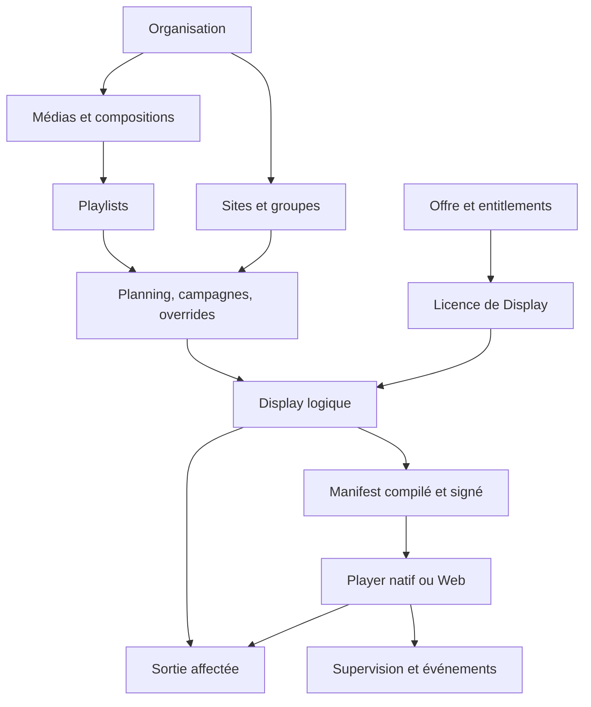

<!-- Généré par scripts/sync-spec.mjs ; modifier le cahier maître. -->

[Retour à l’index](../INDEX.md) · [Source maître](../cahier-des-charges.md#section-3)

## 3. Glossaire et architecture fonctionnelle

| Terme | Définition |
|---|---|
| Organisation / tenant | Périmètre d’isolation des données, utilisateurs, ressources et abonnement. |
| Site | Regroupement géographique ou opérationnel, avec fuseau horaire. |
| Player | Agent natif ou application Web appairée à une organisation. |
| Installation | Instance locale du logiciel ou profil navigateur ; possède sa propre identité. |
| Output / sortie | Connecteur physique du natif ou surface de rendu virtuelle du Web. |
| Display | Surface logique avec résolution, orientation, programmation, supervision et affectation à une sortie. |
| Display Slot / licence | Droit commercial assignable à un Display actif ; sa libération ne supprime pas le Display. |
| Display Group | Groupe de ciblage ; un Display peut appartenir à plusieurs groupes. |
| Média | Ressource logique du client, associée à un ou plusieurs fichiers ou variantes. |
| Asset | Blob immuable identifié par taille et checksum ; original, miniature ou rendu compatible. |
| Composition | Document graphique versionné : canvas, éléments, zones et paramètres. |
| Template | Modèle réutilisable ; son utilisation crée une composition indépendante. |
| Playlist | Séquence ordonnée de médias ou de compositions avec durées et validités. |
| Schedule / planning | Règles temporelles récurrentes ou datées affectées à des cibles. |
| Campaign / campagne | Contenu + ensemble de cibles + période + priorité. |
| Override | Diffusion immédiate temporaire, annulable, prioritaire sur les règles ordinaires. |
| Manifest | Résultat de compilation immuable et signé, propre à un Display et une version. |
| Entitlement | Droit ou quota effectif, indépendant du nom commercial de l’offre. |
| Proof of play | Journal de lectures déclarées par le Player ; ne prouve pas l’attention d’une audience. |
| RPO / RTO | Perte maximale de données visée / délai de reprise visé après incident. |

**FON-001 — Navigation.** Les cinq entrées produit principales sont Bibliothèque, Créateur, Playlists, Programmation et Écrans. Un tableau de bord d’exploitation résume le parc. Utilisateurs, facturation, paramètres et fonctions avancées sont accessibles selon les droits ; les réglages ne doivent pas masquer les alertes critiques du parc.

**FON-002 — Flux de publication.** Une modification sauvegardée n’est pas assimilée à une diffusion réussie. L’interface distingue brouillon, version publiée, compilation, téléchargement/préparation et version appliquée. Un acquittement Player est nécessaire pour afficher « appliqué ».

**FON-003 — Granularité V1.** L’activation est atomique par Display. Un ciblage de plusieurs Displays n’implique pas une bascule simultanée de toutes les machines ; le suivi expose le résultat de chaque cible. La synchronisation de groupe relève de la V2.
