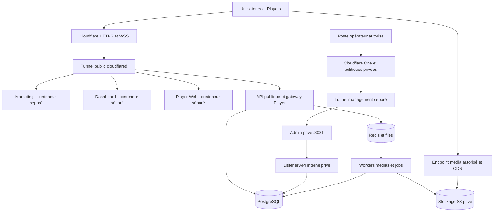

<!-- Généré par scripts/sync-spec.mjs ; modifier le cahier maître. -->

[Retour à l’index](../INDEX.md) · [Source maître](../cahier-des-charges.md#section-14)

<a id="section-14"></a>

## 14. Architecture technique et déploiement

### 14.1. Composants et responsabilités

**ARC-001 — Monolithe modulaire.** Le cloud commence par une API TypeScript structurée en modules métier. NestJS et Fastify restent à arbitrer ; les exigences fonctionnelles ne dépendent pas de ce choix. Les frontières couvrent identité, organisations, contenus, diffusion, flotte, billing et exploitation. Les traitements lourds passent dans les workers, sans bloquer les requêtes utilisateur.

**ARC-002 — Interfaces.** Le dashboard et l'administration reposent sur React/TypeScript, avec Next.js à confirmer selon les besoins. Le Player Web partage les contrats et les éléments de rendu compatibles, sans importer les permissions d'administration. Le natif comporte agent Rust et renderer séparé ; SQLite et le cache local restent opérationnels sans cloud.

**ARC-003 — Persistance.** PostgreSQL porte les données transactionnelles. Utiliser JSONB pour les documents variables identifiés, tout en conservant colonnes, clés étrangères et index pour les relations et filtres centraux. Prisma ou Drizzle reste à choisir. Les transactions protègent notamment quotas, affectations de Displays, publication et transitions d'abonnement.

**ARC-004 — Tâches.** Redis et BullMQ assurent les files médias, compilation de manifestes, emails, réconciliation billing, rapports et nettoyage. Les jobs possèdent une clé métier, un contexte tenant, une politique de reprise et un état observable. **[PROPOSITION]** Une outbox transactionnelle PostgreSQL rend récupérable une tâche métier même si Redis disparaît entre la transaction et son envoi. Redis ne doit pas être l'unique détenteur d'une décision financière ou d'une publication.

**ARC-005 — Médias.** Le stockage utilise une abstraction compatible S3 ; S3, R2, MinIO, Ceph et B2 sont des options à évaluer. Le choix reste ouvert. Le navigateur téléverse directement vers le stockage avec autorisation bornée ; l'API valide l'achèvement avant de lancer l'ingestion. Les Players téléchargent par URL signée ou mécanisme équivalent via un endpoint média/CDN, avec support des requêtes partielles nécessaires à la vidéo.

**ARC-006 — Traitements.** FFmpeg et FFprobe assurent analyse et dérivés vidéo ; libvips est une option pour les images. Les versions et profils de conversion sont enregistrés. Les artefacts produits sont immuables et réutilisables ; les échecs sont visibles sans rendre disponibles des médias incomplets. Les espaces temporaires et les tentatives abandonnées sont nettoyés selon une politique bornée.

### 14.2. Monorepo cible

**ARC-007 — Organisation.** L'arborescence suivante guide la séparation des responsabilités, sans imposer un outil de monorepo particulier :

```text
apps/
  marketing/
  dashboard/
  admin/
  player-web/
  api/
  workers/
packages/
  ui/
  auth/
  permissions/
  render-engine/
  contracts/
  config/
native/
  agent/
  renderer/
```

Les contrats partagés portent schémas, types et versions. Les migrations et tests de compatibilité font partie du dépôt. Un package partagé ne doit pas faire entrer un secret serveur dans un bundle navigateur. Les composants graphiques réutilisables restent séparés des règles d'autorisation appliquées côté serveur.

### 14.3. Réseaux et Cloudflare

**ARC-008 — Entrées publiques.** Les rôles `www`, `app`, `api` et `player` utilisent des hostnames publics HTTPS reliés par Cloudflare Tunnel aux services prévus. Les domaines du projet sont `pixlova.com` et `pixlova.fr` ; leur répartition et les sous-domaines applicatifs restent à définir. **[PROPOSITION]** Les exemples techniques utilisent `app.pixlova.com`, `api.pixlova.com` et `player.pixlova.com`, sans fixer le rôle de `pixlova.fr`. Configurer une liste explicite des routes, un refus par défaut et des réseaux Docker séparant exposition, données et management. L'administration suit uniquement le chemin privé défini en ADM-001.

**ARC-009 — Connecteurs.** `cloudflared` établit ses connexions sortantes ; documenter les règles egress, notamment 7844 TCP/UDP selon transport. Protéger et renouveler les tokens. Les connexions redondantes ou plusieurs réplicas de tunnel ne suppriment pas la dépendance à un hôte unique hébergeant API et base. La promesse HA doit correspondre aux domaines de panne réellement indépendants. [Configuration Tunnel](https://developers.cloudflare.com/tunnel/configuration/), [Disponibilité et bascule](https://developers.cloudflare.com/cloudflare-one/networks/connectors/cloudflare-tunnel/configure-tunnels/tunnel-availability/)

**ARC-010 — Connexions longues.** Le Player supporte une interruption de WebSocket, la reconnexion temporisée et la resynchronisation HTTPS. Cloudflare peut fermer des connexions lors de changements réseau ou de déploiements. La notification de changement ne remplace pas le manifeste validé. Le détail des messages, accusés et reprises est défini dans le protocole Player–Cloud. [WebSockets Cloudflare](https://developers.cloudflare.com/network/websockets/)

**ARC-011 — Chemin des gros fichiers.** Un stockage auto-hébergé peut disposer d'un endpoint dédié, séparé de l'API métier. Vérifier avant choix définitif limites de taille et durée des requêtes, multipart, quotas, cache, requêtes Range et conditions du fournisseur. Aucun engagement de transfert illimité via Tunnel n'est supposé. Les limites mesurées doivent être répercutées dans l'upload et la documentation des formats.

### 14.4. Environnements et livraison

**ARC-012 — Isolation.** Développement, staging et production disposent de bases, stockage, clés Stripe, tokens tunnel et secrets distincts. Les données de test sont synthétiques ou anonymisées. Les migrations et traitements planifiés sont exécutés par des comptes dédiés. Les backups et la restauration font l'objet du PRA.

**ARC-013 — Conteneurs.** Construire des images reproductibles, versionnées et exécutées sans root lorsque possible. Définir limites de ressources, healthchecks, arrêt propre et volumes persistants explicites. Les conteneurs métier ne montent pas le socket Docker. Les consoles de base, Redis, MinIO et l'API Docker restent hors exposition publique et hors routage Player/client.

**ARC-014 — Migrations compatibles.** Le déploiement progressif impose une compatibilité entre versions successives de l'API, des workers et du schéma. Employer des migrations d'ajout puis de retrait différé, avec précontrôles et procédure de récupération. Une migration destructive ne doit pas être déclenchée implicitement par le démarrage simultané de plusieurs réplicas.

**ARC-015 — Livraison.** La chaîne de livraison construit, vérifie, signe les releases concernées et publie des artefacts identifiables. Les environnements exposent versions de l'application, contrats et profils médias. Le retour arrière applicatif est testé avec le schéma encore en service ; le rollback Player conserve sa procédure propre et ses protections contre le rejeu.

**ARC-016 — Capacité initiale et HA.** Docker Compose peut servir au développement et au déploiement initial. Une installation sur un seul serveur doit documenter sa reprise après panne ; une disponibilité tolérant la perte d'un hôte exige plusieurs domaines de panne et une stratégie explicite pour PostgreSQL, stockage, workers et connecteurs. Les objectifs chiffrés, coûts et architecture HA retenue relèvent du chapitre PRA/HA et des points à valider.

### 14.5. Topologie de référence



Le flux média est distinct des requêtes métier : un stockage géré peut exposer son propre endpoint signé ; un stockage auto-hébergé passe par une route dédiée conforme à la politique d'exposition Tunnel. Le navigateur ne reçoit aucun accès console ou credential général S3. Un conteneur worker média peut être isolé plus strictement qu'un worker de compilation ; une panne de transcodage ne doit pas empêcher les heartbeats.

**ARC-017 — Réseau requis.** Les Players initient uniquement des connexions sortantes HTTPS/WSS vers API, stockage/CDN et distribution des releases, avec résolution DNS et synchronisation horaire autorisées. Les accès aux OS repositories éventuels sont documentés séparément. Aucun port de contrôle entrant sur les Players n'est requis. L'egress `cloudflared` côté serveur, notamment 7844 TCP/UDP, ne doit pas être confondu avec l'egress HTTPS 443 des Players. Documenter proxies d'entreprise, renouvellement DNS, certificats et reprise après coupure, sans désactiver la validation TLS.

**ARC-018 — Chaîne CI/CD.** À chaque changement : validation des contrats et migrations, lint/typecheck, tests unitaires et d'intégration concernés, scan de dépendances/images/secrets, build reproductible, publication des artefacts et déploiement staging. Avant production : recette des lots, matrice de compatibilité, sauvegarde et procédure de rollback disponibles. Les builds cloud, Web et natifs sont versionnés indépendamment ; la signature native et ses clés restent dans un environnement de release contrôlé. Kubernetes est une évolution possible, sans obligation V1.

**ARC-019 — Stack d'observabilité.** OpenTelemetry, Prometheus, Grafana, Loki et Sentry ont été proposés comme ensemble de référence, ou équivalents assurant les mêmes fonctions. Choisir les composants et leur rétention avant mise en production ; leurs interfaces internes restent sur le réseau de management.
